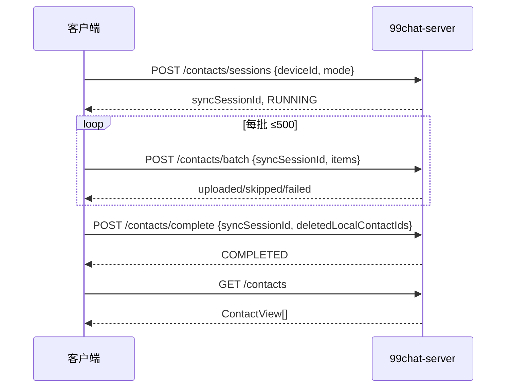
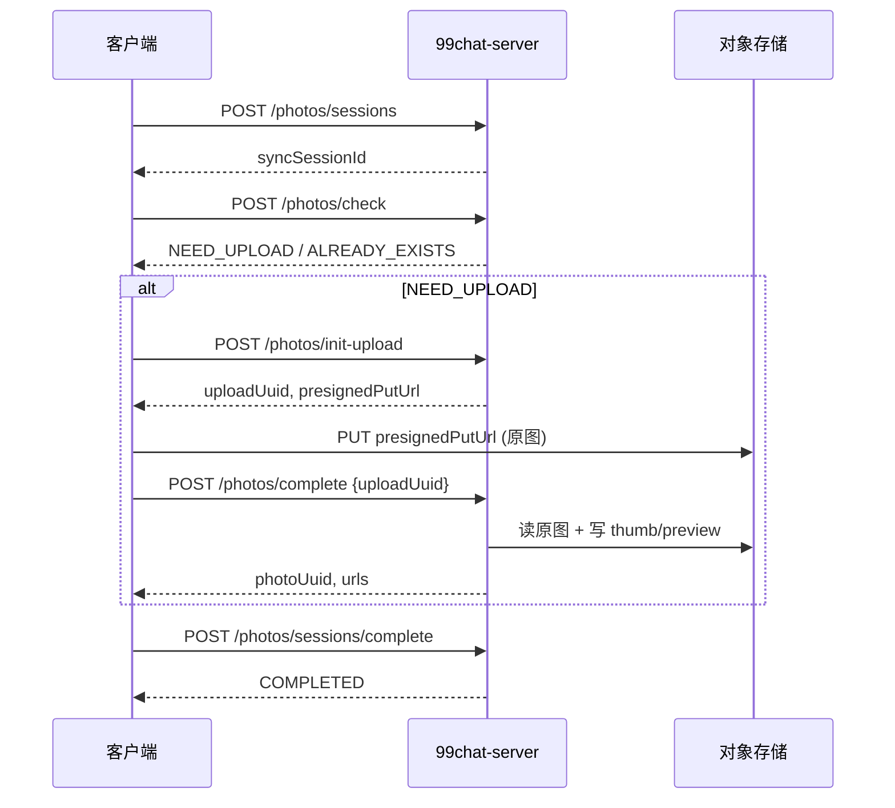

# 云端同步 — 客户端对接文档

> 版本：v1.0  
> 适用：99chat（Flutter / iOS / Android）  
> 范围：登录后**通讯录**与**系统相册**备份到服务端；列表与去重以服务端数据库为准  
> 相关：[cloud-sync-api.md](./cloud-sync-api.md)（接口速查）、[cloud-sync-database.md](./cloud-sync-database.md)（落库约定）

---

## 1. 总览

### 1.1 业务目标

- 用户登录成功后，在后台将本机**通讯录**、**相册照片**同步到云端。
- **通讯录**：每批 `batch` 请求成功即写入数据库，无需 OSS。
- **相册**：原图存 OSS；**仅当** `POST /me/sync/photos/complete` 成功后，照片才会出现在 `GET /me/sync/photos` 列表中。
- 同一张图以 **`contentHash`（SHA-256，64 位小写 hex）** 去重；同一联系人以 **`localContactId`** 稳定标识。

### 1.2 何时触发

| 时机 | 建议模式 | 说明 |
|------|----------|------|
| 首次登录 / 换机恢复 | `FULL` | 全量扫描本机通讯录与相册 |
| 日常登录 / 定时后台 | `INCREMENTAL` | 只传变更项；相册仍走 check 去重 |
| 用户打开「云端备份」页 | 任意 | 可先 `GET /status` 再决定是否同步 |

通讯录与相册为**两条独立会话**（各自的 `syncSessionId`），可并行，也可串行（先通讯录后相册）。

### 1.3 鉴权与 Base URL

- **Base URL**：`http://<host>:8081`（与登录文档一致）
- **Header**：`Authorization: Bearer <token>`（登录接口返回的 JWT）
- **Content-Type**：`application/json`（除相册 multipart complete 外）
- **错误体**：`{ "code": "<机器码>", "message": "<同 code 或校验详情>" }`

---

## 2. 客户端标识与哈希规则

### 2.1 `deviceId`

与登录接口中的 `deviceId` 保持一致（本机稳定 UUID 或厂商 ID），用于 `sessions` 请求。

### 2.2 `localContactId` / `localAssetId`

| 字段 | 格式建议 | 说明 |
|------|----------|------|
| `localContactId` | `ios:<cnContactIdentifier>` / `android:<lookupKey>` | 同一设备上稳定；换机可不同 |
| `localAssetId` | `ios:<PHAsset.localIdentifier>` / `android:<mediaId>` | 相册资源本地 ID |

### 2.3 `fingerprint`（通讯录）

对单条联系人计算 **SHA-256**，输出 **64 位小写十六进制**（无 `0x` 前缀）。

推荐参与哈希的字段（按固定顺序拼接后 UTF-8 再 hash，客户端与服务端约定一致即可）：

```
displayName + "\n" + sorted(phones).join("\n")
```

- `phones`：全部号码转为 **E.164**（如 `+8613812345678`），排序后参与拼接。
- 联系人无号码时：`phones` 为空数组。

### 2.4 `contentHash`（相册）

对**原图文件字节**（或客户端约定的「可复现原图」字节流）计算 SHA-256，**64 位小写 hex**，正则：`^[a-f0-9]{64}$`。

- 服务端 `check` / `init-upload` 会校验格式；不符合返回 `INVALID_HASH`。
- 同内容不同 `localAssetId`：云端只保留一条（按 hash）；`complete` 后会更新 `local_asset_id` 关联。

### 2.5 时间字段

| 字段 | 类型 | 说明 |
|------|------|------|
| `updatedAt`（通讯录） | Unix **秒** | 联系人本机修改时间，可选 |
| `takenAt`（相册） | Unix **秒** | EXIF / 资源创建时间，可选 |

---

## 3. 推荐整体流程（登录后）

```
登录成功拿到 JWT
    │
    ├─► GET /me/sync/status          （可选：展示上次同步时间）
    │
    ├─► 通讯录 FULL/INCREMENTAL
    │     POST /contacts/sessions
    │     循环 POST /contacts/batch（≤500 条/次）
    │     POST /contacts/complete（带 deletedLocalContactIds）
    │
    └─► 相册 FULL/INCREMENTAL
          POST /photos/sessions
          循环：
            POST /photos/check（≤100 条/次）
            对 NEED_UPLOAD：
              POST /photos/init-upload
              PUT presignedPutUrl（原图）
              POST /photos/complete { uploadUuid }
            对 ALREADY_EXISTS：跳过上传，可记 photoUuid
          POST /photos/sessions/complete
```

---

## 4. 同步状态

### `GET /me/sync/status`

服务端按 `userId` **一次查询** `user_sync_state` 组装各类型水位；契约不变。登录瞬间请避免与大量 `/me/*` 无节制并发，以免挤占连接池。

**响应示例**

```json
{
  "types": [
    {
      "syncType": "CONTACTS",
      "lastFullSyncAt": "2026-05-23T08:00:00Z",
      "lastIncrementalSyncAt": "2026-05-23T12:00:00Z",
      "serverRevision": 0
    },
    {
      "syncType": "PHOTOS",
      "lastFullSyncAt": null,
      "lastIncrementalSyncAt": null,
      "serverRevision": 0
    }
  ]
}
```

- 某类型从未同步时，可能**不在** `types` 列表中。
- `lastFullSyncAt` / `lastIncrementalSyncAt` 在对应 `complete` 成功后更新。

---

## 5. 通讯录 API

### 5.1 开始会话

`POST /me/sync/contacts/sessions`

**请求**

```json
{
  "deviceId": "550e8400-e29b-41d4-a716-446655440000",
  "mode": "FULL"
}
```

`mode`：`FULL` | `INCREMENTAL`（枚举字符串，大写）。

**响应**

```json
{
  "syncSessionId": "a1b2c3d4-e5f6-7890-abcd-ef1234567890",
  "syncType": "CONTACTS",
  "syncMode": "FULL",
  "status": "RUNNING"
}
```

保存 `syncSessionId`，后续 batch / complete 必传。

### 5.2 批量上传

`POST /me/sync/contacts/batch`

**请求**

```json
{
  "syncSessionId": "a1b2c3d4-e5f6-7890-abcd-ef1234567890",
  "items": [
    {
      "localContactId": "ios:ABCD-1234",
      "fingerprint": "e3b0c44298fc1c149afbf4c8996fb92427ae41e4649b934ca495991b7852b855",
      "displayName": "张三",
      "phones": ["+8613812345678", "+8613912345678"],
      "updatedAt": 1716451200
    }
  ]
}
```

| 约束 | 值 |
|------|-----|
| 每批最多条数 | **500** |
| `fingerprint` 长度 | **64** |
| `phones` | 字符串数组，建议 E.164 |

**响应**

```json
{
  "syncSessionId": "a1b2c3d4-e5f6-7890-abcd-ef1234567890",
  "results": [
    { "localContactId": "ios:ABCD-1234", "status": "UPLOADED" }
  ],
  "uploaded": 1,
  "skipped": 0,
  "failed": 0
}
```

单条 `status`：

| status | 含义 |
|--------|------|
| `UPLOADED` | 新增或 fingerprint 有变化 |
| `SKIPPED` | 已存在且 fingerprint 相同 |
| `FAILED` | 本条校验/写入失败（不阻断整批） |

### 5.3 结束会话

`POST /me/sync/contacts/complete`

**请求**

```json
{
  "syncSessionId": "a1b2c3d4-e5f6-7890-abcd-ef1234567890",
  "deletedLocalContactIds": ["ios:OLD-ID-1", "ios:OLD-ID-2"]
}
```

- `deletedLocalContactIds`：本次全量扫描中**已不存在**于本机的联系人 ID（软删云端记录）。
- 增量同步若无删除，传 `[]` 或省略。

**响应**

```json
{
  "syncSessionId": "a1b2c3d4-e5f6-7890-abcd-ef1234567890",
  "status": "COMPLETED",
  "deleted": 2
}
```

### 5.4 拉取云端通讯录

`GET /me/sync/contacts`

**响应**：`ContactView[]`（无分页，按 `displayName` 排序）

```json
[
  {
    "localContactId": "ios:ABCD-1234",
    "fingerprint": "e3b0c44298fc1c149afbf4c8996fb92427ae41e4649b934ca495991b7852b855",
    "displayName": "张三",
    "phones": ["+8613812345678"],
    "syncedAt": "2026-05-23T08:01:00Z"
  }
]
```

---

## 6. 相册 API

### 6.1 开始会话

`POST /me/sync/photos/sessions`

请求/响应结构与通讯录 `sessions` 相同，仅 `syncType` 为 `"PHOTOS"`。

### 6.2 去重检查

`POST /me/sync/photos/check`

**请求**

```json
{
  "syncSessionId": "b2c3d4e5-f6a7-8901-bcde-f12345678901",
  "items": [
    {
      "localAssetId": "ios:ASSET-UUID",
      "contentHash": "abc123...64位小写hex...",
      "sizeBytes": 2048000,
      "takenAt": 1716451200,
      "width": 4032,
      "height": 3024
    }
  ]
}
```

| 约束 | 值 |
|------|-----|
| 每批最多 | **100** 条 |
| 单文件上限 | **10 MB**（`chat99.oss.max-upload-bytes`） |

**响应**

```json
{
  "results": [
    {
      "localAssetId": "ios:ASSET-UUID",
      "status": "NEED_UPLOAD",
      "photoUuid": null,
      "originUrl": null,
      "thumbUrl": null,
      "previewUrl": null
    },
    {
      "localAssetId": "ios:OTHER",
      "status": "ALREADY_EXISTS",
      "photoUuid": "c3d4e5f6-a7b8-9012-cdef-123456789012",
      "originUrl": "https://...",
      "thumbUrl": "https://...",
      "previewUrl": "https://..."
    }
  ]
}
```

`status` 枚举：

| status | 客户端动作 |
|--------|------------|
| `NEED_UPLOAD` | 走 init-upload → PUT → complete |
| `ALREADY_EXISTS` | **无需上传**；可本地缓存 `photoUuid` 与 URL |
| `SKIP_TOO_LARGE` | 跳过该资源，不计入失败重试队列 |

### 6.3 申请上传（预签名）

`POST /me/sync/photos/init-upload`

**请求**

```json
{
  "syncSessionId": "b2c3d4e5-f6a7-8901-bcde-f12345678901",
  "localAssetId": "ios:ASSET-UUID",
  "contentHash": "abc123...64位...",
  "sizeBytes": 2048000,
  "takenAt": 1716451200,
  "width": 4032,
  "height": 3024,
  "mimeType": "image/jpeg"
}
```

**响应（需要上传）**

```json
{
  "uploadUuid": "d4e5f6a7-b8c9-0123-def0-234567890123",
  "photoUuid": "e5f6a7b8-c9d0-1234-ef01-345678901234",
  "presignedPutUrl": "https://bucket.oss.../user-backup/...?signature=...",
  "ossOriginKey": "user-backup/{userId}/photos/ab/{hash}_origin.jpg",
  "presignExpiresInSeconds": 3600
}
```

**响应（云端已有同 hash）**

```json
{
  "uploadUuid": null,
  "photoUuid": "e5f6a7b8-c9d0-1234-ef01-345678901234",
  "presignedPutUrl": null,
  "ossOriginKey": "user-backup/...",
  "presignExpiresInSeconds": 0
}
```

此时**不要**再 PUT；直接视为已备份。

### 6.4 上传原图到 OSS

对 `presignedPutUrl` 发起 **HTTP PUT**：

- Body：原图二进制
- `Content-Type`：建议 `image/jpeg`（与预签名一致）
- 需在 `presignExpiresInSeconds`（默认 3600s）内完成

上传单 `uploadUuid` 有效期默认 **60 分钟**（`upload-expire-minutes`）。

### 6.5 完成落库（方式 A：推荐，客户端直传 OSS）

`POST /me/sync/photos/complete`  
`Content-Type: application/json`

**请求**

```json
{
  "uploadUuid": "d4e5f6a7-b8c9-0123-def0-234567890123"
}
```

**响应**

```json
{
  "photoUuid": "e5f6a7b8-c9d0-1234-ef01-345678901234",
  "localAssetId": "ios:ASSET-UUID",
  "contentHash": "abc123...",
  "originUrl": "https://...",
  "thumbUrl": "https://...",
  "previewUrl": "https://...",
  "takenAt": 1716451200
}
```

服务端会：校验 OSS 上已有原图 → 生成 thumb/preview → **写入 `user_photo`**。

### 6.6 完成落库（方式 B：multipart 代传）

适用于无法直传 OSS 的环境。

`POST /me/sync/photos/complete`  
`Content-Type: multipart/form-data`

| 字段 | 类型 | 必填 |
|------|------|------|
| `uploadUuid` | string | 是 |
| `file` | 文件 | 是（原图，≤10MB） |

响应 JSON 与方式 A 相同。服务端代为 `putBytes` 到 OSS 后走同一套缩略图逻辑。

### 6.7 结束相册会话

`POST /me/sync/photos/sessions/complete`

**请求**

```json
{
  "syncSessionId": "b2c3d4e5-f6a7-8901-bcde-f12345678901"
}
```

`deletedLocalContactIds` 在此接口**不需要**（相册删除策略由产品另定；当前仅结束会话统计）。

**响应**

```json
{
  "syncSessionId": "b2c3d4e5-f6a7-8901-bcde-f12345678901",
  "status": "COMPLETED",
  "deleted": 0
}
```

### 6.8 拉取相册列表

`GET /me/sync/photos?page=0&size=50`

| 参数 | 默认 | 上限 |
|------|------|------|
| `page` | 0 | ≥0 |
| `size` | 50 | 最大 **100** |

**响应**

```json
{
  "items": [
    {
      "photoUuid": "e5f6a7b8-c9d0-1234-ef01-345678901234",
      "localAssetId": "ios:ASSET-UUID",
      "contentHash": "abc123...",
      "originUrl": "https://...",
      "thumbUrl": "https://...",
      "previewUrl": "https://...",
      "takenAt": 1716451200,
      "width": 4032,
      "height": 3024,
      "sizeBytes": 2048000
    }
  ],
  "hasMore": true
}
```

- 按 `takenAt` **降序**；`hasMore=true` 时 `page+1` 继续拉取。
- **仅包含**已成功 `complete` 的照片；仅有 `init-upload` 未完成的不会出现在列表中。

### 6.9 单张详情

`GET /me/sync/photos/{photoUuid}`

响应字段同 `PhotoView` 单条。

---

## 7. 时序图

### 7.1 通讯录



### 7.2 相册（预签名直传）



---

## 8. 错误码与重试

| HTTP | code | 说明 | 客户端建议 |
|------|------|------|------------|
| 400 | `INVALID_INPUT` | 缺字段、会话 ID 空 | 修正请求 |
| 400 | `INVALID_FINGERPRINT` | fingerprint 非 64 位 | 重算 hash |
| 400 | `INVALID_HASH` | contentHash 格式错误 | 重算 hash |
| 400 | `BATCH_TOO_LARGE` | 超 500/100 条上限 | 拆批重试 |
| 400 | `OSS_OBJECT_NOT_FOUND` | complete 时 OSS 无原图 | 重新 PUT 后再 complete |
| 404 | `SYNC_SESSION_NOT_FOUND` | 会话不存在 | 重新 sessions |
| 409/400* | `SYNC_SESSION_NOT_RUNNING` | 会话已结束 | 重新 sessions |
| 404 | `UPLOAD_NOT_FOUND` | uploadUuid 无效 | 重新 init-upload |
| 410 | `UPLOAD_EXPIRED` | 上传单超过 60 分钟 | 重新 init-upload + PUT |
| 404 | `PHOTO_NOT_FOUND` | photoUuid 不存在 | 忽略或重新同步 |
| 413 | `FILE_TOO_LARGE` | 超过 10MB | 跳过或压缩 |
| 503 | `OSS_NOT_CONFIGURED` | 服务端未配 OSS | 提示用户稍后再试 |

\* 实际 HTTP 状态以 `ResponseStatusException` 为准，多为 404/400。

### 8.1 相册断点续传

1. 已 `init-upload` 且已 PUT OSS，但 `complete` 失败 → **同一 `uploadUuid` 可重试 complete**（未过期）。
2. `UPLOAD_EXPIRED` → 重新 `init-upload`（会生成新 `uploadUuid`）。
3. 切勿在未 `complete` 时认为备份成功；列表 API 不会返回该图。

### 8.2 通讯录断点

- 同一 `syncSessionId` 在 `RUNNING` 期间可多次 `batch`。
- App 进程被杀：若会话已失效，重新 `sessions` 并全量/增量重传（batch 幂等，重复传安全）。

---

## 9. Flutter 实现要点

### 9.1 依赖建议

- 通讯录：`flutter_contacts` / 平台 Channel
- 相册：`photo_manager` 或平台 PHAsset / MediaStore
- 哈希：`crypto` 包 `sha256.convert(bytes).toString()` → 确保 **小写** hex
- OSS PUT：`dio` / `http` PUT 二进制，勿走带 JSON 封装的网关

### 9.2 后台任务

- 使用 `workmanager` / iOS `BGTask`：登录后排队同步，避免阻塞 UI。
- 相册大图：先读压缩前**用于 hash 的字节**需与上传字节一致，否则 check 与 complete 不一致。
- 网络：Wi-Fi 优先；蜂窝可配置开关。

### 9.3 本地状态表（建议）

| 键 | 用途 |
|----|------|
| `lastContactSyncAt` | 对应 status API |
| `lastPhotoSyncAt` | 同上 |
| `localAssetId → photoUuid` | ALREADY_EXISTS 后免查 |
| `pendingUploadUuid` | 未完成 complete 的恢复 |

### 9.4 隐私与权限

- iOS：`NSContactsUsageDescription`、`NSPhotoLibraryUsageDescription`
- Android：`READ_CONTACTS`、`READ_MEDIA_IMAGES`（按 SDK 版本）
- 上传内容为端到端备份用途，需在隐私政策中说明存储于云端 OSS。

---

## 10. 联调检查清单

- [ ] 登录后带 JWT 调通 `GET /me/sync/status`
- [ ] 通讯录：`sessions` → 1 条 `batch` → `complete` → `GET /contacts` 有条目
- [ ] 相册：`check` NEED_UPLOAD → `init-upload` → PUT OSS → `complete` → `GET /photos` 有条目且含 thumb/preview URL
- [ ] 同图第二次 `check` 返回 `ALREADY_EXISTS`，且无二次 PUT
- [ ] `complete` 在 PUT 之前调用返回 `OSS_OBJECT_NOT_FOUND`
- [ ] 全量结束后 `deletedLocalContactIds` 使云端条目减少（软删）

---

## 11. 修订记录

| 版本 | 日期 | 说明 |
|------|------|------|
| v1.0 | 2026-05-23 | 客户端对接首版：流程、字段、示例、错误与重试 |
