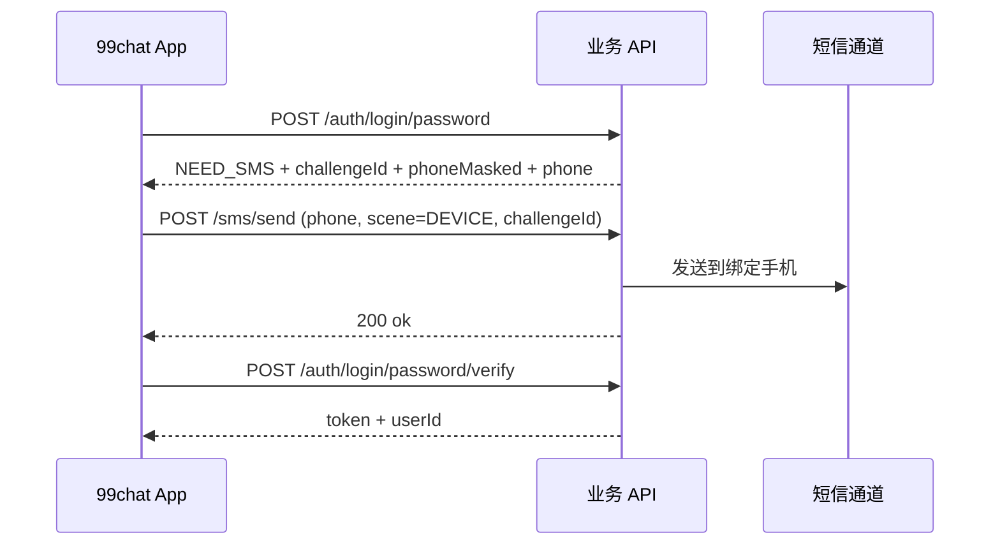

# 设备验证发码 — 方案 A 对接文档

> 版本：v1.0  
> 适用：99chat-server + 99chat App（`auth_api.dart` / `DeviceChallengePage`）  
> 默认 API：`http://47.239.60.107:8081`（`API_BASE_URL` 可覆盖）

## 1. 目标

用户名 / 平台 ID / 手机号 + 密码登录触发**新设备验证**时，客户端能调用 `POST /sms/send`（`scene=DEVICE`）成功发码。

- 界面只展示 **phoneMasked**（含 `*`）
- 发码使用响应中的完整 **phone**（E.164），与 `challengeId` 一并下发

## 2. 流程



## 3. POST /auth/login/password

### 请求（不变）

```json
{
  "account": "cxsxi5d22l",
  "password": "********",
  "deviceId": "客户端 UUID",
  "phoneCountry": "CN"
}
```

**account 解析**：

| account 形式 | 查询方式 |
|--------------|----------|
| 以 `+` 开头 | E.164 手机号 → `users.phone` |
| 纯数字 | 按 `phoneCountry`（默认 CN）转 E.164 → `users.phone` |
| 含字母 | 平台 ID（`users.user_id`） |

### 响应 — 直接成功（不变）

```json
{
  "nextStep": "OK",
  "token": "jwt...",
  "userId": "abc12def34",
  "expiresIn": 7776000
}
```

### 响应 — 需要设备短信（方案 A）

```json
{
  "nextStep": "NEED_SMS",
  "challengeId": "550e8400-e29b-41d4-a716-446655440000",
  "phoneMasked": "+86188****8855",
  "phone": "+8618812348855"
}
```

| 字段 | 说明 |
|------|------|
| `phoneMasked` | 仅用于 UI 展示，**禁止**用于 `/sms/send` |
| `phone` | 用户绑定手机 E.164，**必须**原样用于发码 |
| `token` | NEED_SMS 时不返回 |

`phone` 始终来自 `users.phone`（绑定手机），与 `account` 登录名无关。

## 4. POST /sms/send（scene = DEVICE）

### 请求

```json
{
  "phone": "+8618812348855",
  "scene": "DEVICE",
  "challengeId": "550e8400-e29b-41d4-a716-446655440000"
}
```

### 服务端校验

| 校验项 | 失败 code |
|--------|-----------|
| `phone` 非空、无 `*`、合法 E.164 | `INVALID_PHONE` |
| `scene=DEVICE` 必须带 `challengeId` | `INVALID_INPUT` |
| `challengeId` 存在且未过期 | `CHALLENGE_EXPIRED` |
| challenge 对应用户 `user_status=1` | `ACCOUNT_DISABLED`（403） |
| `phone` 与 challenge 内绑定号一致 | `INVALID_PHONE` |
| 手机号 / IP / 单 challenge 发码次数 | `RATE_LIMITED` |

验证码在创建 challenge 时生成；发码使用 challenge 内已有 code，发往 challenge 记录的手机号。

### 响应

```json
{ "ok": true }
```

## 5. POST /auth/login/password/verify（不变）

```json
{
  "challengeId": "550e8400-e29b-41d4-a716-446655440000",
  "smsCode": "123456",
  "deviceId": "客户端 UUID"
}
```

成功 → 与直接登录相同的 `TokenResponse`（`nextStep=OK` + `token`）。

错误：`CHALLENGE_EXPIRED`、`SMS_CODE_INVALID`（HTTP 410）。

## 6. curl 联调

```bash
BASE=http://47.239.60.107:8081

# 1. 密码登录（新设备）
curl -s -X POST "$BASE/auth/login/password" \
  -H "Content-Type: application/json" \
  -d '{"account":"cxsxi5d22l","password":"你的密码","deviceId":"test-device-1"}'

# 2. 设备发码（使用上一步 phone、challengeId）
curl -s -X POST "$BASE/sms/send" \
  -H "Content-Type: application/json" \
  -d '{"phone":"+8618812348855","scene":"DEVICE","challengeId":"<challengeId>"}'

# 3. 验码登录
curl -s -X POST "$BASE/auth/login/password/verify" \
  -H "Content-Type: application/json" \
  -d '{"challengeId":"<challengeId>","smsCode":"123456","deviceId":"test-device-1"}'
```

## 7. 配置

| 项 | 默认 | 说明 |
|----|------|------|
| `chat99.sms.code.ttl-seconds` | 300 | challenge 与验证码 TTL |
| `chat99.sms.device-challenge-max-sends` | 5 | 同一 challenge 最多发码次数 |

## 8. 安全说明

- 日志中设备挑战记录使用 `account`（登录名），不额外打印完整 `phone`
- 生产环境使用 HTTPS
- 勿新增未白名单的 `/auth/login/password/send-sms`；统一走 `/sms/send`

## 9. 客户端错误提示（必做）

| `code` | HTTP | 展示文案（优先用响应体 `message`） |
|--------|------|-----------------------------------|
| `ACCOUNT_DISABLED` | 403 | **该账号已禁用，请联系管理员** |
| `CHALLENGE_EXPIRED` | 410 | challenge 已过期，请返回重新密码登录 |
| `INVALID_PHONE` / `INVALID_INPUT` | 400 | 参数错误，请返回上一步 |
| `RATE_LIMITED` | 429 | 发送过于频繁，请稍后再试 |

**禁止**将 `403 ACCOUNT_DISABLED` 映射为「服务拒绝访问，请联系后端开放设备验证发码接口」——该场景为账号被运营禁用，与发码接口是否开放无关。

账号禁用时：`POST /auth/login/password` 与 `POST /sms/send`（`scene=DEVICE`）均可能返回上述 403。

## 10. 客户端字段别名（可选）

若短期不能统一为 `phone`，以下字段名 App 已兼容：`boundPhone`、`phoneE164`、`phoneNumber`、`mobile`。  
**不得**使用含 `*` 的脱敏串作为发码参数。

## 11. 修订记录

| 版本 | 日期 | 说明 |
|------|------|------|
| v1.0 | 2026-05-23 | 方案 A：`NEED_SMS` 增加 `phone`；DEVICE 发码校验 |
| v1.1 | 2026-05-31 | `ACCOUNT_DISABLED` 中文 `message`；DEVICE 发码校验账号状态 |
