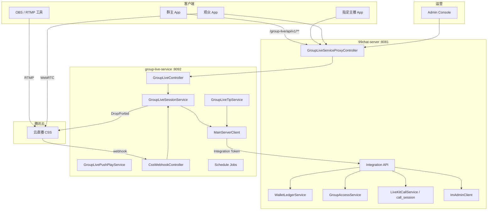
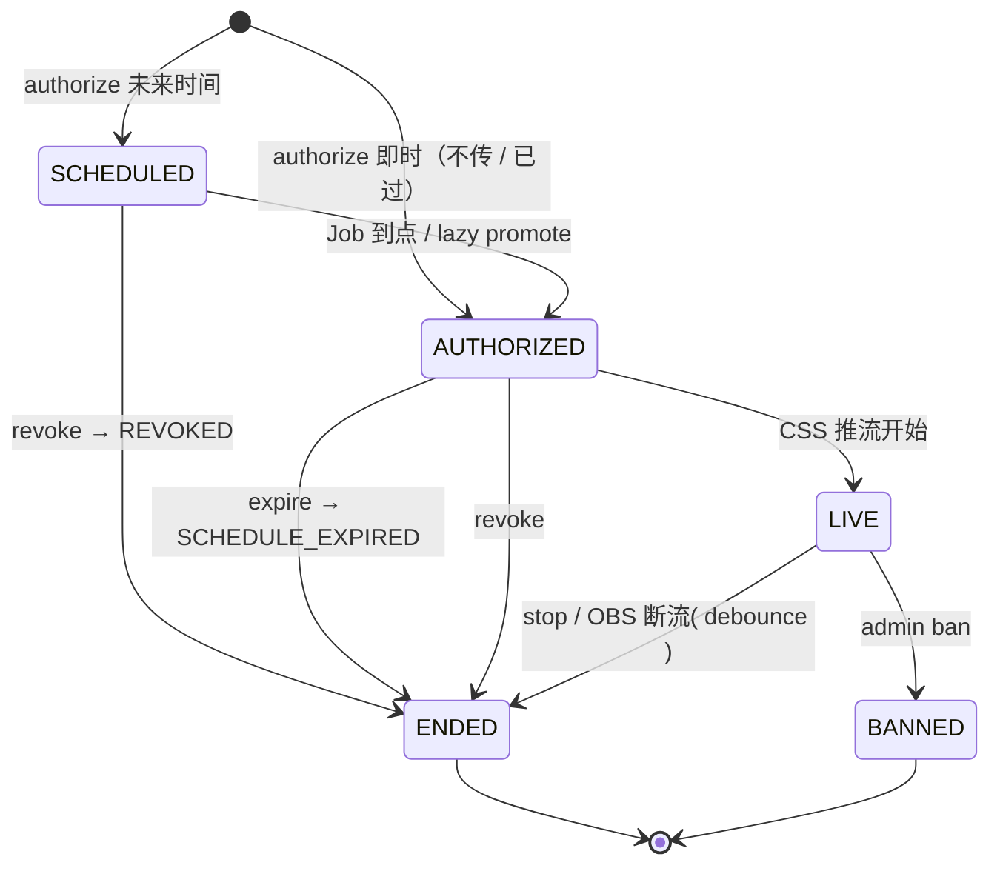
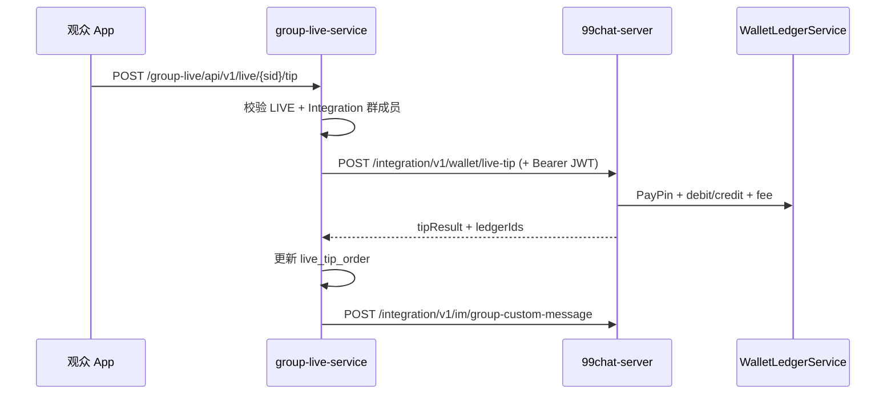

# 群直播 — 架构设计（完整版）

> 版本：v1.1（2026-08-17）  
> 状态：**实施中**（M1 骨架：独立服务 + 主服 proxy / Integration）  
> **部署形态：独立微服务 `/www/wwwroot/group-live-service`**（与主仓 `99chat-server` **同级**，**不并入主服务 JAR**）  
> 读者：后端、客户端、运维、运营后台  
> 关联文档：  
> - 微服务 README：[/www/wwwroot/group-live-service/README.md](../../group-live-service/README.md)  
> - 客户端 API / IM：[group-live-client.md](./group-live-client.md)  
> - 落地清单：[group-live-server.md](./group-live-server.md)  
> - 钱包：[wallet-client.md](./wallet-client.md) / [wallet.md](./wallet.md)  
> - 音视频通话（互斥）：[livekit-call-client.md](./livekit-call-client.md)

---

## 目录

1. [背景与目标](#1-背景与目标)
2. [范围与非目标](#2-范围与非目标)
3. [总体架构](#3-总体架构)
4. [核心概念](#4-核心概念)
5. [状态机与生命周期](#5-状态机与生命周期)
6. [模块设计](#6-模块设计)
7. [数据模型](#7-数据模型)
8. [HTTP API 与 Service 映射](#8-http-api-与-service-映射)
9. [腾讯云 CSS 集成](#9-腾讯云-css-集成)
10. [Webhook 设计](#10-webhook-设计)
11. [定时任务](#11-定时任务)
12. [打赏与钱包](#12-打赏与钱包)
13. [IM 与实时通知](#13-im-与实时通知)
14. [LiveKit 互斥](#14-livekit-互斥)
15. [权限与安全](#15-权限与安全)
16. [边界场景与容错](#16-边界场景与容错)
17. [运营后台](#17-运营后台)
18. [配置与环境变量](#18-配置与环境变量)
19. [部署与运维](#19-部署与运维)
20. [可观测性](#20-可观测性)
21. [测试策略](#21-测试策略)
22. [分期交付](#22-分期交付)

---

## 1. 背景与目标

99chat 需要在 **群场景** 内提供直播能力：群主预约、指定成员在 **OBS** 推流，群成员在 App 内 **低延迟观看**，并支持 **多币种自定义金额打赏**。

### 1.1 业务目标

| 目标 | 说明 |
|------|------|
| 一群一场 | 同一群任意时刻最多 1 条活跃直播链路 |
| 可控开播 | 仅群主可创建预约；仅指定主播可获取推流地址 |
| 可预约 | 创建时必须填写 **房间昵称** + **计划开播时间** |
| 低延迟观看 | 观众默认 **快直播 WebRTC** 拉流 |
| 闭环打赏 | 走现有钱包账本，支持多币种与可配置平台抽成 |
| 可治理 | 主播/群主/群管可结束；平台管理员可禁播 |

### 1.2 技术目标

| 目标 | 说明 |
|------|------|
| **独立微服务** | 业务代码在 `/www/wwwroot/group-live-service/`，独立 JAR/端口/进程/库，**不写入主服务 `src/`** |
| 统一对外入口 | 客户端只访问主服 `:8081/group-live/**`，主服 HTTP 代理到内网 `:8092` |
| 媒体与业务分离 | 推流/拉流走腾讯云 CSS；会话状态在 `group_live` 库 |
| 真相来源清晰 | **`LIVE` 以 CSS 推流回调为准** |
| 主服能力复用 | 群权限、钱包、LiveKit 状态、IM 代发 —— 经 **`/integration/v1/**`** 调主服 |
| 与 LiveKit 共存 | 通话仍在主服 LiveKit；群直播服务通过 Integration 做互斥 guard |

---

## 2. 范围与非目标

### 2.1 v1 范围内

- 群主 `authorize`（anchor + roomName；选填 description、选填 scheduledStartAt；不传时间则即时 AUTHORIZED）
- 改期 / 改房间昵称 / 改描述（仅 `SCHEDULED`）、撤销
- 指定主播 `push-info`（RTMP for OBS）
- 观众 `play-info`（WebRTC + FLV/HLS 降级）
- CSS 推流/断流 webhook
- 自定义金额打赏（USDT / 99 / TRX / CNY）
- 定时 Job：到点 promote、宽限期 expire
- Admin 列表 + ban
- LiveKit 互斥

### 2.2 v1 明确不做

| 不做 | 原因 |
|------|------|
| App 内推流 SDK / 摄像头预览 | 主播用 OBS 自行推流 |
| 礼物 catalog / 礼物动画后台 | v1 仅自定义金额 |
| 自动鉴黄 / AI 审核 | v1 人工 ban；v2 再接 CSS 截图 |
| 录制回放 | v2 |
| 连麦 / 多主播 | v2（需 TRTC 或 CSS 连麦） |
| PC Web 推流地址页 | v2；v1 主播用手机 App 复制地址 |

---

## 3. 总体架构

### 3.0 三进程部署（与三公 / Windows 机器人同模式）

```text
                    ┌──────────────────────────────────────────┐
                    │     99chat-server :8081  (DB: chat99)     │
                    │  JWT / 群资料 / 钱包 / LiveKit / IM Admin   │
                    │  GroupLiveServiceProxyController            │
                    │    /group-live/** → http://127.0.0.1:8092   │
                    │  Integration API（被 group-live 调用）       │
                    └───────────────┬──────────────────────────────┘
                                    │ HTTP 代理 + Integration
                    ┌───────────────▼──────────────────────────────┐
                    │   group-live-service :8092 (DB: group_live)   │
                    │  会话状态机 / CSS URL / Webhook / Job / 编排   │
                    └───────────────┬──────────────────────────────┘
                                    │ RTMP / WebRTC
                    ┌───────────────▼──────────────────────────────┐
                    │            腾讯云 CSS + 腾讯 IM（代发）          │
                    └──────────────────────────────────────────────┘

对照：
  sangong-service  :8088  /sangong/**     DB sangong
  robot-service    :8091  robot 路径代理   DB jiqiren
  group-live-service :8092 /group-live/**  DB group_live
```

| 维度 | 主服务 | group-live-service |
|------|--------|---------------------|
| 代码位置 | `99chat-server/src/` | `/www/wwwroot/group-live-service/` |
| 进程 | `:8081` | `:8092`（默认绑 `127.0.0.1`） |
| 数据库 | `chat99` | **`group_live`（独立账号）** |
| Redis/Kafka | 有 | **无**（v1） |
| 对外暴露 | 公网/API 网关 | **仅内网**，必须经主服代理 |

### 3.1 系统上下文



### 3.2 媒体路径 vs 业务路径

```text
┌─────────────────────────────────────────────────────────────────┐
│ 媒体面（腾讯云 CSS）                                               │
│   OBS ──RTMP──► push.domain ──► CDN ──► play.domain ──► App    │
│                      ▲                           ▲               │
│                      └── webhook ── group-live-service :8092     │
└─────────────────────────────────────────────────────────────────┘

┌─────────────────────────────────────────────────────────────────┐
│ 业务面                                                           │
│   group-live-service：group_live_session / live_tip_order        │
│   99chat-server：wallet_ledger / group_member / call_session     │
│   跨服调用：Integration API（X-Integration-Token）               │
└─────────────────────────────────────────────────────────────────┘
```

### 3.3 主服务最小改动（禁止把群直播业务塞进主 JAR）

| 改动 | 位置 | 说明 |
|------|------|------|
| HTTP 代理 | `com.chat99.server.grouplive.GroupLiveServiceProxyController` | 剥 `/group-live` 前缀 → `GROUP_LIVE_SERVICE_URL` |
| 配置 | `application.yml` → `group-live.proxy-enabled` / `service-url` | 对齐 `sangong.*` / `robot.*` |
| Integration：群权限 | `POST /integration/v1/groups/live-access` | 校验 Owner/Member/Admin |
| Integration：打赏 | `POST /integration/v1/wallet/live-tip` | PayPin + ledger（逻辑仍在主服 Wallet） |
| Integration：通话互斥 | `GET /integration/v1/calls/open-session` | 查 `call_session` RINGING/ANSWERED |
| Integration：IM 代发 | `POST /integration/v1/im/group-custom-message` | 群自定义消息 |
| Integration：Admin | `POST /integration/v1/admin/group-live/check` | 运营 ban 权限 |
| （可选）群事件 | IM 群解散/踢人回调 | 调 group-live internal API 结束 session |

**主服务不新增：** `group_live_session` 表、CSS Client、群直播 Job、群直播 Controller（App 路径）。

### 3.4 与 LiveKit 的关系

| 能力 | 技术 | 部署 |
|------|------|------|
| 1v1 / 小范围通话 | LiveKit | **主服务** |
| 群直播（1→N 广播） | 腾讯云 CSS | **group-live-service** |

互斥：`group-live-service` 经 Integration 查主服 `call_session`；主服 `LiveKitCallService` 经 Integration 或内联查询 `group_live` 库只读（**推荐 Integration**，避免跨库）。

### 3.5 客户端 URL 约定

| 场景 | URL |
|------|-----|
| App 业务 API | `{BASE}/group-live/api/v1/...` |
| CSS 回调 | `https://{api-host}/group-live/webhook/tencent/css` |
| Admin | `{BASE}/group-live/api/v1/admin/...` |

`BASE` = `http://47.239.60.107:8081` 或 HTTPS 反代（与现有 App 一致）。

---

## 4. 核心概念

| 概念 | 说明 |
|------|------|
| **LiveSession** | 一次群直播会话，主键 `liveSessionId`（如 `gl_{uuid}`） |
| **roomName** | 房间昵称（直播标题），authorize 必填，服务端 1–40 字（新 UI 限制 10 字，兼容旧包） |
| **description** | 选填描述，最多 30 字；不传则 NULL。旧客户端可不传 |
| **designated anchor** | 群主指定的唯一主播 `anchorUserId` |
| **活跃槽位** | 同一 `groupId` 下 status ∈ `SCHEDULED \| AUTHORIZED \| LIVE` 占用 1 槽 |
| **streamId** | CSS 流名，`live_{safeGroupId}_{liveSessionId}`，authorize 时生成 |
| **expireAt** | `scheduledStartAt + startGraceSeconds`；超期未推流则过期 |
| **push-info** | 签发 RTMP 服务器 + 串流密钥（OBS 用） |
| **play-info** | 签发 WebRTC/FLV/HLS 播放地址（观众用） |

### 4.1 时间字段关系

```text
authorize 时刻
  authorizedAt = now
  不传 / 已过 / 等于现在：scheduledStartAt = now，status = AUTHORIZED（即时）
  未来时刻：scheduledStartAt = 用户指定，status = SCHEDULED
  expireAt = scheduledStartAt + grace（默认 +30min）

PATCH schedule（仅 SCHEDULED）
  重算 expireAt
  若已签发 push 鉴权，下次 push-info 用新 txTime

到点 Job
  SCHEDULED → AUTHORIZED（允许 push-info）

CSS 推流回调
  AUTHORIZED → LIVE（写 startedAt）

Expire Job
  AUTHORIZED 且 now > expireAt → ENDED(SCHEDULE_EXPIRED)
```

---

## 5. 状态机与生命周期

### 5.1 状态枚举

| 状态 | 占槽 | 含义 |
|------|------|------|
| `SCHEDULED` | ✅ | 已预约，未到 `scheduledStartAt` |
| `AUTHORIZED` | ✅ | 已到点，主播可取 push-info，等待 OBS 推流 |
| `LIVE` | ✅ | CSS 确认推流中 |
| `ENDED` | ❌ | 正常/异常结束 |
| `BANNED` | ❌ | 平台禁播结束 |

### 5.2 状态迁移图



### 5.3 end_reason

| end_reason | 触发 |
|------------|------|
| `NORMAL` | 主播 stop 或 OBS 停推（debounce 后断流） |
| `OWNER_STOP` | 群主 stop |
| `ADMIN_STOP` | 群管理员 stop |
| `DISCONNECT` | CSS 断流（非 ban、非主动 stop） |
| `SCHEDULE_EXPIRED` | 宽限期 Job |
| `REVOKED` | 群主 revoke |
| `ADMIN_BAN` | 平台 ban |
| `GROUP_DISMISSED` | 群解散（见 §16） |
| `ANCHOR_REMOVED` | 指定主播被踢（见 §16） |
| `LIVEKIT_CONFLICT` | 互斥兜底 |

### 5.4 关播权限矩阵

| 操作 | 主播 | 群主 | 群管 | 平台 Admin |
|------|------|------|------|------------|
| `stop`（ENDED） | ✅ | ✅ | ✅ | — |
| `ban`（BANNED + ForbidLiveStream） | — | — | — | ✅ |

---

## 6. 模块设计

### 6.1 仓库布局

```text
/www/wwwroot/
├── 99chat-server/                              # 主服务
│   └── src/main/java/com/chat99/server/
│       ├── grouplive/
│       │   └── GroupLiveServiceProxyController.java    # 仅代理，无业务
│       └── integration/
│           ├── IntegrationGroupLiveAccessController.java
│           ├── IntegrationGroupLiveWalletController.java
│           ├── IntegrationGroupLiveCallController.java
│           └── IntegrationGroupLiveImController.java
│
└── group-live-service/                         # 独立仓 / 独立进程
    ├── pom.xml
    ├── sql/migrate-group-live.sql
    └── src/main/java/
        ├── com/chat99/groupliveservice/
        │   ├── GroupLiveServiceApplication.java
        │   ├── security/JwtAuthFilter.java
        │   ├── integration/MainServerClient.java
        │   └── web/GlobalResponseWrapper.java
        └── com/chat99/grouplive/
            ├── GroupLiveProperties.java
            ├── controller/GroupLiveController.java
            ├── controller/GroupLiveWebhookController.java
            ├── controller/admin/AdminGroupLiveController.java
            ├── service/GroupLiveSessionService.java
            ├── service/GroupLivePushPlayService.java
            ├── service/GroupLiveTipService.java
            ├── service/GroupLiveCssClient.java
            ├── job/GroupLiveSchedulePromoteJob.java
            ├── job/GroupLiveExpireJob.java
            ├── repository/...
            └── domain/...
```

### 6.2 group-live-service 类职责

| 类 | 职责 | 依赖 |
|----|------|------|
| `GroupLiveController` | `/api/v1/**` App API | SessionService, TipService |
| `GroupLiveSessionService` | 状态机、槽位、CSS 编排 | MainServerClient, CssClient |
| `GroupLivePushPlayService` | streamId、RTMP/WebRTC URL | Properties |
| `GroupLiveTipService` | tip 订单 + 调主服扣款 | MainServerClient |
| `MainServerClient` | Integration HTTP 客户端 | okhttp, INTEGRATION_API_TOKEN |
| `GroupLiveCssClient` | Drop/Forbid/Describe | 腾讯云 SDK |
| `GroupLiveWebhookController` | CSS 回调 | Verifier, SessionService |
| `AdminGroupLiveController` | 列表/ban | MainServerClient（Admin 鉴权） |

### 6.3 MainServerClient（Integration 出站）

```java
// 示例接口（主服实现，group-live 调用）
mainServer.checkGroupLiveAccess(groupId, userId, "OWNER"|"MEMBER"|"ADMIN");
mainServer.postLiveTip(LiveTipRequest);          // → 主服 wallet
mainServer.hasOpenCall(userId);                  // → call_session
mainServer.sendGroupCustomMessage(groupId, json);
mainServer.checkAdminGroupLivePermission(jwt);   // Admin ban
mainServer.fetchUserProfiles(userIds);           // 昵称（可选）
```

所有请求带：

```http
X-Integration-Token: <INTEGRATION_API_TOKEN>
Content-Type: application/json
```

App 请求带 `Authorization: Bearer` 时，Integration 内 **转发** 该 JWT 供主服校验 PayPin / 会话（打赏路径）。

### 6.4 事务与副作用顺序

**原则：** `group_live` 库内状态为编排真相；钱包/IM 以主服 Integration 成功为准。

```text
@Transactional（group_live 库）
  1. 校验（Integration：群权限 / 通话状态）
  2. 更新 group_live_session
  3. 打赏：先写 live_tip_order(PENDING)，调 Integration 扣款，再 COMPLETED
  4. afterCommit：
       - Integration 发 IM
       - CssClient drop/forbid
```

---

## 7. 数据模型

### 7.1 ER 关系

```text
group_profile (1) ──< (0..1 active) group_live_session
group_live_session (1) ──< (*) live_tip_order
live_tip_order (*) ──> (*) wallet_ledger (via ref)
call_session ── 互斥查询，无外键
```

### 7.2 DDL（PostgreSQL 示例）

脚本建议路径：`/www/wwwroot/group-live-service/sql/migrate-group-live.sql`（**不在** `chat99` 库执行）

```sql
CREATE TABLE IF NOT EXISTS group_live_session (
    id                          VARCHAR(64) PRIMARY KEY,
    group_id                    VARCHAR(64) NOT NULL,
    room_name                   VARCHAR(40) NOT NULL,
    description                 VARCHAR(30),
    designated_anchor_user_id   VARCHAR(32) NOT NULL,
    authorized_by_user_id       VARCHAR(32) NOT NULL,
    scheduled_start_at          TIMESTAMPTZ NOT NULL,
    authorized_at               TIMESTAMPTZ NOT NULL,
    expire_at                   TIMESTAMPTZ NOT NULL,
    stream_id                   VARCHAR(128) NOT NULL,
    status                      VARCHAR(32) NOT NULL,
    started_at                  TIMESTAMPTZ,
    ended_at                    TIMESTAMPTZ,
    end_reason                  VARCHAR(32),
    stopped_by_user_id          VARCHAR(32),
    stopped_by_role             VARCHAR(16),
    ban_reason                  VARCHAR(256),
    css_push_seq                BIGINT NOT NULL DEFAULT 0,
    version                     BIGINT NOT NULL DEFAULT 0,
    created_at                  TIMESTAMPTZ NOT NULL DEFAULT NOW(),
    updated_at                  TIMESTAMPTZ NOT NULL DEFAULT NOW()
);

CREATE UNIQUE INDEX IF NOT EXISTS uk_group_live_stream_id
    ON group_live_session (stream_id);

CREATE UNIQUE INDEX IF NOT EXISTS uk_group_live_active_slot
    ON group_live_session (group_id)
    WHERE status IN ('SCHEDULED', 'AUTHORIZED', 'LIVE');

CREATE INDEX IF NOT EXISTS idx_group_live_anchor_status
    ON group_live_session (designated_anchor_user_id, status);

CREATE INDEX IF NOT EXISTS idx_group_live_status_expire
    ON group_live_session (status, expire_at);

CREATE TABLE IF NOT EXISTS live_tip_order (
    id                  BIGSERIAL PRIMARY KEY,
    live_session_id     VARCHAR(64) NOT NULL REFERENCES group_live_session(id),
    group_id            VARCHAR(64) NOT NULL,
    from_user_id        VARCHAR(32) NOT NULL,
    to_user_id          VARCHAR(32) NOT NULL,
    currency            VARCHAR(16) NOT NULL,
    amount              BIGINT NOT NULL,
    fee_amount          BIGINT NOT NULL DEFAULT 0,
    memo                VARCHAR(50),
    client_order_id     VARCHAR(64) NOT NULL,
    status              VARCHAR(16) NOT NULL DEFAULT 'COMPLETED',
    ledger_out_id       BIGINT,
    ledger_in_id        BIGINT,
    created_at          TIMESTAMPTZ NOT NULL DEFAULT NOW(),
    CONSTRAINT uk_live_tip_client_order UNIQUE (from_user_id, client_order_id)
);

CREATE INDEX IF NOT EXISTS idx_live_tip_session_time
    ON live_tip_order (live_session_id, created_at DESC);
```

### 7.3 字段说明补充

| 字段 | 说明 |
|------|------|
| `css_push_seq` | 推流开始回调序号，防重复 IM |
| `version` | JPA `@Version` 乐观锁 |
| `ban_reason` | 平台 ban 原因 |
| `stream_id` | authorize 时生成，全生命周期不变 |

### 7.4 stream_id 规范化

```java
// groupId 可能含 @ 等字符，仅保留 [A-Za-z0-9_]，其余替换为 _
String safeGroup = normalize(groupId);
String streamId = "live_" + safeGroup + "_" + liveSessionId;
```

---

## 8. HTTP API 与 Service 映射

完整请求/响应见 [group-live-client.md](./group-live-client.md)。

**对外路径前缀：** `/group-live/api/v1`（经主服代理）；**服务内原生路径：** `/api/v1`。

| HTTP（对外） | HTTP（服务内） | Service 方法 | 权限 | 状态前置 |
|--------------|----------------|--------------|------|----------|
| `POST /group-live/api/v1/groups/{gid}/live/authorize` | `POST /api/v1/groups/{gid}/live/authorize` | `authorize(...)` | Owner | 群无活跃槽 |
| `PATCH /group-live/api/v1/groups/{gid}/live/schedule` | 同左 | `updateSchedule(...)` | Owner | SCHEDULED |
| `POST /group-live/api/v1/groups/{gid}/live/revoke` | 同左 | `revoke(...)` | Owner | SCHEDULED/AUTHORIZED |
| `GET /group-live/api/v1/live/{sid}/push-info` | 同左 | `pushInfo(...)` | Anchor | AUTHORIZED |
| `GET /group-live/api/v1/live/{sid}/play-info` | 同左 | `playInfo(...)` | Member | LIVE |
| `GET /group-live/api/v1/groups/{gid}/live/current` | 同左 | `current(...)` | Member | — |
| `GET /group-live/api/v1/live/{sid}` | 同左 | `detail(...)` | Member | — |
| `POST /group-live/api/v1/groups/{gid}/live/stop` | 同左 | `stop(...)` | Anchor/Owner/Admin | LIVE |
| `POST /group-live/api/v1/live/{sid}/tip` | 同左 | `tip(...)` | Member | LIVE |
| `POST /group-live/webhook/tencent/css` | 同左 | `handleCssEvent(...)` | 腾讯云验签 | — |
| `GET /group-live/api/v1/admin/group-live` | 同左 | `adminList(...)` | Admin | — |
| `POST /group-live/api/v1/admin/group-live/{sid}/ban` | 同左 | `adminBan(...)` | Admin | 活跃或 LIVE |

### 8.1 authorize 核心逻辑（伪代码）

```java
@Transactional
AuthorizeResult authorize(String ownerId, String groupId, AuthorizeRequest req) {
    mainServer.checkGroupLiveAccess(groupId, ownerId, "OWNER");
    mainServer.checkGroupLiveAccess(groupId, req.anchorUserId(), "MEMBER");
    validateRoomName(req.roomName());
    validateScheduleTime(req.scheduledStartAt());
    if (mainServer.hasOpenCall(req.anchorUserId())) {
        throw conflict("ANCHOR_IN_CALL");
    }
    requireGroupTypeAllowed(groupId);

    // ... 写 group_live_session（group_live 库）
    afterCommit(() -> mainServer.sendGroupCustomMessage(groupId, scheduledPayload(s)));
    return toDto(s);
}
```

---

## 9. 腾讯云 CSS 集成

### 9.1 控制台清单

| 项 | 要求 |
|----|------|
| 推流域名 | 开启 RTMP；配置推流鉴权 Key |
| 播放域名 | 开启 **快直播 WebRTC** + FLV + HLS；播放鉴权 Key |
| 回调 | 推流开始 / 断流 → `https://api99chat.99chat.vip/group-live/webhook/tencent/css` |
| （可选）录制 | v2 |

### 9.2 URL 签发

**推流（OBS）：**

```text
rtmpServer = rtmp://{pushDomain}/{appName}/
streamKey  = {streamId}?txSecret={md5}&txTime={hexExpiry}
```

- `txTime` 建议 = **`expireAt` 的 Unix 秒**（与宽限期对齐）
- `push-info` 仅在 `AUTHORIZED` 且 `now < expireAt` 时签发

**播放（观众）：**

| 协议 | URL 形态 | 用途 |
|------|----------|------|
| WebRTC | `webrtc://{playDomain}/{appName}/{streamId}?...` | 默认 |
| FLV | `https://{playDomain}/{appName}/{streamId}.flv?...` | 降级 |
| HLS | `https://{playDomain}/{appName}/{streamId}.m3u8?...` | 弱网降级 |

鉴权算法：[腾讯云直播 URL 鉴权](https://cloud.tencent.com/document/product/267/32735)。

### 9.3 腾讯云 API（业务主动调用）

使用 **API 3.0** `live.tencentcloudapi.com`（Java SDK 或 REST）：

| 场景 | API | 说明 |
|------|-----|------|
| 群侧 stop | `DropLiveStream` | 断开当前推流，不永久禁推 |
| 平台 ban | `ForbidLiveStream` | 禁止该 `streamId` 再推 |
| （可选）查状态 | `DescribeLiveStreamState` | 补偿 Job 对账 |

**失败策略：**

1. 本地先落库 `ENDED` / `BANNED` + IM  
2. CSS API 异步重试（日志 + 告警）  
3. 断流最终由 webhook 或 Describe 补偿

---

## 10. Webhook 设计

### 10.1 入口

```http
POST /group-live/webhook/tencent/css
```

（服务内同路径；经主服 `GroupLiveServiceProxyController` 转发）

- 验签在 **group-live-service** 内完成（非主服）
- 始终返回腾讯云期望的成功 JSON（避免无限重试）

### 10.2 事件处理

| CSS 事件（概念） | 本地动作 |
|------------------|----------|
| 推流开始 | 见 §10.3 |
| 断流 | 见 §10.4 |
| 禁播生效 | 确认 `BANNED`（若由 ban 触发） |

### 10.3 推流开始

```text
1. 解析 stream_id → session
2. 幂等：若已 LIVE 且 css_push_seq 已处理 → return ok
3. 若 status == SCHEDULED → 拒绝或暂存（策略见 §16.1）
4. 若 status == AUTHORIZED → 迁移 LIVE，写 started_at，css_push_seq++
5. afterCommit → IM group_live_started
```

### 10.4 断流 debounce

OBS 网络闪断会短时间多次断流/重推。

| 策略 | 做法 |
|------|------|
| **debounce** | 收到断流后写 `disconnect_pending_at`，**30s** 内若重推则取消 |
| Job 扫描 | `LIVE` 且 disconnect 超时 → `ENDED(DISCONNECT)` + IM ended |
| 主动 stop | 立即 ENDED，跳过 debounce |

配置：`group-live.disconnect-debounce-seconds: 30`

### 10.5 幂等

`GroupLiveWebhookDedupStore`：

```text
key = css|{eventType}|{streamId}|{eventTimeOrSeq}
TTL = 48h
```

---

## 11. 定时任务

| Job | 频率 | 查询 | 动作 |
|-----|------|------|------|
| `GroupLiveSchedulePromoteJob` | 1 min | `status=SCHEDULED AND scheduled_start_at <= now()` | → AUTHORIZED；IM ready |
| `GroupLiveExpireJob` | 1 min | `status=AUTHORIZED AND expire_at < now()` | → ENDED(SCHEDULE_EXPIRED)；IM ended |
| `GroupLiveDisconnectDebounceJob` | 30 s | `status=LIVE AND disconnect_pending` | → ENDED(DISCONNECT) |
| `GroupLiveStaleReconcileJob`（可选） | 5 min | LIVE 但 CSS 无流 | 告警或自动 ENDED |

**实现：** Spring `@Scheduled` + `@SchedulerLock`（若项目已有）或 DB `FOR UPDATE SKIP LOCKED` 防多实例重复。

---

## 12. 打赏与钱包

### 12.1 流程



### 12.2 钱包实现分工

| 层 | 职责 |
|----|------|
| **主服务** | `WalletFeeScene.LIVE_TIP`、`WalletLimitScene.LIVE_TIP`、ledger 写入、`PayPinService` |
| **group-live-service** | `live_tip_order` 业务订单、幂等 `clientOrderId`、调 Integration |

主服新增 Integration：`POST /integration/v1/wallet/live-tip`（见 [附录 D](#附录-d-主服-integration-api草案)）。

**USDT 手续费：** 主服 `WalletFeeService` 为 `LIVE_TIP` 放行抽成配置。

### 12.3 幂等与对账

- `clientOrderId` + `fromUserId` 唯一
- 重复请求参数一致 → 返回原订单
- 参数冲突 → `CLIENT_ORDER_ID_CONFLICT`
- `ledger_out_id` / `ledger_in_id` 写入 `live_tip_order` 便于 Admin 对账

---

## 13. IM 与实时通知

### 13.1 实现方式

**v1：由主服代发 IM**（group-live-service 不直连腾讯 IM REST，避免重复配置 `IM_ADMIN` / UserSig）。

```text
group-live-service
  afterCommit → MainServerClient.sendGroupCustomMessage(groupId, payload)
       → 99chat-server POST /integration/v1/im/group-custom-message
       → ImAdminClient 群发群自定义消息
```

### 13.2 消息列表

| businessID | 触发 |
|------------|------|
| `group_live_scheduled` | authorize |
| `group_live_schedule_updated` | PATCH schedule |
| `group_live_ready` | promote → AUTHORIZED |
| `group_live_started` | CSS 推流开始 |
| `group_live_ended` | stop / expire / disconnect / ban |
| `live_tip` | 打赏成功（建议仅直播间内展示） |

字段含 `roomName`、`liveSessionId`、`anchorUserId`、`scheduledStartAt` 等，见 [group-live-client.md §6](./group-live-client.md#6-im-自定义消息)。

### 13.3 发送时机

- **事务提交后** 调 Integration 发 IM
- 失败：结构化日志 + 可选补偿 Job（`group_live_im_outbox` 表，v2）

### 13.4 TCP Realtime（可选）

在线群顶栏刷新可走主服现有 `GroupRealtimeNotifier`；需在 Integration 或 Kafka 事件中扩展 `group_live_changed`（v2）。

---

## 14. LiveKit 互斥

### 14.1 分工

| 检查 | 执行方 | 方式 |
|------|--------|------|
| 主播是否有进行中的通话 | group-live-service | `GET /integration/v1/calls/open-session?userId=` |
| 主播是否在 LIVE | **主服务** LiveKitCallService | 调 group-live internal 或 Integration 查 session |

### 14.2 规则

| 检查点 | 条件 | 错误码 |
|--------|------|--------|
| `authorize` / `pushInfo` | anchor 存在 `CallSession` status ∈ `RINGING, ANSWERED` | `ANCHOR_IN_CALL` |
| `LiveKitCallService.invite/accept` | caller/callee 为某 `LIVE` session 的 anchor | `ANCHOR_LIVE_ACTIVE` |
| （可选）群通话 | 群存在 `LIVE` session | `GROUP_LIVE_ACTIVE` |

### 14.3 主服 LiveKit 侧

主服 `LiveKitCallService.invite/accept` 增加：

```java
if (groupLiveIntegrationClient.isUserAnchorLive(userId)) {
    throw conflict("ANCHOR_LIVE_ACTIVE");
}
```

内网查询（推荐）：

```http
GET http://127.0.0.1:8092/api/internal/live/anchor-active?userId=xxx
X-Integration-Token: ...
```

### 14.4 group-live 侧

```java
if (mainServer.hasOpenCall(anchorUserId)) throw conflict("ANCHOR_IN_CALL");
```

---

## 15. 权限与安全

### 15.1 群权限

通过 Integration `checkGroupLiveAccess`，主服内复用 `GroupAccessService`：

| 操作 | 校验 |
|------|------|
| authorize / schedule / revoke | Owner |
| push-info | 当前用户 == `designatedAnchorUserId` |
| play-info / tip / current | Member |
| stop | anchor **或** Owner/Admin |

### 15.2 群类型

建议默认允许：`Public`、`Meeting`、`Community`（与 `BACKEND_INVITE_GROUP_TYPES` 对齐）。

配置：`group-live.allowed-group-types` 可覆盖。

### 15.3 roomName 安全

- trim；长度 1–40
- 剥离 `\u0000-\u001F` 控制字符
- IM/Admin 展示时 HTML escape（防 XSS）

### 15.4 push/play URL 安全

- 仅 JWT 鉴权后下发
- push-info **仅 anchor + AUTHORIZED**
- 鉴权短 TTL，绑定 `expireAt`

### 15.5 Webhook 安全

- 验签失败 → 401，不打业务逻辑
- 限流（可选）：按 IP / streamId

---

## 16. 边界场景与容错

### 16.1 OBS 提前推流（status=SCHEDULED）

| 策略 | 说明 |
|------|------|
| **推荐 A** | 忽略推流回调，不写 LIVE；日志告警 |
| 策略 B | 自动 promote 到 AUTHORIZED 再 LIVE | 可能破坏「准时开播」产品语义 |

**推荐 A**；主播需到点后重新推流或等 promote 后再推。

### 16.2 改期后已复制旧 push 地址

- `txTime` 基于 `expireAt`；改期后旧 key 可能提前失效
- App 提示：「改期后请重新获取推流地址」

### 16.3 群解散

- 监听群解散事件（IM 回调 / `GroupProjectionService`）
- 活跃 session → `ENDED(GROUP_DISMISSED)` + `DropLiveStream`

### 16.4 指定主播被踢

| 状态 | 动作 |
|------|------|
| SCHEDULED / AUTHORIZED | revoke 或 ENDED(ANCHOR_REMOVED) |
| LIVE | stop + DropLiveStream |

### 16.5 stop 与 webhook 竞态

- 使用 `version` 乐观锁：仅允许合法迁移
- 已 `ENDED` 的 session 忽略迟到推流回调

### 16.6 CSS 回调丢失

- `GroupLiveStaleReconcileJob` 调 `DescribeLiveStreamState` 对账
- 或 Admin 手动 ban/stop

### 16.7 group-live.enabled=false

所有业务 API 返回 `503` + `GROUP_LIVE_DISABLED`；webhook 可 `skipped: true`。

---

## 17. 运营后台

### 17.1 API

```http
GET  /group-live/api/v1/admin/group-live?status=LIVE&keyword=&page=1&size=20
POST /group-live/api/v1/admin/group-live/{liveSessionId}/ban
```

**列表字段：** `liveSessionId`, `roomName`, `description`, `groupId`, `groupName`, `anchorUserId`, `anchorNickname`, `status`, `scheduledStartAt`, `startedAt`, `tipSummary`

**ban body：**

```json
{ "reason": "违规内容" }
```

### 17.2 权限

| 权限 | 用途 |
|------|------|
| `group_live.read` | 列表 |
| `group_live.write` | ban |

### 17.3 钱包配置

通过现有 `AdminWalletFeeLimitController` 配置 `LIVE_TIP` 各币种 fee/limit。

---

## 18. 配置与环境变量

### 18.1 主服务 `application.yml`（仅代理）

```yaml
chat99:
  group-live:
    proxy-enabled: ${GROUP_LIVE_PROXY_ENABLED:true}
    service-url: ${GROUP_LIVE_SERVICE_URL:http://127.0.0.1:8092}
```

### 18.2 group-live-service `application.yml`

```yaml
server:
  port: ${GROUP_LIVE_PORT:8092}
  address: ${GROUP_LIVE_BIND:127.0.0.1}

spring:
  datasource:
    url: jdbc:mysql://${GROUP_LIVE_DB_HOST:127.0.0.1}:${GROUP_LIVE_DB_PORT:3306}/${GROUP_LIVE_DB_NAME:group_live}?...
    username: ${GROUP_LIVE_DB_USERNAME:group_live}
    password: ${GROUP_LIVE_DB_PASSWORD:}

group-live:
  enabled: ${GROUP_LIVE_ENABLED:true}
  allowed-group-types: Public,Meeting,Community
  schedule:
    min-lead-seconds: 300
    max-lead-days: 7
    start-grace-seconds: 1800
  room-name-max-length: 40
  description-max-length: 30
  disconnect-debounce-seconds: 30
  tip:
    memo-max-length: 50

integration:
  base-url: ${INTEGRATION_API_BASE_URL:http://127.0.0.1:8081}
  token: ${INTEGRATION_API_TOKEN:}

jwt:
  secret: ${JWT_SECRET:}    # = 主服 JWT_SECRET

tencent:
  css:
    secret-id: ${TENCENT_SECRET_ID:}
    secret-key: ${TENCENT_SECRET_KEY:}
    push-domain: ${CSS_PUSH_DOMAIN:}
    play-domain: ${CSS_PLAY_DOMAIN:}
    push-auth-key: ${CSS_PUSH_AUTH_KEY:}
    play-auth-key: ${CSS_PLAY_AUTH_KEY:}
    webhook-key: ${CSS_WEBHOOK_KEY:}
```

### 18.3 环境变量速查

| 变量 | 服务 | 说明 |
|------|------|------|
| `GROUP_LIVE_PROXY_ENABLED` | 主服 | `/group-live/**` 代理开关 |
| `GROUP_LIVE_SERVICE_URL` | 主服 | 内网地址，默认 `http://127.0.0.1:8092` |
| `GROUP_LIVE_PORT` / `GROUP_LIVE_BIND` | group-live | 监听 |
| `GROUP_LIVE_DB_*` | group-live | **`group_live` 库** |
| `JWT_SECRET` | group-live | 与主服一致 |
| `INTEGRATION_API_*` | group-live | 调主服 |
| `CSS_*` / `TENCENT_*` | group-live | 腾讯云 |

---

## 19. 部署与运维

### 19.1 依赖

| 依赖 | group-live-service | 主服务 |
|------|-------------------|--------|
| MySQL `group_live` | ✅ | ❌ |
| MySQL `chat99` | ❌ | ✅ |
| 腾讯云 CSS | ✅ | ❌ |
| 腾讯 IM | 经 Integration 代发 | ✅ ImAdminClient |
| Redis/Kafka | ❌ v1 | ✅ |

### 19.2 上线顺序（切流）

1. 创建 `group_live` 库，执行 `/www/wwwroot/group-live-service/sql/migrate-group-live.sql`
2. 腾讯云：域名、鉴权、回调 URL → `/group-live/webhook/tencent/css`
3. 部署 **group-live-service**（`:8092`，仅 127.0.0.1）
4. 主服开启 `GROUP_LIVE_PROXY_ENABLED=true`，部署 **Integration API + ProxyController**
5. 主服部署 **Wallet LIVE_TIP** 与 LiveKit 互斥改动
6. 灰度：单群 OBS + App 观看 + 打赏
7. Admin 菜单指向 `/group-live/api/v1/admin/**`

切流说明可参照 [sangong-service/scripts/cutover.md](../sangong-service/scripts/cutover.md)。

### 19.3 回滚

- 主服 `GROUP_LIVE_PROXY_ENABLED=false` → App 不可用，不影响主 IM/钱包
- 停止 `group-live-service` 进程
- 已有 LIVE 可在恢复后由 Admin ban

---

## 20. 可观测性

### 20.1 日志（结构化）

每条状态迁移日志：

```json
{
  "event": "group_live_status_change",
  "liveSessionId": "gl_...",
  "groupId": "m...",
  "from": "AUTHORIZED",
  "to": "LIVE",
  "reason": "css_push_start",
  "streamId": "live_..."
}
```

### 20.2 指标（建议）

| 指标 | 类型 |
|------|------|
| `group_live_sessions_active` | Gauge（按 status） |
| `group_live_authorize_total` | Counter |
| `group_live_css_webhook_total` | Counter（by event） |
| `group_live_tip_amount` | Counter（by currency） |
| `group_live_css_api_errors` | Counter |

### 20.3 告警

- webhook 5xx 率 > 阈值
- `LIVE` session 超过 24h
- CSS API 连续失败
- Expire/Promote Job 未执行（心跳）

---

## 21. 测试策略

### 21.1 单元测试

- `roomName` 校验
- `expireAt` 随改期变化
- URL 签发 txTime 与 expireAt 一致
- 状态机非法迁移拒绝

### 21.2 集成测试

| 用例 | 断言 |
|------|------|
| 同群并发 authorize | 仅 1 成功 |
| promote Job | SCHEDULED → AUTHORIZED |
| expire Job | AUTHORIZED → ENDED |
| webhook 推流开始 | → LIVE + IM |
| webhook 重复推流 | 幂等，单条 started IM |
| stop vs 断流顺序 | 最终 ENDED 一致 |
| tip 幂等 clientOrderId | 不重复扣款 |
| anchor 通话中 authorize | `ANCHOR_IN_CALL` |
| anchor LIVE 时 accept 通话 | `ANCHOR_LIVE_ACTIVE` |

### 21.3 联调清单

- [ ] OBS 推流后 App 显示 LIVE
- [ ] 观众 WebRTC 播放成功
- [ ] 弱网 FLV/HLS 降级
- [ ] 打赏扣款 + 飘屏
- [ ] 群主 stop + OBS 停推
- [ ] Admin ban 后 OBS 无法重推
- [ ] 改期后重新 push-info 可用

---

## 22. 分期交付

| 阶段 | group-live-service | 99chat-server（主服） | 验收 |
|------|-------------------|----------------------|------|
| **P0** | 模块骨架、DB、`/api/v1/**`、CSS URL/Webhook、Job、Integration 客户端 | `GroupLiveServiceProxyController`、Integration 群权限/IM/通话查询 | OBS → App 观看 |
| **P1** | `tip` + `live_tip_order` | Integration `wallet/live-tip` + Wallet 枚举/seed | 打赏账本正确 |
| **P2** | debounce Job、Admin API、internal anchor-active | LiveKit 互斥、群解散钩子 | 治理稳定 |
| **P3** | 礼物/榜单/录制 | — | 运营增强 |

---

## 附录 A：错误码索引

见 [group-live-client.md §10](./group-live-client.md#10-错误码汇总草案)。

## 附录 B：客户端页面

见 [group-live-client.md §8](./group-live-client.md#8-客户端页面清单flutter)。

## 附录 C：OBS 配置

见 [group-live-client.md §7](./group-live-client.md#7-obs-配置指引给主播)。

## 附录 D：主服 Integration API（草案）

均需 `X-Integration-Token`（= 主服 `chat99.integration.api-token`）。App 相关接口另传 `Authorization: Bearer`。

### D.1 群权限

```http
POST /integration/v1/groups/live-access
Content-Type: application/json

{
  "groupId": "m123456",
  "userId": "user01abcd",
  "requiredRole": "OWNER"
}
```

`requiredRole`：`OWNER` | `MEMBER` | `ADMIN`（Owner 或群管）。

**200：** `{ "ok": true, "role": "Owner" }`  
**403：** `{ "ok": false, "code": "NOT_GROUP_OWNER" }`

### D.2 打赏（钱包在主服）

```http
POST /integration/v1/wallet/live-tip
Authorization: Bearer <viewer JWT>
Content-Type: application/json

{
  "liveSessionId": "gl_abc123",
  "groupId": "m123456",
  "toUserId": "anchorId",
  "currency": "USDT",
  "amount": 1500000,
  "payPin": "123456",
  "clientOrderId": "tip_xxx",
  "memo": "加油"
}
```

**200：** `{ "tipId": 1, "ledgerOutId": 10, "ledgerInId": 11, "feeAmount": 0 }`

主服内实现：复用 `PayPinService` + `WalletLimitScene.LIVE_TIP` + ledger。

### D.3 通话状态

```http
GET /integration/v1/calls/open-session?userId=user01abcd
```

**200：** `{ "open": true, "callId": "...", "status": "ANSWERED" }` 或 `{ "open": false }`

### D.4 IM 群自定义消息

```http
POST /integration/v1/im/group-custom-message
Content-Type: application/json

{
  "groupId": "m123456",
  "payload": {
    "businessID": "group_live_started",
    "liveSessionId": "gl_abc123",
    "roomName": "今晚策略分享"
  }
}
```

### D.5 Admin 鉴权

```http
POST /integration/v1/admin/group-live/check
Authorization: Bearer <admin JWT>
```

**200：** `{ "ok": true, "permissions": ["group_live.write"] }`

### D.6 内网：主播是否在播（供 LiveKit 互斥）

```http
GET http://127.0.0.1:8092/api/internal/live/anchor-active?userId=xxx
X-Integration-Token: ...
```

**200：** `{ "live": true, "liveSessionId": "gl_..." }`
