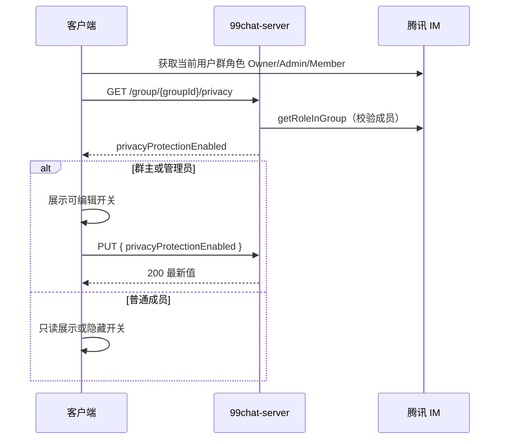
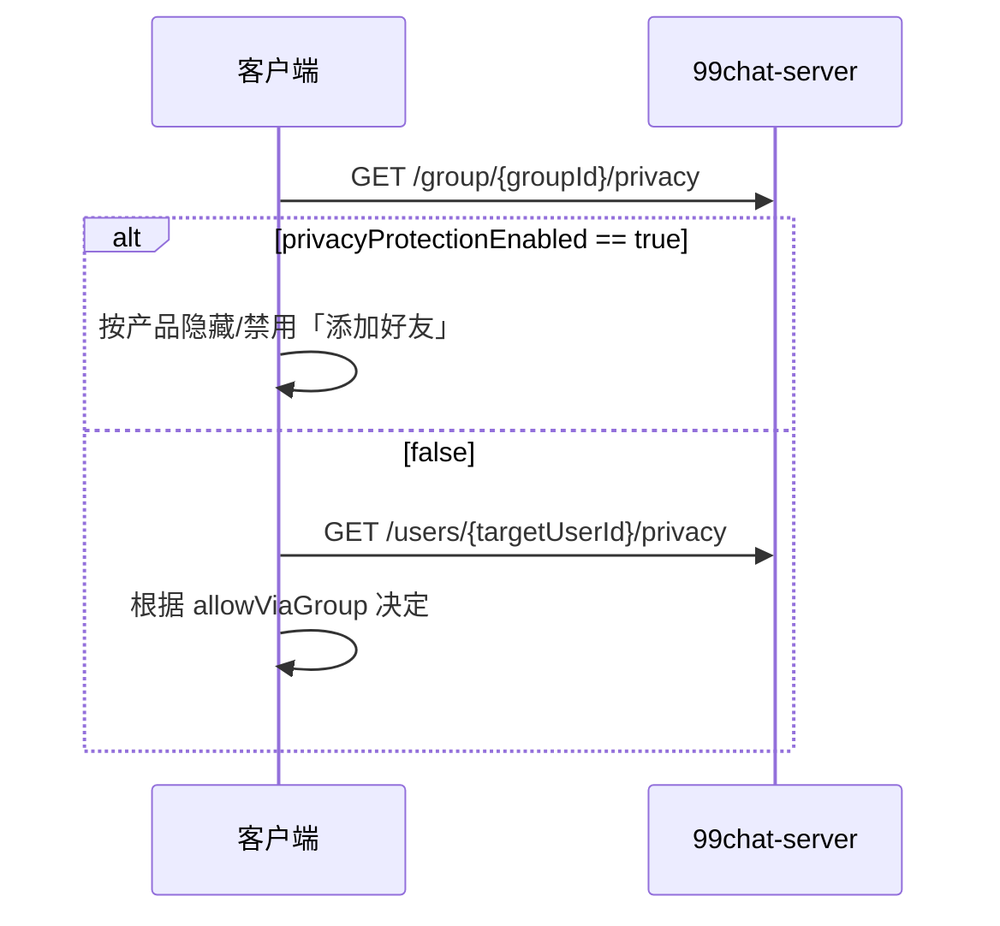

# 群隐私保护 — 客户端对接文档

> 版本：v1.0  
> 适用：99chat（Flutter / iOS / Android）  
> 范围：群设置页「群隐私保护」开关的读取与保存  
> Base URL：`http://47.239.60.107:8081`（开发环境，与现有业务 API 一致）

---

## 1. 总览

### 1.1 业务目标

- 群主 / 群管理员可在群设置中开启或关闭 **群隐私保护**。
- 开关状态由 **99chat-server** 持久化，客户端进入群设置、群资料、群聊内加好友等场景时以**服务端返回值为准**。
- 腾讯 IM 群资料（`GroupInfo`）**不包含**该字段，勿依赖 IM SDK 读写此开关。

### 1.2 字段说明

| 字段 | 类型 | 默认 | 含义 |
|------|------|------|------|
| `privacyProtectionEnabled` | boolean | `true` | 群隐私保护总开关；`true` 表示已开启保护（具体 UI 限制由客户端实现） |

未调用过 PUT 的群，GET 返回默认值 **`true`**（配置项 `chat99.group-privacy.default-privacy-protection-enabled`）。

### 1.3 与用户级隐私的区别

| 层级 | 接口 | 字段 | 作用 |
|------|------|------|------|
| **群级** | `GET/PUT /group/{groupId}/privacy` | `privacyProtectionEnabled` | 本群是否启用群隐私保护（群设置） |
| **用户级** | `GET /users/{userId}/privacy` | `allowViaGroup` | 该用户是否允许他人「通过群聊」加好友 |

两层**独立**。群聊内点击成员名片添加好友时，建议：

1. 若本群 `privacyProtectionEnabled == true` → 按产品规则限制（如隐藏加好友入口）。
2. 否则再查对方 `allowViaGroup`（或 `POST /users/add-friend/check`，`channel: "group"`）。

详见 [backend-add-friend-via-card-integration.md](./backend-add-friend-via-card-integration.md)。

---

## 2. 通用规范

| 项 | 值 |
|----|-----|
| 鉴权 | `Authorization: Bearer <JWT>`（登录接口返回） |
| Content-Type | `application/json` |
| 成功 | 2xx + JSON  body |
| 失败 | `{ "code": "<机器码>", "message": "<描述>" }` |

### 2.1 `groupId` 路径参数

- 与腾讯 IM 一致，Community 群示例：`@TGS#_abc123`
- URL 中 `#` 等字符需 **encode**：`@TGS%23_abc123`
- Dio / `Uri` 拼路径时建议使用 `Uri.encodeComponent(groupId)` 或框架自动编码

---

## 3. 接口

### 3.1 读取群隐私 — `GET /group/{groupId}/privacy`

**用途**：群设置页初始化开关；群聊内判断是否启用群级保护。

**请求**

```http
GET /group/@TGS%23_abc123/privacy HTTP/1.1
Host: 47.239.60.107:8081
Authorization: Bearer <token>
```

**成功 200**

```json
{
  "privacyProtectionEnabled": true
}
```

**错误**

| HTTP | code | 说明 | 客户端建议 |
|------|------|------|------------|
| 401 | — | 未登录 | 跳转登录 |
| 403 | `NOT_GROUP_MEMBER` | 当前用户不在群内 | 不展示设置项或提示无权限 |
| 400 | `INVALID_INPUT` | groupId 非法 | 检查参数 |

**权限**：群内任意成员（Owner / Admin / Member）均可读取。

---

### 3.2 保存群隐私 — `PUT /group/{groupId}/privacy`

**用途**：群主 / 管理员在群设置中切换开关并保存。

**请求**

```http
PUT /group/@TGS%23_abc123/privacy HTTP/1.1
Authorization: Bearer <token>
Content-Type: application/json

{
  "privacyProtectionEnabled": true
}
```

| 字段 | 必填 | 说明 |
|------|------|------|
| `privacyProtectionEnabled` | 是 | 不可为 `null`，否则 `400 INVALID_INPUT` |

**成功 200**

```json
{
  "privacyProtectionEnabled": true
}
```

**错误**

| HTTP | code | 说明 | 客户端建议 |
|------|------|------|------------|
| 403 | `NOT_GROUP_ADMIN` | 非群主/管理员 | 开关只读或隐藏 |
| 403 | `NOT_GROUP_MEMBER` | 非群成员 | 同 GET |
| 400 | `INVALID_INPUT` |  body 缺字段 | 校验表单 |

**权限**：仅 **Owner**、**Admin**（腾讯 IM `getRoleInGroup` 返回值）可修改。

---

## 4. 时序图

### 4.1 群设置页



### 4.2 群聊内加好友（与隐私联动）



---

## 5. Flutter 对接示例

### 5.1 API 封装

```dart
class GroupPrivacySettings {
  final bool privacyProtectionEnabled;
  GroupPrivacySettings({required this.privacyProtectionEnabled});
  factory GroupPrivacySettings.fromJson(Map<String, dynamic> j) =>
      GroupPrivacySettings(
        privacyProtectionEnabled: j['privacyProtectionEnabled'] as bool,
      );
}

class GroupPrivacyApi {
  GroupPrivacyApi(this.dio);
  final Dio dio;

  Future<GroupPrivacySettings> fetch(String groupId) async {
    final path = '/group/${Uri.encodeComponent(groupId)}/privacy';
    final r = await dio.get(path);
    return GroupPrivacySettings.fromJson(r.data as Map<String, dynamic>);
  }

  Future<GroupPrivacySettings> save(String groupId, bool enabled) async {
    final path = '/group/${Uri.encodeComponent(groupId)}/privacy';
    final r = await dio.put(
      path,
      data: {'privacyProtectionEnabled': enabled},
    );
    return GroupPrivacySettings.fromJson(r.data as Map<String, dynamic>);
  }
}
```

### 5.2 群设置页逻辑

```dart
// 进入页面前已知 imRole：Owner / Admin / Member
final settings = await groupPrivacyApi.fetch(groupId);
bool switchValue = settings.privacyProtectionEnabled;
final canEdit = imRole == 'Owner' || imRole == 'Admin';

// SwitchListTile(
//   value: switchValue,
//   onChanged: canEdit ? (v) async {
//     try {
//       final saved = await groupPrivacyApi.save(groupId, v);
//       setState(() => switchValue = saved.privacyProtectionEnabled);
//     } on DioException catch (e) {
//       if (e.response?.data['code'] == 'NOT_GROUP_ADMIN') { ... }
//     }
//   } : null,
// )
```

### 5.3 建议 UI 文案（供产品参考）

| 状态 | 标题 | 副标题（可选） |
|------|------|----------------|
| 关 | 群隐私保护 | 关闭后，群成员可按默认规则查看资料 |
| 开 | 群隐私保护 | 已开启，将限制群内资料与添加方式 |

文案由客户端维护；服务端仅返回 boolean。

---

## 6. curl 联调

```bash
BASE="http://127.0.0.1:8081"
TOKEN="<你的JWT>"
# Community 群 ID，注意 URL 编码
GID="@TGS#_yourGroupId"
ENC=$(python3 -c "import urllib.parse; print(urllib.parse.quote('$GID', safe=''))")

# 读取
curl -sS "$BASE/group/$ENC/privacy" \
  -H "Authorization: Bearer $TOKEN"

# 开启群隐私保护（需群主/管理员 Token）
curl -sS -X PUT "$BASE/group/$ENC/privacy" \
  -H "Authorization: Bearer $TOKEN" \
  -H "Content-Type: application/json" \
  -d '{"privacyProtectionEnabled":true}'
```

---

## 7. 验收用例

| # | 步骤 | 期望 |
|---|------|------|
| 1 | 管理员 GET 未配置过的群 | `privacyProtectionEnabled: true` |
| 2 | 管理员 PUT `true` 后再 GET | `true` |
| 3 | 普通成员 PUT | `403`，`code`: `NOT_GROUP_ADMIN` |
| 4 | 非成员 GET | `403`，`code`: `NOT_GROUP_MEMBER` |
| 5 | 无 Token GET | `401` |
| 6 | PUT body 缺字段 | `400`，`code`: `INVALID_INPUT` |
| 7 | `groupId` 含 `@TGS#_` | 编码后路径可正常 200 |

---

## 8. 数据与运维

- 表名：`group_settings`
- 主键：`group_id`（与 IM GroupId 一致）
- 列：`privacy_protection_enabled`、`created_at`、`updated_at`
- 由 JPA `ddl-auto: update` 自动维护，无需手工建表

配置（`application.yml`）：

```yaml
chat99:
  group-privacy:
    default-privacy-protection-enabled: true
```

---

## 9. 相关文档

| 文档 | 内容 |
|------|------|
| [group-avatar.md](./group-avatar.md) | 群头像上传（同 `/group/{groupId}/` 路径风格） |
| [community-group-invite.md](./community-group-invite.md) | Community 建群与审批 |
| [user-privacy-and-search.md](./user-privacy-and-search.md) | 用户隐私与搜索 |
| [backend-add-friend-via-card-integration.md](./backend-add-friend-via-card-integration.md) | 名片/群渠道加好友预检 |

---

## 10. 修订记录

| 版本 | 日期 | 说明 |
|------|------|------|
| v1.0 | 2026-05-23 | 群隐私保护 GET/PUT 对接文档 |
