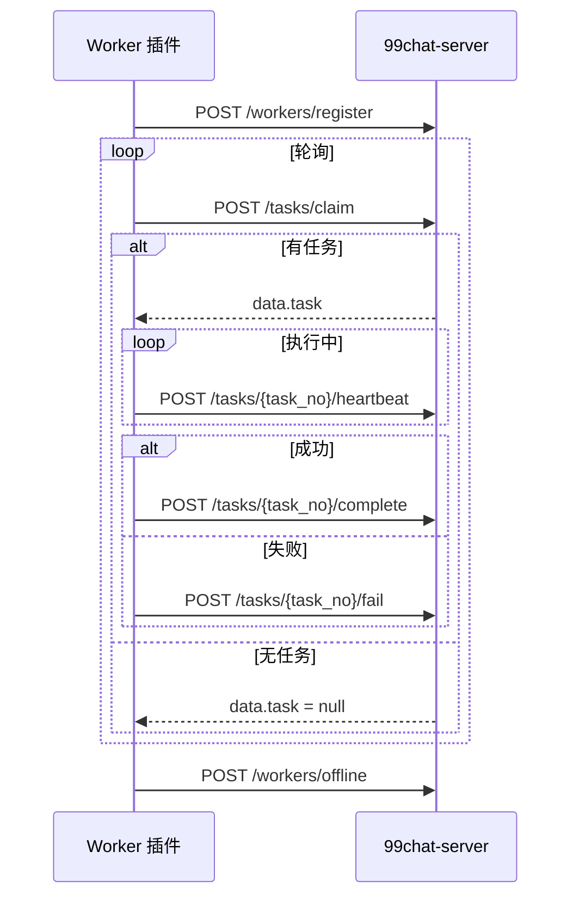

# 生活缴费 — 插件 / Worker 对接文档

> 版本：v1.0  
> 适用：支付宝自动化插件、ADB Worker、内部运维脚本  
> Base URL：`http://47.239.60.107:8081`（以部署为准）  
> 相关：[life-payment-client.md](./life-payment-client.md)（App 用户侧）、[life-payment-client.md#7-im-订单状态推送](./life-payment-client.md#7-im-订单状态推送)（IM 推送）

插件通过 **Worker API** 领取任务、上报心跳与执行结果。所有 Worker 接口均在 `/life-payments` 下，使用 **Bearer Token** 鉴权（非用户 JWT）。

成功响应统一信封：

```json
{ "code": 0, "message": "ok", "data": { ... } }
```

错误响应（非 2xx）：

```json
{ "code": "<error_code>", "message": "<中文或英文文案>" }
```

---

## 1. 鉴权

### 1.1 请求头

| Header | 必填 | 说明 |
|--------|------|------|
| `Authorization` | 是 | `Bearer <token>` |
| `X-Worker-Id` | 否 | 可代替 body 中的 `worker_id`（领任务/心跳/完成/失败） |
| `Content-Type` | POST | `application/json` |

### 1.2 Token 类型

| 类型 | 配置来源 | 约束 |
|------|----------|------|
| **全局 Token** | `LIFE_PAYMENT_WORKER_TOKEN`，留空则回退 `INTEGRATION_API_TOKEN` | 任意 `worker_id` |
| **设备专用 Token** | 管理端签发或 `scripts/seed-life-payment-workers.py` 预置 | **必须**与库中绑定的 `worker_id` 一致，否则 `403 FORBIDDEN` |

设备专用 Token 格式：`lpw_` + 48 位十六进制（例：`lpw_431874fea0bbcadc...`）。服务端仅存 SHA-256 哈希。

### 1.3 预置设备（示例）

| worker_id | 业务范围 | 说明 |
|-----------|----------|------|
| `lp-worker-electric-01` | electric, gas | 电费/燃气专用机 |
| `lp-worker-water-01` | water | 水费专用机 |
| `lp-worker-mobile-01` | mobile | 话费专用机 |
| `lp-worker-multi-01` | 全业务 | 全能备用机 |

明文 Token 部署后见服务器 `scripts/data/life-payment-worker-tokens.env`（勿提交 Git）。

### 1.4 签发 / 轮换 Token（Admin）

```http
POST /api/v1/life-payments/workers/{worker_id}/issue-token
Authorization: Bearer <admin_jwt>
Content-Type: application/json

{
  "device_id": "device-elec-01",
  "device_name": "电费燃气机-01",
  "support_service_types": ["electric", "gas"],
  "remark": "机房 A 区"
}
```

响应 `data.worker_token` **仅返回一次**，请立即保存；库内只存哈希。列表接口 `GET /api/v1/life-payments/workers` 仅返回 `has_token: true/false`。

---

## 2. 推荐运行流程



1. **上线**：`POST /workers/register`，声明 `worker_id`、设备信息与 `support_service_types`  
2. **领任务**：循环 `POST /tasks/claim`；`data.task == null` 表示当前无任务  
3. **执行**：按 `task_action` 操作支付宝；期间每 **15–30s** 调一次 `heartbeat`（超时默认 60s 会回收任务）  
4. **收尾**：`complete` 或 `fail`  
5. **下线**：`POST /workers/offline`

---

## 3. Worker 生命周期

### 3.1 注册上线

`POST /life-payments/workers/register`

```json
{
  "worker_id": "lp-worker-electric-01",
  "device_id": "device-elec-01",
  "device_name": "电费燃气机-01",
  "support_service_types": ["electric", "gas"],
  "app_version": "1.0.0"
}
```

响应 `data`：

```json
{
  "worker_id": "lp-worker-electric-01",
  "status": "online",
  "server_time": "2026-07-10 12:00:00"
}
```

### 3.2 下线

`POST /life-payments/workers/offline`

```json
{
  "worker_id": "lp-worker-electric-01",
  "reason": "maintenance"
}
```

---

## 4. 任务 API

### 4.1 领取任务

`POST /life-payments/tasks/claim`

```json
{
  "worker_id": "lp-worker-electric-01",
  "support_service_types": ["electric", "gas"]
}
```

**有任务** — `data`：

```json
{
  "task": {
    "task_no": "task-20260710-xxxx",
    "task_action": "pay",
    "service_type": "electric",
    "order_no": "lp-electric-20260710-xxxx",
    "query_no": "query-xxxx",
    "payment_status": "paid",
    "city_name": "北京",
    "provider_name": "国网北京市电力公司",
    "account_no": "1101010001",
    "confirmed_user_address": "朝阳区xxx",
    "amount": 50
  }
}
```

**无任务** — `data`：`{ "task": null }`

> 同一 Worker 已有 `running` 任务时，直接返回 `{ "task": null }`（忙碌态）。

`task_action` 枚举：

| 值 | 含义 |
|----|------|
| `query` | 户号查询（无 `order_no`，有 `query_no`） |
| `pay` | 水电燃气缴费 |
| `recharge` | 手机话费充值 |

领取缴费/充值任务后，用户订单状态会变为 `running`，并触发 IM 推送（见客户端文档 §7）。

### 4.2 心跳

`POST /life-payments/tasks/{task_no}/heartbeat`

```json
{
  "worker_id": "lp-worker-electric-01",
  "step": "opening_alipay",
  "message": "正在打开支付宝"
}
```

建议间隔 **≤ 30s**；超过 `LIFE_PAYMENT_TASK_HEARTBEAT_TIMEOUT_SECONDS`（默认 60）未心跳，任务可能被回收或标为需人工。

### 4.3 任务完成

`POST /life-payments/tasks/{task_no}/complete`

#### 户号查询成功

```json
{
  "worker_id": "lp-worker-electric-01",
  "plugin_status": "query_success",
  "user_address": "朝阳区xxx小区",
  "account_balance": "128.50",
  "suggest_amount": "50",
  "receipt": "optional-screenshot-url"
}
```

#### 缴费/充值 — 中间态（可多次回调）

`plugin_status` 为 `cashier_confirm` 或 `processing` 时，任务保持 `running`，需再次 `complete` 上报最终结果：

```json
{
  "worker_id": "lp-worker-electric-01",
  "plugin_status": "processing",
  "execution_status": "支付处理中",
  "receipt": "..."
}
```

#### 缴费/充值 — 最终成功

```json
{
  "worker_id": "lp-worker-electric-01",
  "plugin_status": "paid_success",
  "execution_status": "缴费成功",
  "paid_amount": 50,
  "alipay_trade_no": "2026xxxx",
  "receipt": "..."
}
```

手机充值可用 `recharge_status` 代替 `execution_status`。

响应 `data` 示例：

```json
{
  "task_no": "task-xxxx",
  "order_no": "lp-electric-xxxx",
  "order_status": "success",
  "message": "任务已完成"
}
```

### 4.4 任务失败

`POST /life-payments/tasks/{task_no}/fail`

```json
{
  "worker_id": "lp-worker-electric-01",
  "error_code": "network_error",
  "error_message": "页面加载超时",
  "plugin_status": "failed",
  "receipt": "..."
}
```

常见 `error_code`：

| error_code | 行为 |
|------------|------|
| `network_error` / `page_unknown` / `adb_error` | 可重试（未超 `max_attempts` 时任务回到 `ready`） |
| `waiting_owner_last_char` | 订单 → `need_owner_last_char`，等用户补字 |
| `need_manual` / `cashier_confirm` | 订单 → `need_manual` |
| `provider_not_found` / `account_not_found` / `payment_failed` 等 | 终态失败 |

---

## 5. 状态机（订单侧）

插件主要影响以下 `order_status`（完整说明见 [life-payment-client.md](./life-payment-client.md)）：

| order_status | 触发时机 |
|--------------|----------|
| `paid` | 用户已扣款，任务在队列 |
| `running` | Worker 已 claim |
| `processing` / `cashier_confirm` | complete 中间态 |
| `success` | complete 最终成功 |
| `failed` / `need_manual` / `need_owner_last_char` | fail 或超时回收 |

---

## 6. curl 示例

```bash
BASE=http://127.0.0.1:8081
TOKEN=lpw_your_device_token
WID=lp-worker-electric-01

# 注册
curl -sS -X POST "$BASE/life-payments/workers/register" \
  -H "Authorization: Bearer $TOKEN" -H 'Content-Type: application/json' \
  -d "{\"worker_id\":\"$WID\",\"support_service_types\":[\"electric\",\"gas\"]}"

# 领任务
curl -sS -X POST "$BASE/life-payments/tasks/claim" \
  -H "Authorization: Bearer $TOKEN" -H "X-Worker-Id: $WID" \
  -H 'Content-Type: application/json' \
  -d "{\"worker_id\":\"$WID\",\"support_service_types\":[\"electric\",\"gas\"]}"

# 心跳
curl -sS -X POST "$BASE/life-payments/tasks/<task_no>/heartbeat" \
  -H "Authorization: Bearer $TOKEN" -H 'Content-Type: application/json' \
  -d "{\"worker_id\":\"$WID\",\"step\":\"paying\"}"
```

---

## 7. 运维脚本

| 脚本 | 用途 |
|------|------|
| `scripts/patch-life-payment-worker-tokens.sql` | 已有库增加 `worker_token_hash` 列 |
| `scripts/seed-life-payment-workers.py` | 生成 4 台预置设备 Token（`--mysql` 写入库） |
| `scripts/migrate-life-payments.sql` | 全量建表（含 token 列） |

---

## 8. 实现注意

1. **worker_id 与 Token 绑定**：设备专用 Token 时，`worker_id` 必须与签发时一致（body 或 `X-Worker-Id`）。  
2. **心跳**：长任务必须持续 heartbeat，避免被回收。  
3. **幂等**：`complete` / `fail` 对已成功任务会安全忽略重复回调。  
4. **查询任务**：`task_action=query` 无订单号，不要调订单相关 IM；用户通过轮询 `GET /utility/queries/{query_no}` 获取结果。  
5. **安全**：Token 明文仅签发时可见；丢失请 Admin `issue-token` 轮换。
