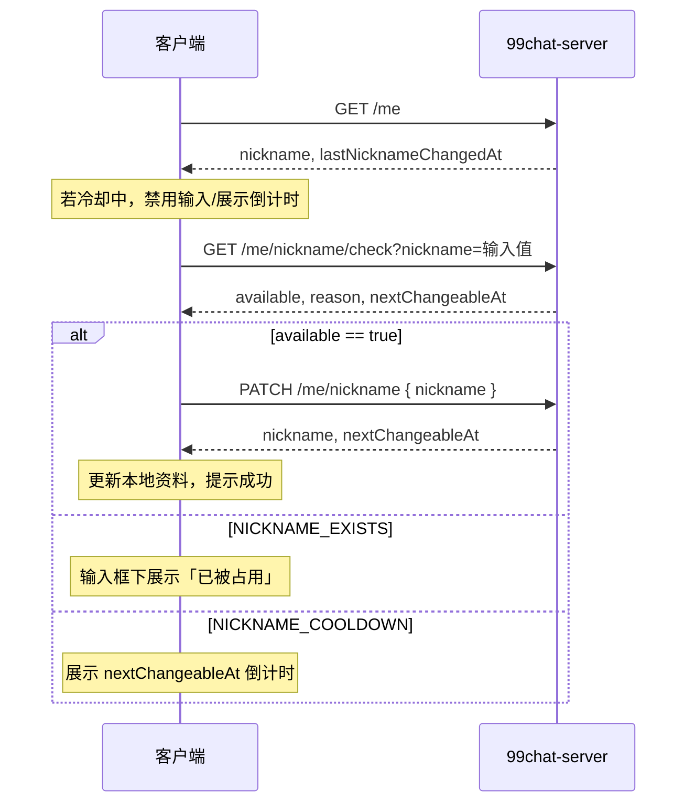

# 修改昵称 — 客户端对接文档

> 版本：v1.0  
> 适用：99chat（Flutter / iOS / Android）  
> 范围：已登录用户修改昵称、7 天冷却、全局唯一校验  
> 相关：[registration-and-login.md](./registration-and-login.md)（注册时昵称规则一致）

---

## 1. 业务规则

| 规则 | 说明 |
|------|------|
| 全局唯一 | 任意两个用户**不能**使用相同昵称（数据库 `UNIQUE`） |
| 7 天 1 次 | 自**上次成功修改**起 **7 天内**不可再改（`chat99.nickname.cooldown-days`，默认 7） |
| 注册后首次 | `lastNicknameChangedAt == null` 时**不受** 7 天限制，可随时第一次改名 |
| 与当前相同 | 提交昵称与当前一致：不扣次数、不报错，返回当前 `nextChangeableAt` |
| 格式 | trim 首尾空格后长度 **2–32** 字符 |
| IM 同步 | 修改成功后服务端调用腾讯云 IM `profile_update` 更新 Nick |

注册时昵称同样需唯一且符合长度；注册**不会**写入 `lastNicknameChangedAt`。

---

## 2. 鉴权与通用约定

- **Base URL**：`http://<host>:8081`
- **Header**：`Authorization: Bearer <token>`
- **Content-Type**：`application/json`
- **错误体**：`{ "code": "...", "message": "..." }`；冷却错误额外含 `nextChangeableAt`

---

## 3. 接口一览

| 方法 | 路径 | 说明 |
|------|------|------|
| GET | `/me` | 当前用户资料（含昵称、头像、上次修改时间） |
| POST | `/me/avatar` | 上传并修改头像（见 [user-avatar.md](./user-avatar.md)） |
| GET | `/me/nickname/check?nickname=` | 修改前预检（推荐） |
| PATCH | `/me/nickname` | 提交修改 |

---

## 4. 获取当前资料

### `GET /me`

**响应示例**

```json
{
  "userId": "a1b2c3d4e5",
  "phone": "+8613812345678",
  "phoneMasked": "+86138****5678",
  "nickname": "小明",
  "avatarUrl": "https://cdn.example.com/avatar/default.png",
  "lastNicknameChangedAt": "2026-05-16T10:00:00Z",
  "bypassDeviceCheck": false
}
```

| 字段 | 说明 |
|------|------|
| `nickname` | 当前昵称 |
| `lastNicknameChangedAt` | 上次**成功修改**时间；`null` 表示注册后尚未改过，可随时第一次修改 |

**客户端计算「下次可改时间」**

```
若 lastNicknameChangedAt == null → 现在即可改
否则 nextChangeableAt = lastNicknameChangedAt + 7 天
若 now < nextChangeableAt → 展示倒计时，禁用保存按钮
```

---

## 5. 修改前预检（推荐）

在用户点击「保存」前，可对输入框内容做防抖后调用，避免无效提交。

### `GET /me/nickname/check?nickname={urlEncoded}`

**Query**

| 参数 | 必填 | 说明 |
|------|------|------|
| `nickname` | 是 | 用户输入的昵称（服务端会 trim） |

**示例**

```
GET /me/nickname/check?nickname=%E6%96%B0%E6%98%B5%E5%8F%8B
```

### 响应

**可修改**

```json
{
  "available": true,
  "reason": null,
  "nextChangeableAt": "2026-05-30T12:00:00Z"
}
```

- `nextChangeableAt`：若本次修改成功，**下一次**可改时间（约当前时间 + 7 天）。

**昵称已被占用**

```json
{
  "available": false,
  "reason": "NICKNAME_EXISTS",
  "nextChangeableAt": null
}
```

**7 天冷却中**

```json
{
  "available": false,
  "reason": "NICKNAME_COOLDOWN",
  "nextChangeableAt": "2026-05-23T10:00:00Z"
}
```

- `nextChangeableAt`：冷却结束时间，用于 UI 倒计时。

**与当前昵称相同**

```json
{
  "available": true,
  "reason": null,
  "nextChangeableAt": "2026-05-23T10:00:00Z"
}
```

`available=true` 但点保存时 PATCH 不会改变昵称（无副作用）。

### `reason` 枚举

| reason | 含义 | UI 建议 |
|--------|------|---------|
| `null` | 可以修改（或仅与当前相同） | 允许保存 |
| `NICKNAME_EXISTS` | 其他用户已占用 | 提示「昵称已被使用」 |
| `NICKNAME_COOLDOWN` | 7 天内已改过 | 提示「x 天后可再次修改」+ 倒计时 |

### 格式错误

`400 INVALID_INPUT` — 长度不在 2–32（trim 后）或参数缺失。

---

## 6. 提交修改

### `PATCH /me/nickname`

**请求**

```json
{
  "nickname": "新昵称"
}
```

**成功 200**

```json
{
  "nickname": "新昵称",
  "nextChangeableAt": "2026-05-30T12:00:00Z"
}
```

- 更新本地缓存的 `nickname` 与 `lastNicknameChangedAt`（可设为 `now`）。
- 用 `nextChangeableAt` 锁定 7 天内编辑入口。
- IM SDK 侧昵称一般由服务端 `profile_update` 同步；若本地有缓存，可监听资料变更或重新拉 profile。

**失败**

| HTTP | code | 响应体 |
|------|------|--------|
| 400 | `INVALID_INPUT` | 长度不合法等 |
| 401 | — | 未登录 / token 失效 |
| 404 | `USER_NOT_FOUND` | 用户不存在 |
| 409 | `NICKNAME_EXISTS` | `{ "code", "message" }` |
| 409 | `NICKNAME_COOLDOWN` | 含 **`nextChangeableAt`**（ISO-8601） |

**冷却错误示例**

```json
{
  "code": "NICKNAME_COOLDOWN",
  "message": "nickname can only be changed once every 7 days",
  "nextChangeableAt": "2026-05-23T10:00:00Z"
}
```

---

## 7. 推荐 UI 流程



### 交互建议

1. **进入页**：`GET /me` 判断是否处于冷却期。  
2. **输入时**：防抖 300–500ms 调 `check`；`NICKNAME_EXISTS` 实时红字。  
3. **保存**：可先不调 check，直接 PATCH；以 PATCH 结果为准（防并发）。  
4. **冷却期**：保存按钮置灰，文案如「2026-05-23 后可修改」。  
5. **注册页**：仅 `POST /auth/register` 带 `nickname`，规则相同（唯一 + 2–32），无 7 天限制。

---

## 8. Flutter 示例（伪代码）

```dart
class NicknameApi {
  final Dio dio;

  Future<MeProfile> me() async {
    final r = await dio.get('/me');
    return MeProfile.fromJson(r.data);
  }

  Future<NicknameCheck> check(String nickname) async {
    final r = await dio.get(
      '/me/nickname/check',
      queryParameters: {'nickname': nickname},
    );
    return NicknameCheck.fromJson(r.data);
  }

  Future<NicknameUpdate> update(String nickname) async {
    final r = await dio.patch('/me/nickname', data: {'nickname': nickname});
    return NicknameUpdate.fromJson(r.data);
  }
}

bool canEditNickname(MeProfile me) {
  final last = me.lastNicknameChangedAt;
  if (last == null) return true;
  return DateTime.now().toUtc().isAfter(last.add(const Duration(days: 7)));
}
```

---

## 9. 错误码速查

| code | HTTP | 场景 |
|------|------|------|
| `INVALID_INPUT` | 400 | 昵称过短/过长、空参数 |
| `NICKNAME_EXISTS` | 409 | 与其他用户重复 |
| `NICKNAME_COOLDOWN` | 409 | 7 天内已修改过 |
| `USER_NOT_FOUND` | 404 | 账号异常 |

---

## 10. 配置（运维）

```yaml
chat99:
  nickname:
    cooldown-days: 7
    min-length: 2
    max-length: 32
```

---

## 11. 联调检查清单

- [ ] `GET /me` 返回 `lastNicknameChangedAt`（新用户为 `null`）
- [ ] 首次 `PATCH` 成功，`lastNicknameChangedAt` 有值
- [ ] 7 天内第二次 `PATCH` → 409 `NICKNAME_COOLDOWN` 且带 `nextChangeableAt`
- [ ] 占用他人昵称 → `check` 与 `PATCH` 均为 `NICKNAME_EXISTS`
- [ ] 提交与当前相同昵称 → 200，昵称不变
- [ ] 输入 `"  ab  "` → 存为 `"ab"`（trim）

---

## 12. 修订记录

| 版本 | 日期 | 说明 |
|------|------|------|
| v1.0 | 2026-05-23 | 昵称修改 + 预检接口客户端文档 |
