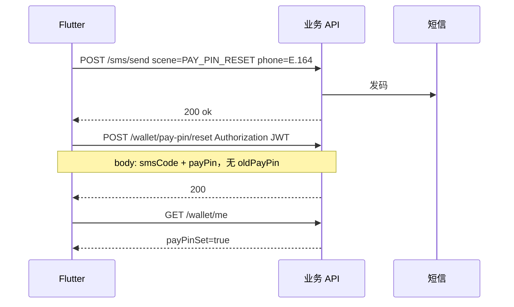
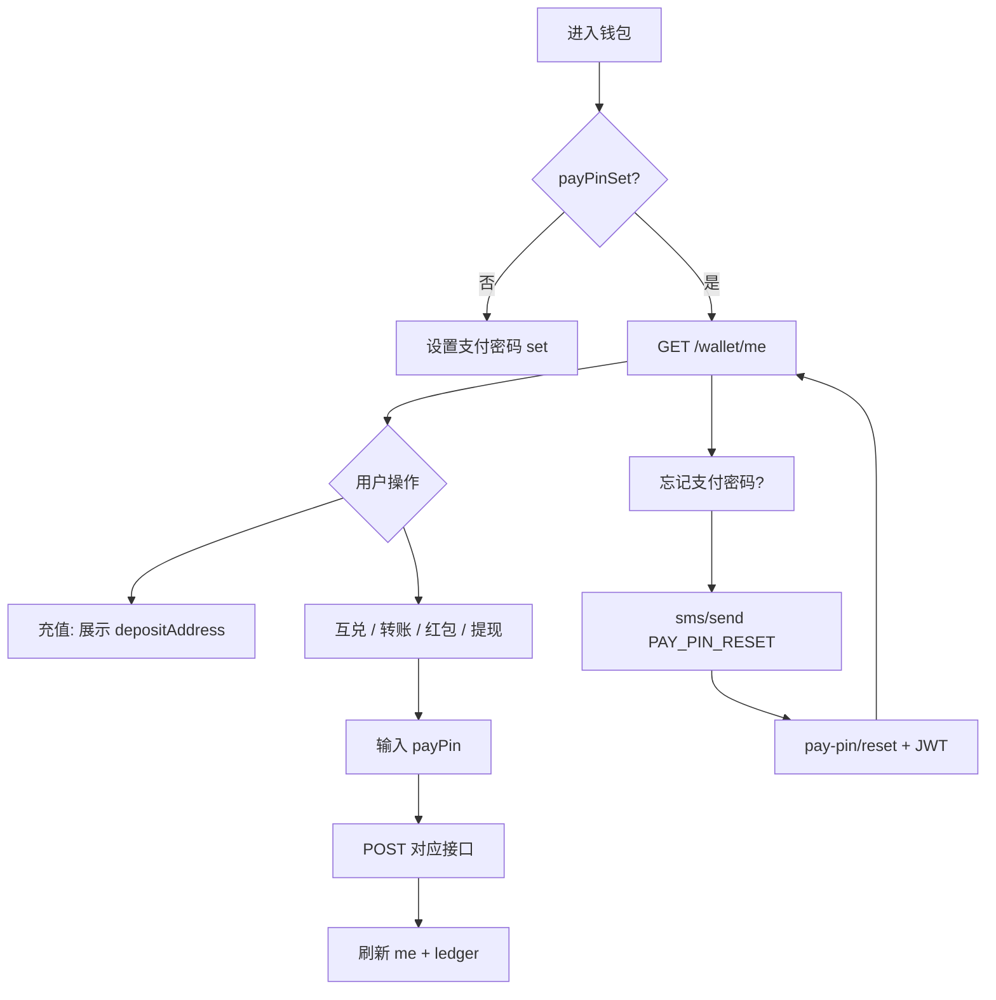

# 钱包与双币种 — 客户端对接文档

> 版本：v1.1  
> 适用：99chat Flutter  
> Base URL：`http://47.239.60.107:8081`（以部署为准）  
> 后端模块说明：[wallet.md](./wallet.md)

---

## 1. 总览

| 能力 | 说明 |
|------|------|
| **USDT** | TRC20 链上充值到个人地址；平台内转账 **不上链、无手续费**；可提现到任意 TRON 地址 |
| **平台币（代码 `99`）** | 锚定人民币，UI 可展示为「99」或「元」；库内单位为 **分**（`1 元 = 100 分`）；**不可提现** |
| **互兑** | USDT ↔ 平台币，汇率来自 Frankfurter + 运营浮动；换算 **向下取整** |
| **转账 / 红包** | 发起时选择 `USDT` 或 `99`；需 **6 位支付密码** |
| **充值** | 最小 **1 USDT**；约 **19 个区块确认**后到账（通常十余分钟量级） |

### 1.1 金额单位（必读）

| currency | 字段类型 | 客户端展示 |
|----------|----------|------------|
| `USDT` | `long` **micro**（6 位小数） | `amountMicro / 1_000_000` 显示 USDT |
| `99` | `long` **fen**（2 位小数） | `balances.platformFen` 存金额；**币种名**在 `currency` 字段里填 `"99"` |

请求/响应里的 **`currency`** 填 **`"99"`** 表示平台币（兼容旧值 `PLATFORM`）。**不是**把余额字段名叫 `99`。

示例：`amountMicro: 1500000` → 1.5 USDT；`amountFen: 8800` → 88.00 元。

### 1.2 鉴权

除注册/登录外，钱包接口均需：

```http
Authorization: Bearer <token>
Content-Type: application/json
```

### 1.3 统一响应信封（必读，App 端全局）

自本版本起，**App 端**接口（除运营后台 `/admin/**`、`/api/v1/**` 与第三方回调 `/webhook/**` 外）的 **成功响应（HTTP 2xx）** 统一包装为：

```json
{
  "code": 0,
  "message": "ok",
  "data": <原始业务数据>
}
```

- 判断成功：`HTTP 2xx` 且 `code == 0`。业务数据一律取 `data`。
- 分页接口的 `data` 为统一分页结构：

```json
{
  "content": [ /* ... */ ],
  "page": 0,
  "size": 20,
  "totalElements": 135,
  "totalPages": 7
}
```

> 注意：除 `GET /wallet/ledger` 已采用上述统一分页结构外，其余列表接口（如 `/wallet/transfers`、`/wallet/exchanges`、`/wallet/red-packets`、`/wallet/withdrawals`、`/wallet/deposits`）的 `data` 仍为 Spring Data `Page` JSON（含 `content`、`totalElements`、`number`、`size` 等），同样包在信封内。
>
> 本文后续各接口示例若未特别说明，给出的均为 **`data` 内的内容**（已省略外层信封）。

### 1.4 错误体

错误响应（**非 2xx**）保持既有格式，**不**包裹成功信封：

```json
{
  "code": "INSUFFICIENT_BALANCE",
  "message": "INSUFFICIENT_BALANCE"
}
```

钱包常见 `code` 见 [§10](#10-错误码)。

---

## 2. 注册与钱包地址

注册成功时响应新增 `wallet`（老版本客户端可忽略该字段）。

### `POST /auth/register`

请求不变，见 [registration-and-login.md](./registration-and-login.md)。

**200 示例**

```json
{
  "token": "eyJ...",
  "expiresIn": 7776000,
  "userId": "abc12def34",
  "nextStep": "OK",
  "wallet": {
    "depositAddress": "TXYZ...",
    "usdtContract": "TR7NHqjeKQxGTCi8q8ZY4pL8otSzgjLj6t",
    "minDepositUsdt": "1"
  }
}
```

| 字段 | 说明 |
|------|------|
| `depositAddress` | 用户专属 TRC20 充值地址（Base58） |
| `usdtContract` | USDT 合约地址，扫码/展示用 |
| `minDepositUsdt` | 最小充值额（字符串，单位 USDT） |

**充值 UI**：展示地址 + 二维码；提示仅支持 **TRC20 USDT**、最小 1 USDT、到账时间取决于链上确认。

登录接口（`/auth/login/sms` 等）**不**返回 `wallet`；进入钱包页时调 `GET /wallet/me`。

---

## 3. 钱包首页

### `GET /wallet/me`

**200**

```json
{
  "depositAddress": "TXYZ...",
  "usdtContract": "TR7NHqjeKQxGTCi8q8ZY4pL8otSzgjLj6t",
  "minDepositUsdt": "1",
  "balances": {
    "usdtMicro": 2500000,
    "platformFen": 128800
  },
  "usdtPrice": {
    "cnyPerUsdt": 7.2456,
    "cnyPerUsdtBuy": 7.2090,
    "cnyPerUsdtSell": 7.2822,
    "quoteCurrency": "CNY",
    "updatedAt": "2026-05-23T10:00:00Z"
  },
  "platformCurrency": "99",
  "payPinSet": true
}
```

| 字段 | 说明 |
|------|------|
| `usdtPrice` | **USDT 兑人民币价格**（1 USDT = `cnyPerUsdt` 元）；`buy`/`sell` 为互兑方向参考价（含运营浮动）；汇率不可用时为 `null` |
| `platformCurrency` | 平台币币种代码，固定 **`99`**（不是金额） |
| `payPinSet` | `false` 时须先引导 `POST /wallet/pay-pin/set`，否则转账/红包/提现/互兑会返回 `403 PAY_PIN_NOT_SET` |

---

## 3.1 币种资产列表

### `GET /wallet/currencies`

钱包资产页专用：返回各币种的 logo、名称、参考价、余额及充提能力。

**200**

```json
{
  "currencies": [
    {
      "code": "99",
      "name": "99币",
      "logoUrl": "https://99chat.oss-cn-hongkong.aliyuncs.com/wallet/platform.png",
      "price": 1.0,
      "priceCurrency": "CNY",
      "amount": 128800,
      "amountUnit": "fen",
      "decimals": 2,
      "amountDisplay": "1288.00",
      "availableAmount": 128800,
      "frozenAmount": 0,
      "depositEnabled": false,
      "withdrawEnabled": false,
      "platformCoin": true,
      "sortOrder": 1
    },
    {
      "code": "USDT",
      "name": "USDT",
      "logoUrl": "https://99chat.oss-cn-hongkong.aliyuncs.com/wallet/usdt.png",
      "price": 7.2456,
      "priceCurrency": "CNY",
      "amount": 2500000,
      "amountUnit": "micro",
      "decimals": 6,
      "amountDisplay": "2.500000",
      "availableAmount": 2500000,
      "frozenAmount": 0,
      "depositEnabled": true,
      "withdrawEnabled": true,
      "platformCoin": false,
      "sortOrder": 2
    }
  ],
  "priceUpdatedAt": "2026-06-07T10:00:00Z"
}
```

| 字段 | 说明 |
|------|------|
| `code` | 币种代码：`USDT`、`99` |
| `name` | 展示名称（运营可配） |
| `logoUrl` | Logo 图片 URL（运营可配） |
| `price` | 1 展示单位兑 `priceCurrency` 的价格；USDT 为实时汇率，99 固定 `1.0`；不可用时为 `null` |
| `priceCurrency` | 固定 `CNY` |
| `amount` | 原始整数余额（USDT=micro，99=fen） |
| `amountUnit` | `micro` / `fen` |
| `decimals` | 展示小数位数 |
| `amountDisplay` | 服务端格式化后的余额字符串 |
| `availableAmount` | 可用余额 |
| `frozenAmount` | 冻结余额（USDT 提现 PENDING 时计入） |
| `depositEnabled` | 是否展示充值入口 |
| `withdrawEnabled` | 是否展示提现入口 |
| `platformCoin` | 是否平台币 |
| `sortOrder` | 列表排序 |
| `priceUpdatedAt` | 汇率更新时间；不可用时为 `null` |

---

## 4. 支付密码

6 位数字，与**登录密码**独立。忘记登录密码走 `scene=RESET` + `/auth/password/reset`；忘记支付密码走本节 **`PAY_PIN_RESET`**，两套验证码**不能混用**。

| 方式 | 接口 | 是否需要旧 PIN | 是否需要短信 |
|------|------|----------------|--------------|
| 首次设置 | `POST /wallet/pay-pin/set` | — | 否 |
| 记得旧 PIN | `POST /wallet/pay-pin/change` | 是 | 否 |
| 忘记 PIN | `POST /wallet/pay-pin/reset` | **否** | 是（`PAY_PIN_RESET`） |

### `POST /wallet/pay-pin/set`（首次）

```json
{ "payPin": "123456" }
```

**200** 空 body。  
**409** `PAY_PIN_ALREADY_SET`

### `POST /wallet/pay-pin/change`（记得旧密码时）

```json
{
  "oldPayPin": "123456",
  "newPayPin": "654321"
}
```

**403** `PAY_PIN_INVALID` / `PAY_PIN_LOCKED`

### `POST /wallet/pay-pin/reset`（短信重置，**无需旧密码**）

**前置**：向绑定手机发码

```http
POST /sms/send
```

```json
{
  "phone": "+8613812345678",
  "scene": "PAY_PIN_RESET"
}
```

要求：`phone` 为当前账号绑定手机（E.164）；用户须已注册。

**重置**（需登录态 JWT）：

```json
{
  "smsCode": "123456",
  "payPin": "654321"
}
```

**200** 空 body。成功后 `payPinSet=true`，锁定状态会清除。

| HTTP | code | 说明 |
|------|------|------|
| 410 | `SMS_CODE_INVALID` | 验证码错误或过期 |
| 403 | `ACCOUNT_DISABLED` | 账号禁用 |
| 400 | `INVALID_PAY_PIN` | 非 6 位数字 |

> 未登录也可先 `POST /sms/send`；重置接口必须带 `Authorization`，服务端用 JWT 用户绑定手机校验验证码，无需在 body 里再传手机号。

**忘记支付密码（时序）**



发码参数与 [registration-and-login.md §8.1](./registration-and-login.md) 中 `POST /sms/send` 一致；`scene` 填 `PAY_PIN_RESET`，`phone` 必须为 **GET /me** 或注册资料中的绑定手机。

---

## 5. 充值记录

### `GET /wallet/deposits?page=0&size=20`

Spring Data 分页，**200** 为 Page JSON，例如：

```json
{
  "content": [
    {
      "id": 1,
      "userId": "abc12def34",
      "txId": "a1b2...",
      "logIndex": 0,
      "fromAddress": "TFrom...",
      "toAddress": "TTo...",
      "amountMicro": 10000000,
      "confirmations": 19,
      "status": "CREDITED",
      "blockTimestamp": "2026-05-23T10:00:00Z",
      "creditedAt": "2026-05-23T10:18:00Z",
      "createdAt": "2026-05-23T10:05:00Z"
    }
  ],
  "totalElements": 1,
  "totalPages": 1,
  "number": 0,
  "size": 20
}
```

| status | 客户端文案建议 |
|--------|----------------|
| `CONFIRMING` | 确认中（`confirmations/19`） |
| `CREDITED` | 已到账 |
| `FAILED` | 失败 |

到账后余额增加，以 `GET /wallet/me` 或流水为准。

---

## 6. 交易记录查询

除各业务 **POST** 返回当次结果外，可用下列 **GET** 分页查询历史。均需 JWT。

### 6.0 接口与业务对照

| 业务 | 专用列表 API | 统一流水 `ledgerType`（可多选筛选） |
|------|----------------|-------------------------------------|
| 链上充值 | `GET /wallet/deposits` | `DEPOSIT` |
| 提现（链上出金） | `GET /wallet/withdrawals` | `WITHDRAW` |
| 平台内转账 | `GET /wallet/transfers` | `TRANSFER_OUT` / `TRANSFER_IN` |
| 闪兑（互兑） | `GET /wallet/exchanges` | `EXCHANGE_OUT` / `EXCHANGE_IN`（可能有 `FEE`） |
| 发红包 | `GET /wallet/red-packets?role=sent` | `RED_PACKET_SEND` |
| 领红包 | `GET /wallet/red-packets?role=received` | `RED_PACKET_RECEIVE` |
| 红包退回 | 无专用列表；见流水或红包详情 `status=REFUNDED` | `RED_PACKET_REFUND` |

> **说明**：USDT 转给其他用户为 **平台内账本转账**，不上链；链上记录仅 **充值 / 提现**。  
> 流水 `refType` + `refId` 可关联业务单（如 `TRANSFER` + 转账单 id、`EXCHANGE` + 互兑单 id、`RED_PACKET` + 红包 id）。

通用分页参数：`page`（从 0）、`size`（默认 20）。响应统一包在信封 `data` 内（见 [§1.3](#13-统一响应信封必读app-端全局)）：`/wallet/ledger` 为统一分页结构，其余列表为 Spring Data `Page` JSON（`content`、`totalElements` 等）。

---

### 6.1 平台内转账记录 — `GET /wallet/transfers`

| 参数 | 说明 |
|------|------|
| `direction` | `sent` 我发出 / `received` 我收到 / `all` 全部（默认 `all`） |

**200** `content[]` 为 `WalletTransfer`：

```json
{
  "id": 12,
  "fromUserId": "abc12def34",
  "toUserId": "xyz99abcde",
  "currency": "USDT",
  "amount": 500000,
  "feeAmount": 0,
  "memo": "午饭",
  "createdAt": "2026-05-23T12:00:00Z"
}
```

---

### 6.2 闪兑（互兑）记录 — `GET /wallet/exchanges`

**200** `content[]` 为 `WalletExchangeOrder`：

```json
{
  "id": 5,
  "userId": "abc12def34",
  "direction": "USDT_TO_PLATFORM",
  "inputAmount": 1000000,
  "outputAmount": 720,
  "surplusFen": 0,
  "rateSnapshot": "{\"usdCny\":7.2,...}",
  "createdAt": "2026-05-23T12:00:00Z"
}
```

---

### 6.3 红包记录 — `GET /wallet/red-packets`

| 参数 | 说明 |
|------|------|
| `role` | `sent` 我发出的红包（默认）/ `received` 我领取的记录 |

- `role=sent`：`content[]` 为 `WalletRedPacket`
- `role=received`：`content[]` 为 `WalletRedPacketClaim`（含 `packetId`，可再查详情）

---

### 6.4 红包详情与领取明细

#### `GET /wallet/red-packet/{id}`

需 JWT。返回发包信息 + 领取列表：

```json
{
  "packet": {
    "id": 10,
    "orderId": 10,
    "publicId": "red_packet_58b05f2a-875f-4f1d-bd32-7975357efa2a",
    "senderUserId": "abc12def34",
    "packetType": "LUCKY_GROUP",
    "conversationType": "GROUP",
    "groupId": "@TGS#xxx",
    "exclusiveUserId": null,
    "toUserId": null,
    "currency": "99",
    "totalAmount": 10000,
    "amount": 10000,
    "remainingAmount": 8000,
    "remainingCount": 4,
    "expiresAt": "2026-05-24T12:00:00Z",
    "createdAt": "2026-05-23T12:00:00Z"
  },
  "claims": [],
  "claimState": "CAN_OPEN",
  "myClaimAmount": null
}
```

`GROUP_TRANSFER`（群转账）示例要点：

```json
{
  "packet": {
    "id": 368,
    "orderId": 368,
    "publicId": "red_packet_....",
    "senderUserId": "abc12def34",
    "packetType": "GROUP_TRANSFER",
    "conversationType": "GROUP",
    "groupId": "m25KMR3N5CY",
    "exclusiveUserId": "xyz99abcde",
    "toUserId": "xyz99abcde",
    "currency": "USDT",
    "totalAmount": 1000000,
    "amount": 1000000,
    "status": "COMPLETED",
    "displayTitle": "群转账"
  },
  "claims": [ ... ],
  "claimState": "RECEIVED",
  "myClaimAmount": 1000000
}
```

| 字段（`packet` 内） | 说明 |
|---------------------|------|
| `orderId` | 等同数字 `id`，与 IM 卡 `orderId` 对齐 |
| `amount` | 等同 `totalAmount`，与 IM 卡 `amount` 对齐 |
| `toUserId` | 等同 `exclusiveUserId`（收款方）；群抢红包常为 null |
| `groupId` / `senderUserId` | 群会话 / 发卡校验必用 |
| `displayTitle` | 仅 `GROUP_TRANSFER` 为「群转账」，其它类型省略 |
| `currency` | API 码：`USDT` / `99`（非枚举名 PLATFORM） |

> 群转账查卡请走本接口，**不要**调 `GET /wallet/transfer/{id}`（那是单聊转账表）。

| claimState | 含义 | 前端 UI |
|------------|------|---------|
| `CAN_OPEN` | 可领取（`ACTIVE` 且有余量，当前用户未领） | 显示「开」 |
| `RECEIVED` | 当前用户已领取 | 显示「已领取」；`myClaimAmount` 为到账金额 |
| `EMPTY` | 已抢完 / 已过期退回 / 不可再领 | 显示「已抢完」 |

#### `GET /wallet/red-packet/{id}/claim-state`（轻量，推荐气泡用）

仅需 JWT，不返回领取列表，适合会话列表刷新状态：

```json
{
  "claimState": "CAN_OPEN",
  "myClaimAmount": null,
  "packetStatus": "ACTIVE",
  "remainingCount": 4,
  "orderId": 10,
  "publicId": "red_packet_....",
  "packetType": "LUCKY_GROUP",
  "senderUserId": "abc12def34",
  "groupId": "@TGS#xxx",
  "toUserId": null,
  "currency": "99",
  "amount": 10000,
  "displayTitle": null
}
```

气泡做 `_securedWalletCard` 时可只用本接口校验 `senderUserId` / `groupId` / `amount` / `toUserId`，不必每次拉完整详情。

| HTTP | 说明 |
|------|------|
| 403 `NOT_GROUP_MEMBER` | 非该群成员（群红包） |
| 403 `FORBIDDEN` | 其他无权限查看 |
| 404 | 红包不存在 |

可查看条件：发送方；`exclusiveUserId`；已领取用户；或 **当前用户为该群成员** 的群红包（`conversationType=GROUP`，经 IM 校验成员身份）。

#### `GET /wallet/red-packet/{id}/claims`

返回该红包的领取明细数组（权限同详情）。`data` 为 `RedPacketClaimRecord[]`：

```json
[
  {
    "id": "101",
    "userId": "xyz99abcde",
    "currency": "99",
    "amount": 3200,
    "createdAt": "2026-05-23T12:01:00Z",
    "bestLuck": true,
    "nickName": "小明",
    "avatarUrl": "https://.../avatar.png"
  }
]
```

| 字段 | 类型 | 说明 |
|------|------|------|
| `id` | String | 领取记录 id |
| `userId` | String | 领取人 userId |
| `currency` | String | 币种 `USDT` / `99`（取自红包） |
| `amount` | long | 领取金额（USDT=micro，99=fen） |
| `createdAt` | String | 领取时间 |
| `bestLuck` | boolean | 是否「手气最佳」（仅 `LUCKY_GROUP` 多份红包，金额最大的一条为 `true`） |
| `nickName` | String? | 领取人昵称（取自 IM，可能为空；为空时前端可自行用 IM 资料补全） |
| `avatarUrl` | String? | 领取人头像（同上） |

---

### 6.5 提现记录 — `GET /wallet/withdrawals`

见 [§10.2](#102-提现记录)。

---

### 6.6 统一资金流水 — `GET /wallet/ledger`

**200** 分页，`content[]` 示例：

```json
{
  "id": 100,
  "userId": "abc12def34",
  "currency": "USDT",
  "amount": -500000,
  "balanceAfter": 2000000,
  "ledgerType": "TRANSFER_OUT",
  "refType": "TRANSFER",
  "refId": 12,
  "counterpartUserId": "xyz99abcde",
  "remark": "午饭",
  "createdAt": "2026-05-23T12:00:00Z"
}
```

**字段说明**

| 字段 | 类型 | 说明 |
|------|------|------|
| `id` | Long | 流水 ID |
| `userId` | String | 用户 ID |
| `currency` | String | 币种：`USDT` / `99`（库内 `CNY`、`PLATFORM` 统一展示为 `99`） |
| `amount` | long | 变动额，**正=入账，负=出账**（`USDT` 单位 micro，`99` 单位 fen） |
| `balanceAfter` | long | 本次变动后该币种余额 |
| `ledgerType` | String | 账变类型（见下表） |
| `refType` | String | 关联业务类型，如 `TRANSFER`、`EXCHANGE`、`WITHDRAW`、`ADMIN_ADJUST` |
| `refId` | Long | 关联业务单 ID（运营调账时可为 `null`） |
| `counterpartUserId` | String | 对手方用户 ID（转账/红包时有值，否则 `null`） |
| `remark` | String | 备注 |
| `packetType` | String | 红包关联时有值（如 `GROUP_TRANSFER`） |
| `displayTitle` | String | 可选展示标题；`packetType=GROUP_TRANSFER` 时为 **「群转账」**；其它类型通常省略，客户端按原逻辑显示「红包」 |
| `createdAt` | Instant | 创建时间（ISO8601 UTC） |

> 分页外层为标准 Spring `Page`：`content[]`、`totalElements`、`totalPages`、`number`、`size`、`first`、`last`。

| ledgerType | 含义 |
|------------|------|
| `DEPOSIT` | 链上充值入账；**运营后台调增**亦记为此类型，`refType=ADMIN_ADJUST`，`remark` 多为「后台调账」 |
| `WITHDRAW` | 提现扣款；**运营后台调减**亦记为此类型，`refType=ADMIN_ADJUST` |
| `TRANSFER_OUT` / `TRANSFER_IN` | 转账出/入 |
| `RED_PACKET_SEND` / `RED_PACKET_RECEIVE` / `RED_PACKET_REFUND` | 红包发出/领取/退回 |
| `EXCHANGE_OUT` / `EXCHANGE_IN` | 互兑出/入 |
| `FEE` | 手续费 |

`amount` 有符号：正=入账，负=出账。

**按类型筛选**（可选，可重复传参）：

```http
GET /wallet/ledger?ledgerType=TRANSFER_OUT&ledgerType=TRANSFER_IN&page=0&size=20
```

未传 `ledgerType` 时返回全部类型。

#### 按来源筛选 `source`（链上 vs 内部）

可选参数 `source`，用于把「链上充提」与「运营后台调账」分成独立分页（不传则行为不变）：

| `source` | 含义 |
|----------|------|
| `CHAIN` | 真实链上充值/提现（`refType=DEPOSIT`/`WITHDRAW`） |
| `INTERNAL` | 运营后台调账（`refType=ADMIN_ADJUST`） |

`source` 与单个 `ledgerType`（`DEPOSIT` 或 `WITHDRAW`）配合，分页准确。

#### 钱包记录页筛选 Tab → 请求参数

| 筛选 Tab | 请求 |
|----------|------|
| 全部 | `GET /wallet/ledger` |
| 链上充币 | `?ledgerType=DEPOSIT&source=CHAIN` |
| 内部充币 | `?ledgerType=DEPOSIT&source=INTERNAL` |
| 链上提币 | `?ledgerType=WITHDRAW&source=CHAIN` |
| 内部提币 | `?ledgerType=WITHDRAW&source=INTERNAL` |
| 红包 | `?ledgerType=RED_PACKET_SEND&ledgerType=RED_PACKET_RECEIVE` |
| 红包退款 | `?ledgerType=RED_PACKET_REFUND` |
| 转账 | `?ledgerType=TRANSFER_OUT&ledgerType=TRANSFER_IN` |
| 转账退款 | 暂无对应数据（平台内转账直接到账，无退款流程），前端可隐藏或显示空 |

> 「链上提币」只含真实提现扣款；提现失败退款（`refType=WITHDRAW_REFUND`）不计入，避免与扣款混淆。

#### 钱包总记录页（WalletRecordScreen）聚合

客户端并行请求后本地合并排序。运营后台调账需从下列接口露出（**无需改 ledger 请求参数**）：

| 展示分类 | 接口 | 运营调账（USDT） |
|----------|------|------------------|
| 充值 | `GET /wallet/deposits` | 合并入列表：`txId=SYS-ADJ-{ledgerId}`，`status=CREDITED`，`id≥7000000000` |
| 提现 | `GET /wallet/withdrawals` | 合并入列表：`txId=SYS-ADJ-{ledgerId}`，`toAddress=OPERATIONS`，`id≥8000000000` |
| 闪兑/退款等 | `GET /wallet/ledger?ledgerType=EXCHANGE_OUT&ledgerType=EXCHANGE_IN&ledgerType=RED_PACKET_REFUND&ledgerType=WITHDRAW_REFUND` | 自动附带 `refType=ADMIN_ADJUST` 流水；响应 `ledgerType` 映射为 `EXCHANGE_IN`（加款）/ `EXCHANGE_OUT`（减款） |

平台币（`currency=99`）/ TRX 调账仅在 **ledger** 聚合条目中展示（映射为 `EXCHANGE_IN`/`EXCHANGE_OUT`）。识别运营调账可看 `refType=ADMIN_ADJUST` 或 `txId` 前缀 `SYS-ADJ-`。

`refType` / `refId` 关联：`DEPOSIT`→充值单（`refType=ADMIN_ADJUST` 时为运营调账，无 `refId`）；`WITHDRAW`→提现单（同上）；`TRANSFER`→转账单；`EXCHANGE`→互兑单；`RED_PACKET`→红包 id。

**历史数据**：2026-05 前部分运营调账在库中为 `ledgerType=ADMIN_ADJUST`；接口返回时会映射为 `DEPOSIT`/`WITHDRAW`（按 `amount` 正负）。平台币调账流水 `currency` 为 `99`（非 `CNY`）。

---

## 7. 互兑

> **闪兑专项文档（含买卖汇率字段与预估公式）**：[wallet-exchange-client.md](./wallet-exchange-client.md)

### `POST /wallet/exchange`

```json
{
  "direction": "USDT_TO_PLATFORM",
  "amount": 1000000,
  "payPin": "123456"
}
```

| direction | amount 含义 |
|-----------|-------------|
| `USDT_TO_PLATFORM` | 输入 USDT **micro** |
| `PLATFORM_TO_USDT` | 输入平台币 **fen** |

**200**

```json
{
  "id": 5,
  "userId": "abc12def34",
  "direction": "USDT_TO_PLATFORM",
  "inputAmount": 1000000,
  "outputAmount": 720,
  "surplusFen": 0,
  "rateSnapshot": "{\"usdCny\":7.2,\"markupBps\":0,\"floatBps\":50,...}",
  "createdAt": "2026-05-23T12:00:00Z"
}
```

**503** `RATE_UNAVAILABLE`  
**400** `EXCHANGE_AMOUNT_TOO_SMALL`（换算结果不足 1 分）

**503** `EXCHANGE_MAINTENANCE`（运营在后台「闪兑配置」关闭闪兑开关；`message` 为「正在维护」）

客户端可在提交前用 `outputAmount` 展示「预计获得」；汇率由服务端实时计算，**无**单独 preview 接口（首期）。

---

## 8. 转账（平台内）

### `POST /wallet/transfer`

```json
{
  "toUserId": "xyz99abcde",
  "currency": "USDT",
  "amount": 500000,
  "payPin": "123456",
  "memo": "可选备注"
}
```

| 规则 | 说明 |
|------|------|
| `currency=USDT` | 对方须为平台用户；**不上链、手续费为 0** |
| `currency=99` | 可按运营配置收取手续费 |
| 好友关系 | **不要求**好友，仅校验 `toUserId` 存在 |

**200**

```json
{
  "id": 12,
  "fromUserId": "abc12def34",
  "toUserId": "xyz99abcde",
  "currency": "USDT",
  "amount": 500000,
  "feeAmount": 0,
  "memo": "午饭",
  "createdAt": "2026-05-23T12:00:00Z"
}
```

成功后服务端会发 IM **自定义消息**（见 [§11](#11-im-自定义消息)）。

---

## 9. 红包

### 9.1 发红包 — `POST /wallet/red-packet/send`

```json
{
  "packetType": "LUCKY_GROUP",
  "conversationType": "GROUP",
  "groupId": "@TGS#xxx",
  "toUserId": null,
  "currency": "99",
  "totalAmount": 10000,
  "perAmount": null,
  "packetCount": 5,
  "greeting": "恭喜发财",
  "payPin": "123456",
  "clientPacketId": "red_packet_58b05f2a-875f-4f1d-bd32-7975357efa2a"
}
```

| 可选字段 | 说明 |
|----------|------|
| `clientPacketId` | IM 卡片 / 路由用字符串 ID，格式 `red_packet_{uuid}`。传入后写入 `publicId`，详情/领取路径可用该字符串；不传则服务端自动生成 |

**200** 返回 `WalletRedPacket`，含数字 `id` 与字符串 `publicId`。路径 `GET/POST /wallet/red-packet/{id}/...` 的 `{id}` **同时支持**数字主键与 `publicId`。

#### packetType 与字段

| packetType | conversationType | 必填字段 | 行为 |
|------------|------------------|----------|------|
| `NORMAL_GROUP` | `GROUP` | `groupId`, `perAmount`, `packetCount` | 每份固定 `perAmount`，群内抢 |
| `LUCKY_GROUP` | `GROUP` | `groupId`, `totalAmount`, `packetCount` | 总金额随机拆分 |
| `EXCLUSIVE` | `GROUP` 或 `C2C` | `toUserId`, `totalAmount` | **直接到账**，无需领取 |
| `NORMAL_C2C` | `C2C` | `toUserId`, `totalAmount` | 单聊 **直接到账** |
| `GROUP_TRANSFER` | `GROUP` | `groupId`, `toUserId`, `totalAmount` | **群转账**：双方须在群（本地投影点查），**直接到账**；流水 `displayTitle=群转账` |

扣款总额：

- `NORMAL_GROUP`：`perAmount * packetCount`
- 其他：`totalAmount`

群红包 **24 小时**未领完，剩余退回发送方（`GROUP_TRANSFER` / `EXCLUSIVE` / `NORMAL_C2C` 直达无过期退回）。

`conversationType=GROUP` 时：

- 普通群红包 / 拼手气 / 专属：发送方须为群成员（IM 角色校验），否则 `403 NOT_GROUP_MEMBER`
- **`GROUP_TRANSFER`**：付款方与收款方均须为群成员（**本地投影点查**，不拉全员），任一方不在群 → `403 NOT_GROUP_MEMBER`

**200** 返回 `WalletRedPacket` 对象（含 `id`, `status`, `expiresAt` 等）。

### 9.2 领取 — `POST /wallet/red-packet/{id}/claim`

仅 **群普通 / 群拼手气** 且 `status=ACTIVE` 时需要。**无需**交易密码，**无需**请求体（JWT 即可）。

**200**

```json
{
  "id": 3,
  "packetId": 10,
  "userId": "xyz99abcde",
  "amount": 1888,
  "createdAt": "2026-05-23T12:01:00Z"
}
```

| HTTP | code |
|------|------|
| 403 | `NOT_GROUP_MEMBER` |
| 410 | `RED_PACKET_EXPIRED` |
| 410 | `RED_PACKET_EMPTY` |
| 409 | `ALREADY_CLAIMED` |

发送方也可领取自己发的群红包（每人每包仅可领一次）；须为群成员。

### 9.3 详情

见 [§6.4 红包详情与领取明细](#64-红包详情与领取明细)。

### 9.4 群红包领取通知（仅 IM 定向灰字）

> **完整前端对接**：[wallet-red-packet-claim-notice-client.md](./wallet-red-packet-claim-notice-client.md)

群 **普通 / 拼手气** 红包在有人领取后：

1. **IM 群定向消息**（`To_Account=[发包人]`，仅发包人收到）— 居中灰字系统提示，落在群时间线

卡片 `status` / `remainingCount`：以领取接口响应或拉红包详情刷新；**不再**推送 TCP `red_packet_changed`（含 `card_refresh` / `expired`）。过期退回仍入账并走支付助手通知。

#### IM 自定义消息 `businessID: red_packet_claim_notice`

服务端在 `POST /wallet/red-packet/{id}/claim` 成功后代发（`From_Account` = 发包人，与红包卡片一致）：

```json
{
  "businessID": "red_packet_claim_notice",
  "version": 1,
  "noticeId": "rpcn_10_claimer1_1718700000",
  "packetId": "10",
  "senderUserId": "abc12def34",
  "groupId": "@TGS#xxx",
  "claimerUserId": "xyz99abcde",
  "claimerName": "张三",
  "showFinishedSuffix": false,
  "text": "张三领取了你的红包"
}
```

| 字段 | 说明 |
|------|------|
| `noticeId` | 幂等键 `rpcn_{packetId}_{claimerUserId}_{claimTsSec}` |
| `showFinishedSuffix` | 最后一次领完为 `true`，文案含「，你的红包已被领完」 |
| `text` | 服务端拼好，客户端优先展示 |

客户端：识别 `businessID` 渲染居中灰字；**无需**对其他群成员过滤（定向消息仅发包人下行）。

> **已废弃**：TCP `red_packet_changed`（`card_refresh` / `expired`）。请勿再监听。

> 库表：`wallet_red_packet_claim_notice`（幂等记录）。部署需执行 `scripts/migrate-wallet-red-packet-claim-notice.sql`。

---

## 10. 提现（仅 USDT）

> **完整文档**（含手续费计算、Admin 手续费配置接口、状态机与集成流程）：[wallet-withdraw.md](./wallet-withdraw.md)

### `POST /wallet/withdraw`

```json
{
  "toAddress": "TUserExternalAddress...",
  "amountMicro": 5000000,
  "payPin": "123456"
}
```

服务端按配置扣除 **手续费**（可能为比例或固定），实际链上打款金额为 `payoutMicro`。  
**无**用户端手续费试算接口；默认固定 **1 USDT**（`feeMicro=1000000`），试算规则与运营配置见 [wallet-withdraw.md §5](./wallet-withdraw.md#5-手续费规则无用户端试算接口)。

`toAddress` 为用户输入的**明文字符串**；服务端仅做最小校验（非空、长度≤256、不可含控制字符），不保证链上地址一定有效；如广播失败会 `FAILED` 并退款（见 [wallet-withdraw.md](./wallet-withdraw.md)）。

**200**

```json
{
  "id": 7,
  "userId": "abc12def34",
  "toAddress": "T...",
  "amountMicro": 5000000,
  "feeMicro": 1000000,
  "payoutMicro": 5000000,
  "status": "PENDING",
  "txId": null,
  "failReason": null,
  "createdAt": "2026-05-23T12:00:00Z",
  "completedAt": null
}
```

| status | 说明 |
|--------|------|
| `PENDING` / `BROADCASTING` | 处理中 |
| `COMPLETED` | 成功，`txId` 有值 |
| `FAILED` | 失败，余额已冲正 |

### 10.2 提现记录 — `GET /wallet/withdrawals?page=0&size=20`

提现记录分页（字段见 §10.1 `WalletWithdrawal`）。

### 10.3 手续费与运营配置（摘要）

| 类型 | 接口 | 说明 |
|------|------|------|
| 用户 | **无** 试算 API | 提交后看响应 `feeMicro`；确认页可按 [wallet-withdraw.md](./wallet-withdraw.md) 本地试算 |
| 运营 | `GET /admin/wallet/fee-config` | 查 `scene=WITHDRAW` |
| 运营 | `PUT /admin/wallet/fee-config/{id}` | 改固定/比例手续费 |
| 运营 | `GET/PUT /admin/wallet/exchange-config` | `minWithdrawUsdtMicro` 最低提现额 |
| 运营 | `GET/PUT /admin/wallet/limit-config/{id}` | 单笔/单日限额（按 `amountMicro`） |

---

## 11. IM 自定义消息（由客户端发送）

**服务端不再**代发转账/红包的 IM 自定义消息；账本接口成功只改余额。聊天里的展示消息请由 **客户端** 在业务成功后自行发送 `TIMCustomElem`，`Data` 建议格式如下（与历史兼容）：

### 11.1 转账 — `customType: wallet_transfer`

```json
{
  "customType": "wallet_transfer",
  "currency": "USDT",
  "amount": 500000,
  "orderId": 12,
  "fromUserId": "abc12def34",
  "toUserId": "xyz99abcde",
  "status": "COMPLETED"
}
```

### 11.2 红包 — `customType: wallet_red_packet`

```json
{
  "customType": "wallet_red_packet",
  "currency": "99",
  "amount": 10000,
  "orderId": 10,
  "publicId": "red_packet_58b05f2a-875f-4f1d-bd32-7975357efa2a",
  "packetType": "LUCKY_GROUP",
  "status": "ACTIVE",
  "senderUserId": "abc12def34",
  "greeting": "恭喜发财"
}
```

`orderId` 为数字主键；`publicId` 为字符串 ID。拉详情 / claim-state 时路径可用二者之一（勿使用未提交到服务端的本地 UUID）。

| status | UI |
|--------|-----|
| `ACTIVE` | 可点击领取（群） |
| `COMPLETED` | 已领完 / 已到账 |
| `REFUNDED` | 已过期退回 |

**注意**：资金以服务端账本为准；IM 消息仅作展示入口，详情页应调 `GET /wallet/red-packet/{id}`。

### 11.3 群转账 — `customType: wallet_group_transfer`

群会话内全员可见卡片；服务端**不代发**，由客户端在 `POST /wallet/red-packet/send`（`packetType=GROUP_TRANSFER`）成功后发到群。

```json
{
  "customType": "wallet_group_transfer",
  "currency": "USDT",
  "amount": 1000000,
  "orderId": 10,
  "publicId": "red_packet_58b05f2a-875f-4f1d-bd32-7975357efa2a",
  "packetType": "GROUP_TRANSFER",
  "status": "COMPLETED",
  "groupId": "@TGS#xxx",
  "senderUserId": "abc12def34",
  "toUserId": "xyz99abcde",
  "greeting": "谢谢"
}
```

推送预览文案为 `[群转账]`（可带 greeting）。详情仍走 `GET /wallet/red-packet/{id}`（群成员可查）。

---

## 12. 推荐流程（Flutter）



### 12.1 API 封装示例

```dart
class WalletApi {
  WalletApi(this.dio);
  final Dio dio;

  Future<WalletMe> getMe() async {
    final r = await dio.get('/wallet/me');
    return WalletMe.fromJson(r.data);
  }

  Future<void> setPayPin(String pin) async {
    await dio.post('/wallet/pay-pin/set', data: {'payPin': pin});
  }

  /// 忘记支付密码：先对绑定手机 scene=PAY_PIN_RESET 发码，再调用本方法。
  Future<void> resetPayPinWithSms({
    required String boundPhoneE164,
    required String smsCode,
    required String newPayPin,
  }) async {
    await dio.post('/sms/send', data: {
      'phone': boundPhoneE164,
      'scene': 'PAY_PIN_RESET',
    });
    await dio.post('/wallet/pay-pin/reset', data: {
      'smsCode': smsCode,
      'payPin': newPayPin,
    });
  }

  Future<TransferResult> transfer({
    required String toUserId,
    required String currency, // USDT | 99
    required int amount,
    required String payPin,
    String? memo,
  }) async {
    final r = await dio.post('/wallet/transfer', data: {
      'toUserId': toUserId,
      'currency': currency,
      'amount': amount,
      'payPin': payPin,
      if (memo != null) 'memo': memo,
    });
    return TransferResult.fromJson(r.data);
  }

  Future<RedPacket> sendRedPacket(Map<String, dynamic> body) async {
    final r = await dio.post('/wallet/red-packet/send', data: body);
    return RedPacket.fromJson(r.data);
  }

  static Map<String, dynamic>? parseCustomData(String? data) {
    if (data == null || data.isEmpty) return null;
    return jsonDecode(data) as Map<String, dynamic>;
  }
}
```

### 12.2 展示辅助

```dart
String formatUsdt(int micro) => (micro / 1000000).toStringAsFixed(6);
String formatPlatformYuan(int fen) => (fen / 100).toStringAsFixed(2);
```

---

## 13. 错误码

| code | HTTP | 说明 |
|------|------|------|
| `PAY_PIN_NOT_SET` | 403 | 未设置支付密码 |
| `PAY_PIN_INVALID` | 403 | 支付密码错误 |
| `PAY_PIN_LOCKED` | 403 | 错误次数过多已锁定 |
| `PAY_PIN_ALREADY_SET` | 409 | 首次 set 时已存在 PIN |
| `SMS_CODE_INVALID` | 410 | 支付密码重置验证码无效/过期 |
| `ACCOUNT_DISABLED` | 403 | 账号禁用 |
| `INVALID_PAY_PIN` | 400 | 非 6 位数字 |
| `INSUFFICIENT_BALANCE` | 409 | 余额不足 |
| `LIMIT_EXCEEDED` | 409 | 超过单笔/单日限额 |
| `FEE_EXCEEDS_AMOUNT` | 400 | 手续费大于等于金额 |
| `RATE_UNAVAILABLE` | 503 | 汇率暂不可用 |
| `RECIPIENT_NOT_FOUND` | 404 | 收款用户不存在 |
| `RED_PACKET_EXPIRED` | 410 | 红包已过期 |
| `RED_PACKET_EMPTY` | 410 | 已领完 |
| `ALREADY_CLAIMED` | 409 | 已领取过 |
| `WITHDRAW_MIN_NOT_MET` | 400 | 低于最低提现额 |
| `INVALID_TRON_ADDRESS` | 400 | TRON 地址无效 |
| `EXCHANGE_AMOUNT_TOO_SMALL` | 400 | 互兑结果不足 1 分 |
| `EXCHANGE_MAINTENANCE` | 503 | 闪兑维护中（后台关闭开关） |
| `WALLET_NOT_CONFIGURED` | 503 | 服务端未配置助记词（运维） |
| `FORBIDDEN` | 403 | 无权查看该红包 |
| `NOT_GROUP_MEMBER` | 403 | 非群成员，无法查看/领取群红包或在该群发包 |
| `INVALID_DIRECTION` | 400 | `transfers` 的 `direction` 非法 |
| `INVALID_ROLE` | 400 | `red-packets` 的 `role` 非法 |

---

## 14. 修订记录

| 日期 | 说明 |
|------|------|
| 2026-05-23 | 初版：双币种、充值、互兑、转账、红包、提现、IM 约定 |
| 2026-05-23 | 支付密码短信重置：`PAY_PIN_RESET` + `POST /wallet/pay-pin/reset`（无需旧 PIN） |
| 2026-05-24 | 交易记录：`/transfers`、`/exchanges`、`/red-packets`；红包详情含 `claims`；流水支持 `ledgerType` 筛选；流水 `refId` 关联业务单 |
| 2026-05-24 | 群红包详情/领取/状态：仅群成员可查看与领取；发包时校验发送方为群成员 |
| 2026-05-26 | 新增 [wallet-withdraw.md](./wallet-withdraw.md) 提现与手续费完整文档 |
| 2026-06-07 | **App 端统一响应信封** `{code,message,data}`（排除 `/admin`、`/api/v1`、`/webhook`）；`GET /wallet/ledger` 改为富集 `WalletLedgerRecord` + 统一分页结构；`GET /wallet/red-packet/{id}/claims` 富集为 `RedPacketClaimRecord`（币种 / 手气最佳 / 昵称头像） |
| 2026-08-14 | 互兑专项对接：[wallet-exchange-client.md](./wallet-exchange-client.md)（`cnyPerUsdtBuy` / `cnyPerUsdtSell`） |
