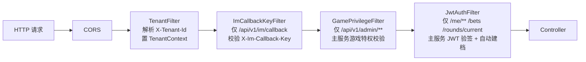
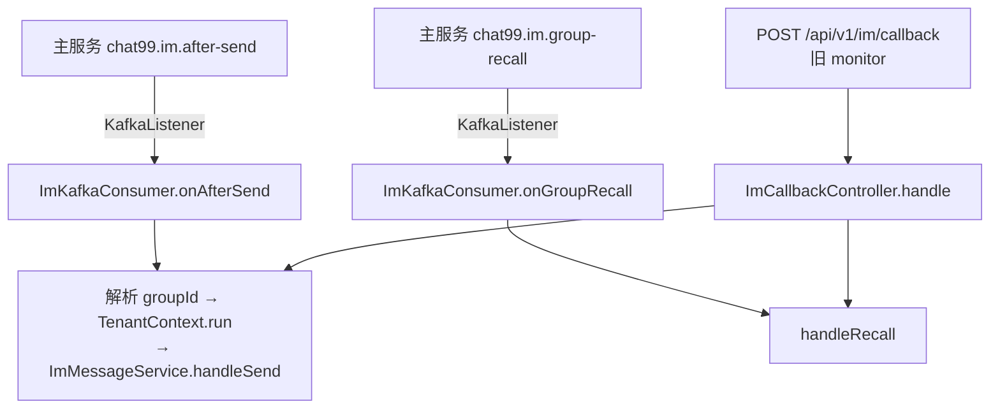
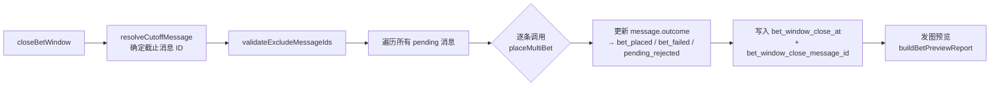
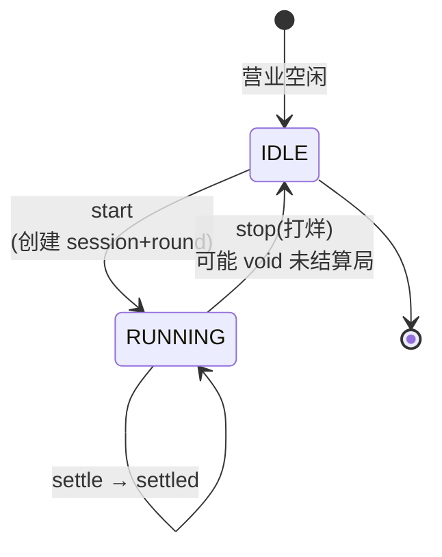
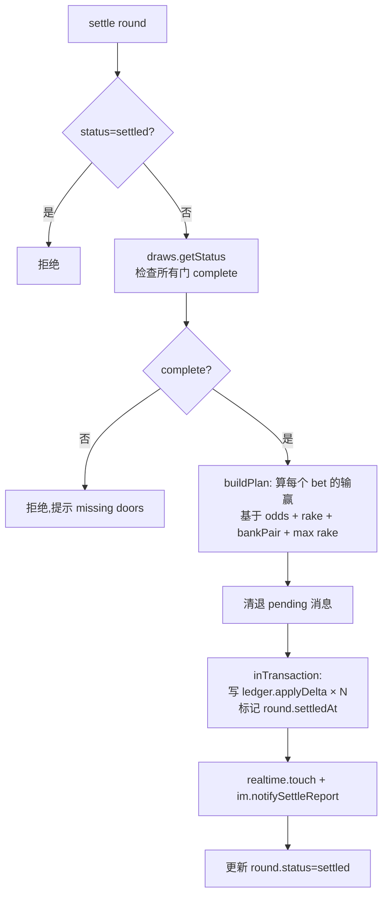
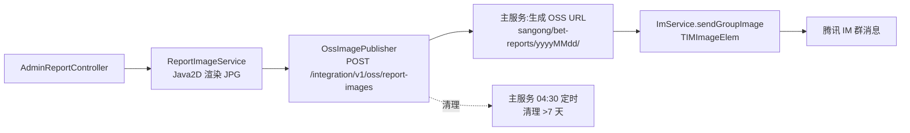
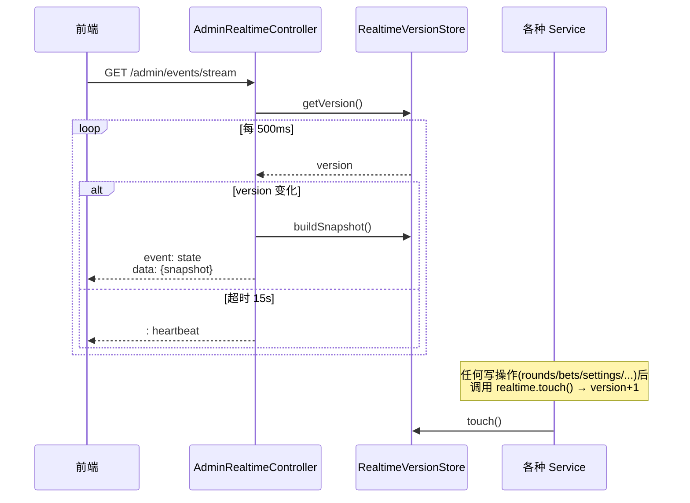
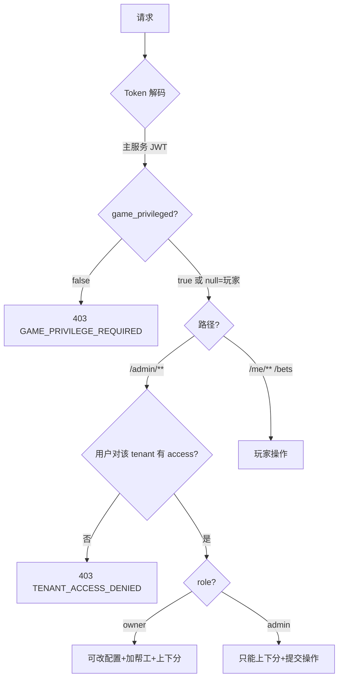
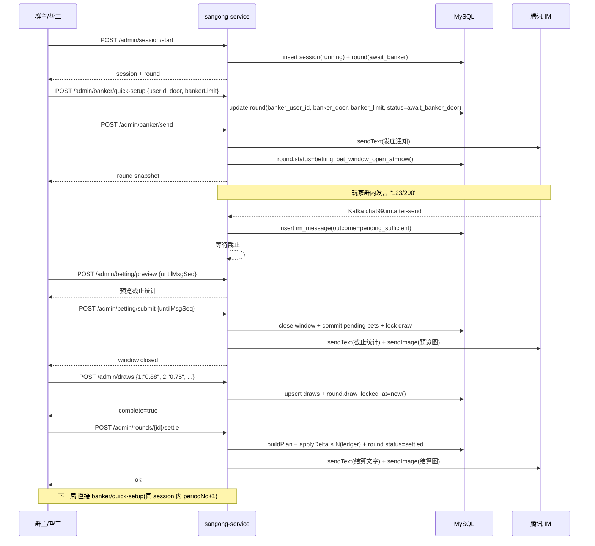
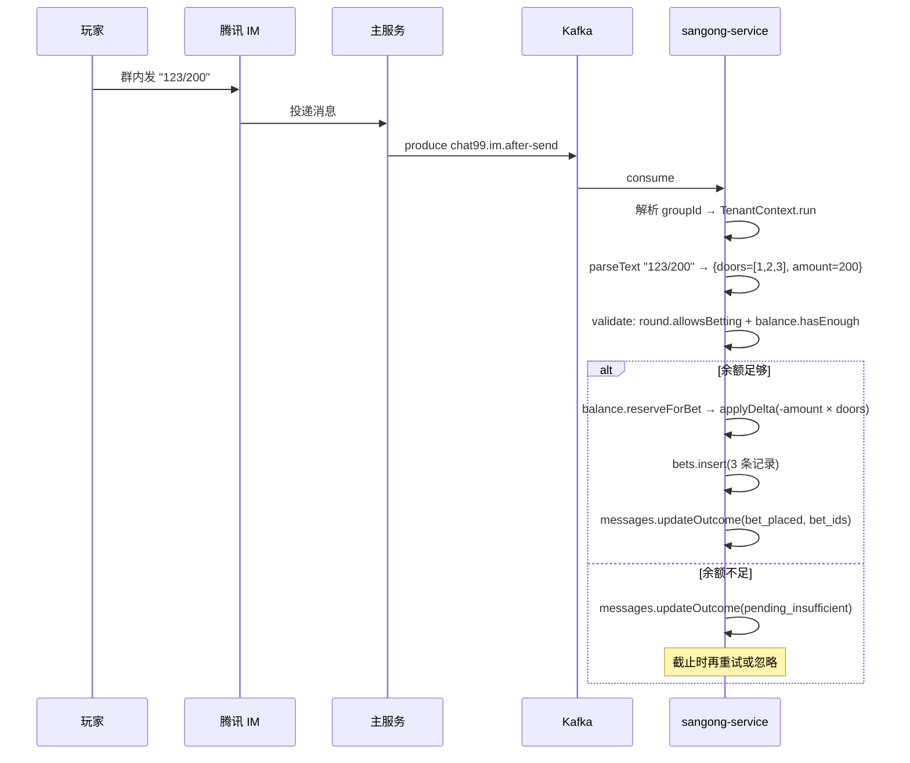

# 三公服务完整流程文档(sangong-service)

> **适用版本**:Java 17 / Spring Boot 3.5.14 / 多租户版
> **服务端口**:`127.0.0.1:8088`(只绑内网,对外统一走主服务 `/sangong/**`)
> **文档路径**:`sangong-service/docs/sangong-complete-flow.md`
> **配套文档**:`docs/frontend-integration.md`(前端对接 API 速查,1257 行)
> **对照实现**:所有 service 注释均明确 “与 PHP XxxService 一致”,本文档是 PHP sangong/api 的 Java 完整重写版流程

---

## 0. 项目结构与边界

```
sangong-service/
├── pom.xml                      Spring Boot 3.5.14 + Java 17,依赖 jjwt/okhttp/spring-kafka/tls-sig-api-v2
├── src/main/java/com/chat99/sangong/
│   ├── SangongApplication.java  @EnableKafka + @EnableScheduling + @EnableConfigurationProperties
│   ├── common/                  BusinessException / GlobalExceptionHandler / TimeFmt
│   ├── config/                  SangongProperties + WebMvcConfig
│   ├── controller/              17 个 controller,所有对外路由
│   ├── domain/                  9 个 POJO(SangongRound/Bet/RoundDraw/User/Session/Tenant/ImMessage/Ledger/CoBank)
│   ├── image/                   报表生图(Java2D)
│   ├── repository/              12 个 Repository(NamedParameterJdbcTemplate 直写 SQL)
│   ├── security/                JwtAuthFilter / TenantFilter / GamePrivilegeFilter / ImCallbackKeyFilter / JwtService
│   ├── service/                 25+ 个 Service
│   ├── tenant/                  TenantContext(基于 ThreadLocal)
│   └── web/admin/               管理后台辅助
├── scripts/
│   ├── migrations/              001_multi_tenant.sql + 002_tenant_access.sql
│   ├── build.sh / start.sh / stop.sh / status.sh / smoke.sh / contract-smoke.sh
│   └── cutover.md               切流说明
└── deploy/nginx-sangong.conf    8088 反代(可选,默认不走)
```

### 0.1 服务定位

| 维度 | 说明 |
|---|---|
| **职责** | 三公(骰子点数比大小)游戏的局内核心:接收 IM 消息→下注→定庄→开彩→结算→出报表 |
| **存储** | MySQL 库 `sangong`(与历史 PHP 同库,**同一时刻只允许一个写端**——见 cutover.md) |
| **依赖** | MySQL(`sangong`)、Kafka(`chat99.im.after-send` / `chat99.im.group-recall`)、腾讯 IM REST(撤回/资料)、主服务 Integration API(直连) |
| **边界** | 不自签 JWT、不直连公网、报表图片走主服务 `/integration/v1/oss/report-images` 上 OSS |

### 0.2 统一入口与对外地址

```
┌─────────────────────────────────────────────────┐
│  前端 / 移动端                                    │
│  base = http://HOST:8081/sangong                │
└──────────────────────┬──────────────────────────┘
                       │ SangongServiceProxyController(主服务侧)
                       │ 剥掉 /sangong 前缀
┌──────────────────────▼──────────────────────────┐
│  sangong-service  127.0.0.1:8088                 │
│  默认 SANGONG_BIND=127.0.0.1,对外不可达          │
└─────────────────────────────────────────────────┘
```

---

## 1. 安全过滤器链(请求生命周期)



### 1.1 过滤器顺序与作用域(SecurityConfig.java)

| 过滤器 | Order | 作用路径 | 职责 |
|---|---|---|---|
| **TenantFilter** | HIGHEST+20 | `/api/v1/admin/**` `/api/v1/me/**` `/api/v1/rounds/current` `/api/v1/bets` `/api/v1/settings` | 解析 `X-Tenant-Id` Header 或 `?tenantId=`,校验租户存在且 active,设置 `TenantContext`;管理路径必须带 |
| **ImCallbackKeyFilter** | HIGHEST+10 | `/api/v1/im/callback` | 校验 `X-Im-Callback-Key`(兼容旧 HTTP 回调,Kafka 模式下可不使用) |
| **GamePrivilegeFilter** | HIGHEST | `/api/v1/admin/**` | 主服务 `users.game_privileged=true` 校验;不可用时返回 503 |
| **JwtAuthFilter** | 默认 | `/api/v1/me/**` `/api/v1/rounds/current` `/api/v1/bets` | 解析 `Authorization: Bearer <主服务JWT>`,用共享密钥 `CHAT99_JWT_SECRET` 验签,`sub` 即 IM 用户 ID,按租户自动建档,塞入 `request.auth_user` |
| **SecurityConfig** | — | 全部 | `.csrf(disable) .cors(*) .stateless .anyRequest.permitAll` |

### 1.2 玩家鉴权复用主服务 JWT

```java
// JwtAuthFilter.doFilterInternal 核心
Claims claims = jwtService.parse(header.substring(7));       // 共享密钥验签
String sub = claims.getSubject();                            // = 主服务 user_id = IM 用户 ID
SangongUser user = userService.findOrCreateByImUserId(sub, null);  // 按 tenant_id+im_user_id 唯一键查/建档
request.setAttribute("auth_user", user);
```

### 1.3 多租户上下文

```java
// TenantContext 基于 ThreadLocal
TenantContext.run(tenantId, () -> { /* 业务代码 */ });
// Kafka 消费者用法:解析 groupId → 查找 tenant → TenantContext.run
// SSE StreamingResponseBody 用法:把请求线程 tenantId 显式传到异步线程
```

---

## 2. 数据模型(核心表)

```sql
-- 多租户:tenant_id 贯穿所有业务表
sangong_tenants            租户(主键 tenant_id,通常 = IM 群 ID @TGS#xxx)
sangong_tenant_access      账号-租户授权(main_user_id, tenant_id, role: owner/admin, is_default)
sangong_sessions           营业会话(id, tenant_id, status, current_period_no, current_round_id, started_at)
sangong_rounds             局(id, tenant_id, session_id, period_no, status, banker_user_id, banker_door, banker_limit, bet_window_open_at, bet_window_close_at, draw_locked_at, settled_at)
sangong_round_draws        每门开彩(round_id, door, amount_raw, amount_hundredths, hand_type, hand_label, point_value, pair_value, compare_value)
sangong_bets               下注(round_id, user_id, door, amount, proxy, im_message_id)
sangong_users              玩家(id, tenant_id, im_user_id, nickname, balance, group_id)
sangong_ledger             账本(user_id, group_id, session_id, type, amount, balance_after, ref_type, ref_id, note, operator)
sangong_co_banks           合庄占股(round_id, user_id, amount)
sangong_im_messages        IM 消息入库(group_id, im_user_id, msg_seq, msg_id, msg_time, text, outcome, outcome_detail, bet_id)  ← 幂等键 (group_id, msg_seq)
sangong_user_groups        用户分组(管理员运营分组,非必用)
sangong_settings           设置(主键 (tenant_id, setting_key),存门数/赔率/抽水/IM 群 ID 等)
```

### 2.1 局状态机

```
              ┌──── start ────┐
[voided] ◄──── void(中途打烊)──┘
   ▲
   │  settle(完全结算) → settled
   │
[await_banker] ── bankerSetup ──▶ [await_banker_door] ── bankerSend(发庄) ──▶ [betting]
                                                                                  │
                                                                       close(截止下注)
                                                                                  ▼
                                                                          [co_bank_closed]
                                                                                  │
                                                                              recordDraws(全部)
                                                                                  │
                                                                       status=settled(余额分配)
```

> 实际判定:`SangongRound.allowsBetting() = (BETTING || CO_BANK_CLOSED) && drawLockedAt==null`

---

## 3. IM 消息入口(双通道:Kafka 优先 + HTTP 兼容)



### 3.1 Kafka 消费(`ImKafkaConsumer.java`)
- `@ConditionalOnProperty(sangong.kafka.enabled=true)`
- `topic-after-send = chat99.im.after-send`,`topic-group-recall = chat99.im.group-recall`
- `groupId = sangong-im-consumer`
- `auto-offset-reset: latest`
- 消费 `onAfterSend` 时按 `groupId` 找 `sangong_tenants.im_group_game_id` → 找不到直接 ack;找到则 `TenantContext.run(...)` 内调用 `ImMessageService.handleSend`

### 3.2 HTTP 兼容(`ImCallbackController.java`)
- 腾讯 IM 风格 payload(`CallbackCommand` 字段)→ `ActionStatus` 响应;旧 monitor 风格(`action: recall`)→ JSON 响应
- groupId 找不到租户直接返回 `ignored: true`(避免腾讯 IM 重试风暴)

### 3.3 推荐配置

```bash
# 主服务
IM_GROUP_MONITOR_ENABLED=false     # 关闭旧 HTTP 转发
# sangong
SANGONG_KAFKA_ENABLED=true
KAFKA_BOOTSTRAP=127.0.0.1:9092
SANGONG_IM_CALLBACK_KEY=...        # 兼容回退(可选)
```

---

## 4. 玩家发言处理流水线(`ImMessageService`)

> 这是整个系统最复杂的链路:从一条 IM 群消息 → 落库 → 解析 → 预录入 → 截止 → 落注。

```mermaid
flowchart TD
    MSG[IM 群消息] --> P[parseSendPayload<br/>提取 groupId/imUserId/nickname/text/msgSeq]
    P --> Q{幂等检查<br/>(group_id, msg_seq)}
    Q -->|命中| RET[返回历史 outcome]
    Q -->|未命中| STORE[入库 sangong_im_messages<br/>outcome=stored]
    STORE --> CMD{是否游戏指令?}
    CMD -->|否| FIN1[关联到当前局,outcome=stored]
    CMD -->|是| RES[betTextParser.parse<br/>resolve 校验]
    RES --> R1{解析成功?}
    R1 -->|否| REJ[outcome=ignored + outcome_detail=rejectReason]
    R1 -->|是| V{校验:<br/>局相位 + 余额 + 门范围 + 庄门}
    V -->|不足| PI[outcome=pending_insufficient<br/>保留截止时重试]
    V -->|拒绝| PR[outcome=pending_rejected]
    V -->|通过| PS[outcome=pending_sufficient<br/>计入截止候选]
    PI --> CLOSE[截止时统一落注]
    PR --> CLOSE
    PS --> CLOSE
```

### 4.1 指令文本解析(`BetTextParser.java`)

支持的指令格式(与 PHP 完全一致):

```text
123.500     单门下注:门号 123 + 金额 500
123/500     同上,斜杠分隔
123,500     同上,逗号分隔
123（500）  全角括号
234 500     空格分隔
123 200     单门下注:门号 123 + 金额 200
123-200     连号范围下注(1-2,3,4)
全200 / 公2000  全闲门下注("全"|"公"+"金额")
```

**多门连写规则**:
- `"10"` → 单门 10(避免拆成 `[1, 0]`)
- 其他按字符解析,`'0'` 表示第 10 门
- 庄门会被剔除(`resolve` 阶段过滤)

### 4.2 校验流程(`placeBet`/`placeMultiBet`)

```java
1. rounds.getCurrent()                                  // 当前局
2. round.allowsBetting()                                // 局相位:必须 BETTING|CO_BANK_CLOSED 且未 drawLocked
3. door 范围 1..doorCount
4. amount ∈ [min_bet, max_bet]
5. 庄门不可下(bankerDoor != door)
6. 庄主不可在闲门下(round.bankerUserId != user.id)
7. balance.hasEnough(user, amount)
   ├─ 不足:写 pending_insufficient + IM 通知
   └─ 充足:扣款(balance.applyDelta) + 落注(bets.insert)
```

### 4.3 下注模式

| 模式 | 入口 | 行为 |
|---|---|---|
| **玩家 API 下注** | `POST /api/v1/bets` body=`{text: "123/200"}` 或 `{door, amount}` | 同步落注 + 扣款;余额不足返回 `422 INSUFFICIENT_BALANCE` |
| **IM 群消息下注** | Kafka `chat99.im.after-send` | 预录入(pending),截止时统一落注,避免"边下注边截止"的并发问题 |
| **管理员代录** | `POST /api/v1/admin/bets` | 走 `placeBet(..., isProxy=true)` 标记 `proxy=true` |
| **撤回撤销** | Kafka `chat99.im.group-recall` | `ImMessageService.handleRecall`:遍历该消息产生的 bet → `balance.releaseHold(amount, "bet_recall")` → 标记 bet 已撤销 |

### 4.4 下注窗口截止(`RoundService.closeBetWindow`)



- **幂等**:已结算局不能再 close
- **截止消息**:`untilMessageId` 或 `untilMsgSeq`,系统自动排除截止消息本身
- **可预览**:`POST /admin/betting/preview` 不传 `send:true` 仅预览统计,不真的截止

---

## 5. 对局全生命周期

### 5.1 状态流转总览



### 5.2 开机 / 关机(`SessionService`)

```java
// start()
if (getRunning() != null) throw "已在运行中,不可重复开机";
SangongSession session = sessions.insertRunning();   // status=running, current_period_no=1
SangongRound round = rounds.createForSession(session, 1);  // status=await_banker
session.setCurrentRoundId(round.getId());
sessions.update(session);
realtime.touch();

// stop()
session.setStatus(IDLE); session.setStoppedAt(now); session.setCurrentRoundId(null);
// 若当前局未结算 → rounds.voidUnsettledRound(round) 作废
// 发最后一局的账单 im.notifyAdminSettleBill(lastSettledRound)
```

### 5.3 定庄(`RoundService.setupBanker` / `quickSetupBanker`)

```
1. 校验:status 必须 await_banker 或 await_banker_door(可重复定庄)
2. 计算 doorCount(从 GameSettings 读取,可热改)
3. 写入 banker_user_id, banker_door, banker_limit
4. 状态切到 betting(banker_door 已选)或保持 await_banker_door(只选了庄未选门)
5. IM 发庄通知 im.notifyBanker(round)
```

**合庄(`CoBankService`)**:
- `co-bank/add`:额外合庄人追加出资(庄主可独立设 `bankerLimit`)
- `co-bank/close`:关闭合庄口,不再接受追加
- `co-bank/send`:发合庄汇总(`poolTotal`、`sharePercent`)

### 5.4 开彩录入(`DrawService.recordDraws`)

```java
@Transactional
public Map recordDraws(round, drawsInput /* door → amountRaw */) {
    assertCanRecord:  // settled|未选门|未截止 → 拒绝
    round = rounds.lockById(round.id);     // SELECT ... FOR UPDATE
    for (entry : drawsInput) {
        int hundredths = drawAmountParser.parse(amountRaw);  // 90→90, 0.88→88, 1→100, 0 不允许
        HandInfo hand = handTypeService.analyze(hundredths); // 见 §6
        draws.upsert(draw);
    }
    if (round.drawLockedAt == null) {
        round.drawLockedAt = now();
        rounds.save(round);                // 锁盘:之后下注被拒
    }
    realtime.touch();
    return buildStatus(round);             // complete: 所有 required 门都录完
}
```

---

## 6. 三公核心算法

### 6.1 开彩金额解析(`DrawAmountParser`)

| 输入 | 内部表示(hundredths) |
|---|---|
| `90` | 90 |
| `0.88` | 88 |
| `0.5` | 50 |
| `1` / `1.0` / `1.00` | 100(代表 1.00 元/1 倍) |
| `00` | 100 |
| `0.00` / `0` / `0.0` | **拒绝** "不允许录入 0.00" |
| 其他 | 拒绝 "开彩金额格式无效" |

### 6.2 牌型分析(`HandTypeService.analyze(hundredths)`)

| 输入 | 牌型 | label | pointValue | pairValue | compareValue |
|---|---|---|---|---|---|
| `100` | `one_yuan` | `1.00` | null | null | `100` |
| `99`(9+9) | `pair` | `对子99` | null | 99 | `rank(9,9)*100 + rank(9,9) = 9*100+9 = 909` |
| `82`(8+2) | `niuniu` | `牛牛` | null | null | `rank(8)*100 + rank(2) = 800+2 = 802` |
| `73`(7+3) | `point` | `0点` | 0 | null | `rank(7)*100 + rank(3) = 700+3 = 703` |
| `28`(2+8) | `point` | `0点` | 0 | null | `rank(2)*100 + rank(8) = 800+2 = 802` ← 同点比大小 |

> **同点比大小**:数字优先级 `0 > 9 > 8 > ... > 1`,`rank(0)=10`,所以 `28 > 73`(802 > 703)。

### 6.3 庄闲比牌(`CompareService.bankerWins`)

```java
// 1. 金额相等 → 庄胜(平局庄大)
if (banker.amount == player.amount) return true;

// 2. 按牌型等级比较
rank: ONE_YUAN=4 > PAIR=3 > POINT=2 > NIUNIU=1
if (rank 不同) return banker.rank > player.rank;

// 3. 同牌型细分
switch (type) {
  case ONE_YUAN, NIUNIU: return true;             // 这两类平局庄大
  case PAIR:   return banker.pairValue > player.pairValue || true; // 同对庄大
  case POINT:  // 先比 point(0~9),再比 compareValue
    if (point 不同) return banker.point > player.point;
    if (compare 不同) return banker.compare > player.compare;
    return true;                                  // 全平庄大
}
```

### 6.4 结算分账(`SettleService.settle`)



#### 6.4.1 分账数学(`SettlePlanMathTest`)

每条 bet 的结算金额:

```
gross = amount × odds   (odds 来自赔率表,如 pair=1.00, point.p=1.00)
rake  = gross × rakePts / 1000  (rake 抽水,默认 banker 6 / player 0)
net   = gross - rake

// 注意:rake 是从庄家收益里扣,不是从闲家派彩里扣(数学见 PHP SettleService)
```

#### 6.4.2 冲正与重结

- **voidSettlement**:已结算局反向冲正(全部 ledger 反向 delta,改 round.status=await_banker_door 之前的状态或新局)
- **resettle**:局被冲正后,重新执行 settle(数学不变,但 ledger 会重写)
- 都用 `TransactionTemplate`(避免同类自调用绕过 `@Transactional`)

---

## 7. 余额账务(`BalanceService`)

### 7.1 余额模型

```
sangong_users.balance       长整型(整分积分,非人民币分)
sangong_ledger             流水表(user_id, amount[有符号], balance_after, type, ref_*, note, operator)
```

### 7.2 关键操作

```java
credit(user, +amount, type, sessionId, note, refType, refId, operator);   // 上分
debit(user, -amount, ...);                                                  // 下分
reserveForBet(user, amount)   → balance.applyDelta(-amount, "bet_hold");   // 下注扣款
releaseHold(user, amount, type, sessionId, note)                            // 撤回/作废退款

// applyDelta 核心:
@Transactional
public BalanceResult applyDelta(user, delta, type, ...) {
    user = users.lockById(user.id);                          // SELECT ... FOR UPDATE
    long newBalance = user.balance + delta;
    users.updateBalance(user.id, newBalance);
    ledgers.insert(new Ledger(...));                         // 写流水
}
```

> **结算 debit 允许余额变负**(与 PHP 一致);其他上分/扣款场景校验余额足够。

### 7.3 上下分 API

| 路径 | 用途 | 调用方 |
|---|---|---|
| `POST /api/v1/admin/users/credit` | 给玩家上分 | 群主/帮工 |
| `POST /api/v1/admin/users/debit` | 给玩家下分 | 群主/帮工 |
| `POST /api/v1/admin/users/{id}/credit` | 同上(按 ID) | 群主/帮工 |
| `POST /api/v1/admin/bets` | 代录下注(标记 proxy=true) | 群主/帮工 |
| `GET /api/v1/me/balance` | 玩家查自己余额 | 玩家 |

---

## 8. 报表与图片(`ReportImageService` + `image/`)

### 8.1 五类报表

| 报表 | 路径 | 渲染 |
|---|---|---|
| **用户积分报表** | `POST /admin/reports/users/points-image` | 玩家积分列表(标题/玩家/分) |
| **走势图** | `POST /admin/reports/trend-image` | 每门最近 N 期开彩走势色块 |
| **下注图** | `POST /admin/reports/bet-image` | 每门下注金额柱状 |
| **结算图** | `POST /admin/reports/settle-image` | 庄闲对照表(庄门/点/倍率/金额) |
| **结算账单** | `POST /admin/reports/settle-bill` | 每位玩家净收益 |

### 8.2 图片生成与推送链路



**关键点**:
- 图不落本地磁盘;Java2D 内存渲染 → OSS → OSS URL → IM
- 历史文件:`/bet-reports/**` 静态目录(本地兜底)
- 主服务每天 04:30 清理(`SANGONG_REPORT_IMAGE_RETENTION_DAYS=7`)
- 字体:ArialRoundedMTBold + Noto Sans CJK 回退(中文+Twemoji)
- 色板:橙标题 / 绿底积分 / 走势色块

---

## 9. 实时状态推送(SSE)

### 9.1 推送通道

`GET /api/v1/admin/events/stream`(`Content-Type: text/event-stream`)



### 9.2 推送内容

```json
{
  "version": 12345,
  "tenantId": "@TGS#xxx",
  "session": { "id": 1, "status": "running", "currentPeriodNo": 5 },
  "round": { "id": 5, "status": "betting", "periodNo": 5, "bankerDoor": 3, "betWindowOpenAt": "..." },
  "doorTotals": { "1": 1000, "2": 0, "3": 500 },
  "pendingMessageCount": 3,
  "lastDraws": [...]
}
```

---

## 10. 设置管理(`GameSettingsService` + `SettingsRepository`)

### 10.1 设置项(主键 `tenant_id + setting_key`)

| Key | 默认 | 说明 |
|---|---|---|
| `door_count` | 6 | 下注门数(2~10,改后实时生效) |
| `min_bet` / `max_bet` | 0 / 99999999 | 下注金额范围 |
| `odds_pair` / `odds_max` | 100(=1.00) / 100 | 对子/最大倍率(万分位) |
| `odds_p0` ~ `odds_p9` | 100 | 每个点数的赔率 |
| `rake_banker_p*` | 6 | 庄家在每点的抽水(万分位) |
| `rake_player_p*` | 0 | 闲家在每点的抽水 |
| `rake_banker_pair` / `rake_banker_max` | 6 / 6 | 庄家对子/最大抽水 |
| `rake_player_pair` / `rake_player_max` | 0 / 0 | 闲家对子/最大抽水 |
| `im_group_game_id` / `im_group_admin_stats_id` / `im_bot_user_id` | 配置回退 | 腾讯 IM ID(填错会自动规范化) |

### 10.2 缓存机制

```java
private final ConcurrentHashMap<String, Map<String, String>> cacheByTenant = new ConcurrentHashMap<>();

public Map<String, String> raw() {
    return cacheByTenant.computeIfAbsent(tenantId, k -> repo.findAllForTenant(k));
}
// 写后调用 gameSettings.invalidateCache(tenantId) 清缓存
```

### 10.3 设置操作

- `GET /api/v1/settings` — 读当前租户设置
- `PUT /api/v1/settings` — 写入(管理员权限)
- 前端对接:`docs/frontend-integration.md` 详细说明

---

## 11. 权限与多租户隔离

### 11.1 三层权限



### 11.2 群主 vs 帮工

| 操作 | 群主 owner | 帮工 admin |
|---|---|---|
| 上下分 | ✅ | ✅ |
| 定庄 / 截止 / 开彩 / 结算 | ✅ | ✅ |
| 改设置 / 切换机器人 / 切换下注群 | ✅ | ❌ |
| 加帮工 / 移除帮工 | ✅ | ❌ |

### 11.3 租户识别

| 路径 | 租户识别方式 |
|---|---|
| 前端管理请求 | `X-Tenant-Id` Header 或 `?tenantId=`,必填 |
| 前端玩家请求 | `X-Tenant-Id` 或 JWT claim(自动) |
| Kafka 群消息 | `groupId` → `sangong_tenants.im_group_game_id` |
| 旧 HTTP 回调 | payload 中的 `GroupId` |

### 11.4 租户列表特殊路径

- `GET /api/v1/admin/tenants` — 列表(不需 tenantId,根据当前账号筛可见的)
- `POST /api/v1/admin/tenants` — 创建(第一个认领的账号自动 owner)
- `GET/PUT /api/v1/admin/my-config` — 当前账号自己的配置(不需 tenantId)

---

## 12. 完整业务流程图(管理员跑局)



---

## 13. 关键时序:玩家从 IM 群消息到下注



---

## 14. 异常与回滚路径

### 14.1 常用异常

| 异常类 | 触发条件 | HTTP 状态 |
|---|---|---|
| `InsufficientBalanceException` | 余额不足 | 422 INSUFFICIENT_BALANCE |
| `BusinessException` | 业务规则违反(走 `GlobalExceptionHandler`) | 400/422 |
| `RuntimeException("本局已结算")` | 重复结算 | 422 |
| `IllegalStateException` | 越权/未认领 | 403 |
| `JwtException` | JWT 验签失败 | 401 UNAUTHORIZED |
| `IllegalArgumentException("租户不存在")` | tenantId 找不到 | 400 |

### 14.2 全局响应格式

```json
{ "ok": false, "code": "ERROR_CODE", "message": "中文错误说明" }
{ "ok": true,  "data": {...} 或业务字段 }
```

### 14.3 SSE 中断恢复

前端实现要点:
- 写操作成功后:用响应更新 UI → 主动拉一次 snapshot → SSE 后续校准
- 切租户:关旧 SSE → 清状态 → 改 `X-Tenant-Id` → 新 SSE
- 用支持 Header 的 fetch(`EventSource` 不能自定义 Header,需 polyfill 或用 `fetch + ReadableStream`)

---

## 15. 部署与运维

### 15.1 环境变量

```bash
# 必填
DB_HOST=127.0.0.1
DB_PORT=3306
DB_DATABASE=sangong
DB_USERNAME=sangong
DB_PASSWORD=***
CHAT99_JWT_SECRET=<主服务 app_setting.JWT_SECRET>

# 腾讯 IM
IM_SDK_APP_ID=***
IM_KEY=***
IM_BOT_USER_ID=bot_sangong
IM_GROUP_GAME_ID=@TGS#***
IM_GROUP_ADMIN_STATS_ID=@TGS#***
IM_GROUP_LEDGER_ID=@TGS#***

# 主服务集成
INTEGRATION_API_BASE_URL=http://127.0.0.1:8081
INTEGRATION_API_TOKEN=***

# Kafka
KAFKA_BOOTSTRAP=127.0.0.1:9092
SANGONG_KAFKA_ENABLED=true
SANGONG_KAFKA_TOPIC_AFTER_SEND=chat99.im.after-send
SANGONG_KAFKA_TOPIC_GROUP_RECALL=chat99.im.group-recall
SANGONG_KAFKA_CONSUMER_GROUP=sangong-im-consumer

# 本服务
SANGONG_PORT=8088
SANGONG_BIND=127.0.0.1   # 默认只绑内网
APP_URL=http://HOST:8081/sangong   # 报表图片外链前缀
SANGONG_STORAGE_DIR=data
```

### 15.2 构建与启动

```bash
cd /www/wwwroot/99chat-server/sangong-service
export JAVA_HOME=/www/server/java/jdk-17.0.8
export PATH=$JAVA_HOME/bin:$PATH

./scripts/build.sh         # ../mvnw -DskipTests package
./scripts/start.sh         # 后台 nohup 启动
./scripts/status.sh        # PID + 端口 + 健康检查
./scripts/smoke.sh         # 健康 + settings + admin/session + snapshot
./scripts/contract-smoke.sh # 契约:主路径/别名/鉴权/报表(禁 404/501)

../mvnw test               # 单元测试:BetTextParser / HandTypeService / SettlePlanMath / ReportImage
```

### 15.3 切流与回滚

参见 `scripts/cutover.md`,核心原则:
- **同一时刻只允许一个写端**(PHP 或 Java)连 sangong 库
- 回滚只改流量入口,不改库
- 关 Java:`./scripts/stop.sh` 或临时关 `SANGONG_KAFKA_ENABLED`

### 15.4 监控要点

| 指标 | 检查方式 |
|---|---|
| 进程存活 | `./scripts/status.sh` → curl `/api/v1/health` |
| Kafka 消费 | `sangong.kafka.enabled=true` 时查看 `sangong-service.log` 中 `kafka send handled` |
| DB 连接 | HikariCP pool 配置 `maximum-pool-size: 20`,监控 `pool.PendingConnections` |
| SSE 活跃数 | 通过 SSE 长连接数估算(nginx `connections`) |
| 报表超时 | 60s 上限,超时检查 Java heap(`SANGONG_IMAGE_SCALE=3` 倍率) |

---

## 16. 文件清单速查

### 16.1 业务核心(必读)

| 文件 | 行数 | 职责 |
|---|---|---|
| `SangongApplication.java` | 17 | 启动入口 |
| `config/SangongProperties.java` | — | 配置绑定 |
| `security/JwtAuthFilter.java` | 73 | JWT 验签 + 自动建档 |
| `security/TenantFilter.java` | 72 | 租户解析 |
| `security/SecurityConfig.java` | 41 | 过滤器装配 |
| `service/ImKafkaConsumer.java` | 108 | Kafka 入口 |
| `service/ImMessageService.java` | 1031 | 发言入库 + 下注预录入 + 截止 + 撤回(全链路) |
| `service/BetTextParser.java` | 200 | 指令文本解析 |
| `service/DrawAmountParser.java` | 54 | 开彩金额解析 |
| `service/HandTypeService.java` | 50 | 牌型分析 |
| `service/CompareService.java` | 65 | 庄闲比牌 |
| `service/BalanceService.java` | 94 | 余额账务 |
| `service/BetService.java` | 437 | 下注校验/扣款/落注/统计 |
| `service/RoundService.java` | 574 | 局生命周期 |
| `service/DrawService.java` | 154 | 开彩录入 |
| `service/SettleService.java` | 586+ | 结算分账 + 冲正 + 重结 |
| `service/CoBankService.java` | 75 | 合庄占股 |
| `service/SessionService.java` | 109 | 开机/关机 |
| `service/GameSettingsService.java` | 441 | 设置读写 + 缓存 |
| `service/TenantService.java` | 381 | 租户 CRUD + 授权 |
| `service/UserService.java` | — | 用户查询/建档 |
| `service/RealtimeVersionStore.java` | — | SSE 版本号 |

### 16.2 控制器

| 文件 | 路径前缀 |
|---|---|
| `RootController` | `/` |
| `AuthController` | `/api/v1/auth/token`(已下线) |
| `MeController` | `/api/v1/me/**` |
| `ImCallbackController` | `/api/v1/im/callback` |
| `PlayerRoundController` | `/api/v1/rounds/current` |
| `PlayerBetController` | `/api/v1/bets` |
| `SettingsController` | `/api/v1/settings` |
| `AdminImNotifyController` | `/api/v1/admin/im/send` |
| `AdminMyConfigController` | `/api/v1/admin/my-config/**` |
| `AdminProxyBetController` | `/api/v1/admin/bets` |
| `AdminRealtimeController` | `/api/v1/admin/events/**`(含 SSE) |
| `AdminRoundController` | `/api/v1/admin/rounds/**`(687 行,核心) |
| `AdminSessionController` | `/api/v1/admin/session/**` |
| `AdminTenantsController` | `/api/v1/admin/tenants/**` |
| `AdminUserBalanceController` | `/api/v1/admin/users/**` |
| `AdminUserGroupController` | `/api/v1/admin/user-groups/**` |
| `AdminUserReportController` | `/api/v1/admin/reports/**`(401 行,报表) |

### 16.3 单元测试

| 文件 | 覆盖 |
|---|---|
| `BetTextParserTest` | 指令解析 + 多门连写 + 庄门剔除 |
| `HandTypeServiceTest` | 牌型分析 + 同点比大小 |
| `SettlePlanMathTest` | 结算数学 + 抽水 + 分摊 |
| `ReportImageServiceTest` | 报表生图核心路径 |
| `ReportImageGoldenRenderTest` | 报表生图黄金对照 |

---

## 17. 与 PHP `sangong/api` 版的差异

| 维度 | PHP Lumen 版 | Java 版 |
|---|---|---|
| 框架 | Lumen | Spring Boot 3.5 |
| DB 访问 | Eloquent | NamedParameterJdbcTemplate 直写 SQL |
| 鉴权 | 自签 Token | 复用主服务 JWT(共享密钥) |
| 消息入口 | monitor HTTP 回调 | Kafka 为主,HTTP 兼容 |
| 多租户 | 单群 | `sangong_tenants` + `X-Tenant-Id` |
| 账号隔离 | 无 | `sangong_tenant_access`(owner/admin) |
| 报表图片 | GD 落本地磁盘 + IM 静态 URL | Java2D 内存 + 直传 OSS + OSS URL |
| 用户昵称 | 腾讯 IM portrait_get | 主服务 Integration `/integration/v1/users/profiles` |
| 撤回 | 旧 IM 集成服务 | 主服务直连 `/integration/v1/im/messages/recall` |
| 抽水分摊 | `floor()` | `Math.floorDiv()`(向负无穷取整匹配 PHP) |

---

## 18. 不给前端调用的接口(参考前端黑名单)

```text
POST /api/v1/im/callback                       # Kafka 已自动消费,不要前端调用
POST /integration/v1/users/profiles           # 主服务在内部用
POST /integration/v1/users/game-privilege-check
POST /integration/v1/im/messages/recall
POST /integration/v1/oss/report-images
POST /api/v1/auth/token                       # 已下线 410 ENDPOINT_GONE
```

---

## 19. 联调自检清单

```text
[ ] Base 使用 /sangong,不直连 8088
[ ] 不发送 X-Settings-Key(已废弃)
[ ] 管理请求带主服务 JWT
[ ] 非特权用户 → 403
[ ] 群主用 /admin/my-config 配置;帮工由群主授权
[ ] 所有租户业务请求带 X-Tenant-Id
[ ] 切租户会关闭旧 SSE
[ ] SSE 用支持自定义 Header 的客户端
[ ] 写操作后刷新 snapshot
[ ] preview 不传 send:true
[ ] user-flow 不传 section/scope
[ ] 不调用 /rounds/{id}/stats/send
[ ] 报表超时 60 秒
[ ] 现金/积分使用整数,非浮点
[ ] 时间带 ISO 偏移,不假设 UTC
[ ] 下注指令支持 1.200 / 12/200 / 全200 / 公1000
```

---

**文档结束。**

所有 service 的注释都明确"与 PHP XxxService 一致",意味着 PHP sangong/api Lumen 是这套 Java 实现的真值参考。如需更细的数学(例如具体每点抽水公式),参考 `SettlePlanMathTest.java` 与 `service/SettleService.java#buildPlan`。
