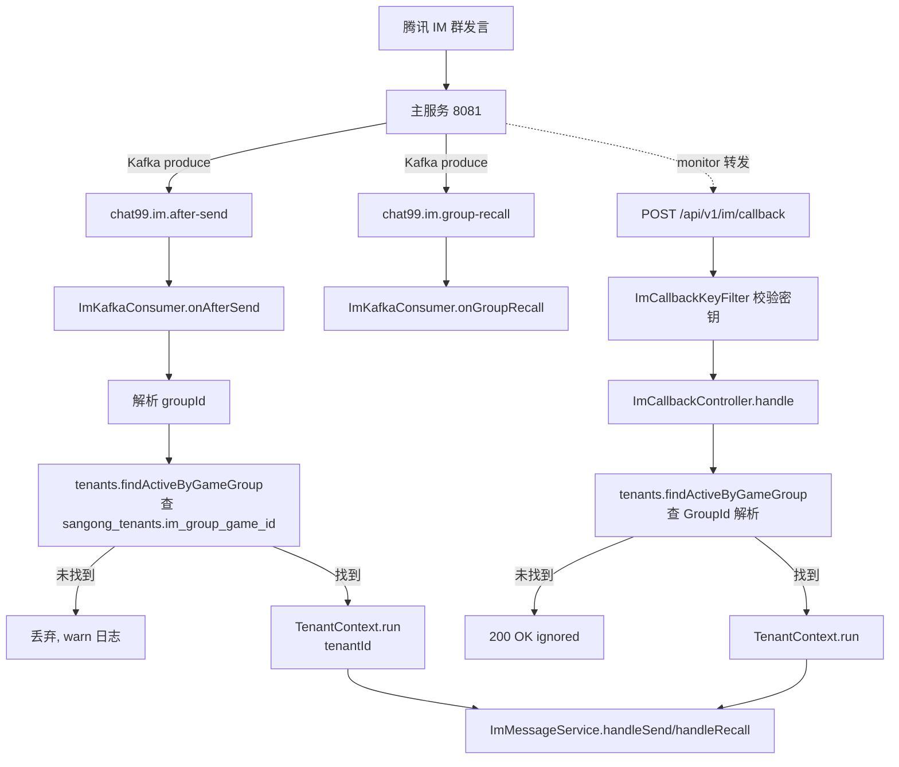
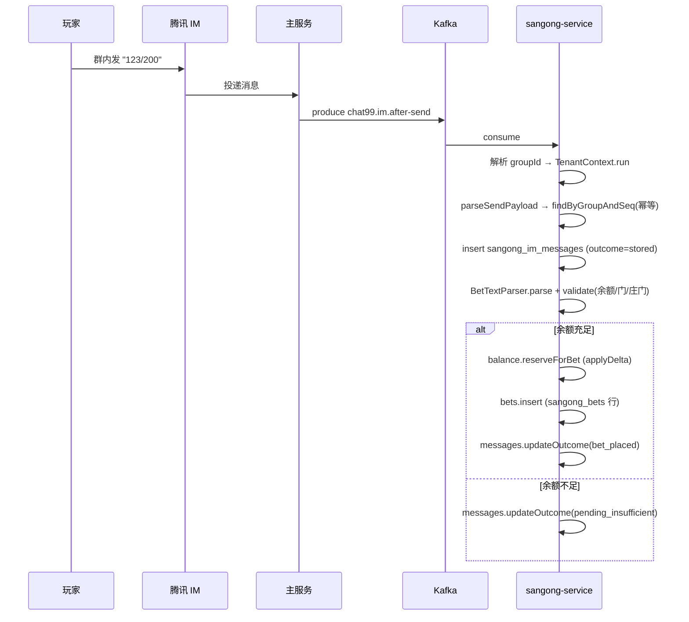
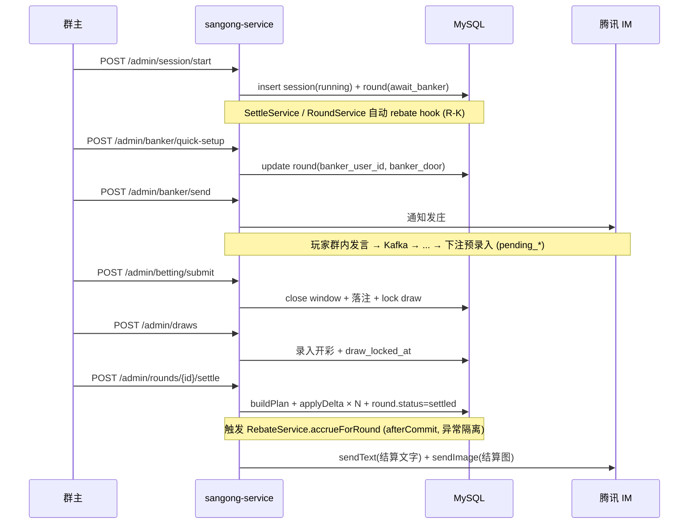

# 多租户隔离规范 (sangong-service)

> **适用版本**:Java 17 / Spring Boot 3.5 / 多租户版
> **服务端口**:`127.0.0.1:8088`(只绑内网,对外统一走主服务 `/sangong/**`)
> **配套文档**:`docs/sangong-complete-flow.md`(业务流)、`docs/frontend-integration.md`(前端对接)

---

## 0. 核心概念

**租户(`tenant`)** = 一个 IM 游戏群。所有三公数据按 `tenant_id` 隔离,`tenant_id` 通常等于 IM 群 ID(如 `m2BXXNKM5CS`)。

租户 ID 在两个地方出现,概念不同:

| 字段 | 所在表 | 含义 |
|---|---|---|
| `sangong_tenants.tenant_id`(PK) | 租户注册表 | 租户本身的"身份证号" |
| `sangong_tenants.im_group_game_id`(UNIQUE) | 租户注册表 | 该租户对应的腾讯 IM 群 ID,**通常是同一个值**,但可以不同 |
| `sangong_*` 各表的 `tenant_id` 列 | 业务表 | 标识该行属于哪个租户 |

**默认行为**:`SettleService.settle`、`BetService.placeBet`、`TenantFilter` 都按"当前 `TenantContext` ThreadLocal" 决定租户。

---

## 1. 数据模型 — 三种隔离机制

### 1.1 显式 `tenant_id` 列 + WHERE 过滤(强保证)

| 表 | 隔离列 | 备注 |
|---|---|---|
| `sangong_tenants` | PK = `tenant_id` | 定义表 |
| `sangong_tenant_access` | `(main_user_id, tenant_id)` 复合 PK | 主服务账号 ↔ 租户 |
| `sangong_sessions` | `tenant_id` | 营业会话 |
| `sangong_users` | `tenant_id` + `(tenant_id, im_user_id)` UNIQUE | 玩家(全局 `im_user_id` UNIQUE 已拆) |
| `sangong_ledger` | `tenant_id` | 账本(写入路径全 `TenantContext.require()`) |
| `sangong_settings` | 复合 PK `(tenant_id, setting_key)` | 设置 |
| `sangong_rounds` | `tenant_id` 冗余 | 局(便于直接 `WHERE tenant_id=:t`) |
| `sangong_agent_balance` | `tenant_id` | 代理余额 |
| `sangong_agent_ledger` | `tenant_id` | 代理账本 |
| `sangong_rebate_pending` | `tenant_id` | 返水幂等 |

### 1.2 隐式契约 — 靠 `round_id` / `group_id` 间接 scope(弱保证)

| 表 | 实际 scope 列 | 安全前提 |
|---|---|---|
| `sangong_bets` | `round_id` | round 是 per-tenant 的(`sangong_rounds.tenant_id`);所有查询都 `WHERE round_id=:r`,round_id 是 PK 全库唯一 |
| `sangong_co_banks` | `round_id` | 同上 |
| `sangong_round_draws` | `round_id` | 同上 |
| `sangong_im_messages` | `group_id`(IM 群 ID) | 腾讯 IM 群 ID 全局唯一(`@TGS#...` 或你们的自定义 ID 体系) |

**风险与防御**:任何持有"错误 round_id"的上游调用都能跨租户读到数据。**已加防御**:`BetRepository.userDoorRows` 等 JOIN 查询在 RoundService / ReportService 都被 `currentRound = rounds.getCurrent()`(走 `TenantContext.require()` 过滤)赋值。如果未来有人直接传一个外群 round_id,会无声读到不该读的数据。**防御建议**:在 `BetRepository.userDoorRows` 等加 `EXISTS (SELECT 1 FROM sangong_rounds r WHERE r.id = b.round_id AND r.tenant_id = :t)` —— 见 §6 待办。

### 1.3 跨租户共用(按设计)

| 表 | 用途 | 设计意图 |
|---|---|---|
| `sangong_user_groups` | 运营分组模板(分组名/编号/备注) | 全库共用的"分组池",`countUsers` 已加 tenant 过滤(P0-2 已修) |
| `sangong_tenant_agent_groups` | 每租户代理实例(agent + max_rebate_pct) | **每租户一份**,同一个 IM 用户可在多个租户代理 |

`is_agent_group=0` 的运营分组全库共用;代理分组走 **走法 B**(`sangong_tenant_agent_groups`),每租户独立实例:
- UNIQUE KEY `(tenant_id, group_id)` — 同一分组在本租户只有一份代理实例
- KEY `(tenant_id, agent_im_user_id)` — 反查"代理在本租户绑了哪些分组"
- 同一个 IM 用户可以在 A 群、B 群同时代理(各占一行)
- 数据流:`user.group_id = 5 → sangong_user_groups[5]`(运营模板,跨租户共用) → JOIN `sangong_tenant_agent_groups[(tenant_id, 5)]` 拿本租户的代理/返水配置
- 迁移脚本 `004_tenant_agent_groups.sql` 自动把 `is_agent_group=1` 的行复制到每个 tenant

---

## 2. TenantContext — ThreadLocal 单租户标识

```java
public final class TenantContext {
    private static final ThreadLocal<String> HOLDER = new ThreadLocal<>();
    // set / get / require / clear / run
}
```

### 2.1 何时 set

| 入口 | 时机 | 备注 |
|---|---|---|
| HTTP `/api/v1/admin/**`、`/api/v1/me/**`、`/rounds/current`、`/bets`、`/settings` | `TenantFilter` 解析 `X-Tenant-Id` 或 `?tenantId` | finally clear |
| HTTP `/api/v1/admin/tenants`、`/api/v1/admin/my-config` | `Filter skipped` | 这两个路径允许跨租户操作 |
| HTTP `/api/v1/im/callback` | `ImCallbackController` 从 `payload.GroupId` 解析 → `TenantContext.run(...)` | 共享密钥靠 `ImCallbackKeyFilter` |
| Kafka `chat99.im.after-send` / `chat99.im.group-recall` | `ImKafkaConsumer.onAfterSend` / `onGroupRecall` 解析 `groupId` 后 `TenantContext.run(...)` | 群不识别 → 直接丢弃 |
| SSE `AdminRealtimeController.stream` | worker线程 `TenantContext.run(tenantId, ...)` 把请求线程的 tenantId 显式带过去 | 不能依赖 ThreadLocal 继承 |
| `TenantService.update` / `seedSettings` | 内部 `TenantContext.run(t.getTenantId(), ...)` | 修改租户自己 |

### 2.2 何时 require / get

- **`require()`**(抛 `IllegalStateException("TENANT_REQUIRED")`):所有写入路径、所有读取租户表的查询
- **`get()`**(返回 null):仅在允许"无租户上下文"的位置使用:
  - `TenantContext.run(Runnable)` 内部,用于恢复前值
  - `TenantRepository.findByGameGroupId`(根据 IM 群 ID 反查租户,这是租户注册查询,本身不该依赖 TenantContext)
  - `GameSettingsService.invalidateCache()` / `RealtimeVersionStore.versionPath()` 已被强制 require(防止 ctx-less 误触发)
  - `GamePrivilegeFilter` 读 ctx 判断是否要做 `canManage` 校验(ctx 缺失 = tenants/my-config 路径)

### 2.3 不传播的边界

`TenantContext.run(Runnable)` 是**同步**包装,**不**把 ThreadLocal 传给子线程。涉及边界:

- **SSE `StreamingResponseBody`**:worker线程必须显式 `TenantContext.run(tenantId, ...)`(`AdminRealtimeController` 已正确处理)
- **Kafka consumer 线程**:已经显式 `TenantContext.run(...)`(已正确)
- **`TransactionTemplate`**:不会切换线程,在同一线程上运行(`SettleService.applySettlement` / `AgentTransferService` / `RebateService` 都安全)
- **未来 `@Async` / `@Scheduled` / `CompletableFuture`**:必须**显式** `TenantContext.run(tenantId, ...)` 包一层。当前没有这类代码,但**新增 cron/定时任务时必须遵守**。

---

## 3. HTTP 请求生命周期

```
┌──────────────────────────────────────────────────────┐
│  HTTP Request                                         │
└──────────────────────────────────────────────────────┘
                  │
                  ▼ CORS
                  │
                  ▼ TenantFilter (Order HIGHEST+20)
                  │   shouldNotFilter 路径白名单:
                  │     - /api/v1/admin/tenants*
                  │     - /api/v1/admin/my-config*
                  │   解析 X-Tenant-Id → 查 sangong_tenants → TenantContext.set
                  │   finally: TenantContext.clear
                  │
                  ▼ ImCallbackKeyFilter (Order HIGHEST+10)
                  │   仅 /api/v1/im/callback
                  │   校验 X-Im-Callback-Key
                  │
                  ▼ GamePrivilegeFilter (Order HIGHEST)
                  │   仅 /api/v1/admin/** + PUT /api/v1/settings
                  │   调主服务 /integration/v1/users/game-privilege/check
                  │   set request.admin_user_id
                  │   canManage(userId, tenantId) 校验
                  │
                  ▼ JwtAuthFilter (默认)
                  │   仅 /api/v1/me/** + /rounds/current + /bets
                  │   Bearer JWT 验签 → claim.sub 即 IM 用户 ID
                  │   findOrCreateByImUserId(tenant内自动建档)
                  │   set request.auth_user
                  │
                  ▼ Controller
                  │
                  ▼ TenantContext.clear (TenantFilter finally)
```

### 3.1 鉴权链叠加规则

- 同一个请求可以**串多个 filter**(HTTP 回调=ImCallbackKeyFilter → Controller)
- 但 `JwtAuthFilter` 和 `GamePrivilegeFilter` 是**互斥**作用域:一个管玩家(`/me/**`),一个管管理员(`/admin/**`)
- `TenantFilter` 总是第一个处理 tenant

---

## 4. IM 消息 → Kafka → 业务



### 4.1 两条入口对比

| 维度 | Kafka | HTTP 回调 |
|---|---|---|
| 启用开关 | `SANGONG_KAFKA_ENABLED=true` | `IM_GROUP_MONITOR_ENABLED=true`(主服务侧) |
| 鉴权 | Kafka ACL | `X-Im-Callback-Key` Header |
| 租户解析 | `payload.groupId` | `payload.GroupId` 或 `payload.groupId` |
| 解析失败 | 静默丢弃 + warn | 200 OK `{ignored:true, reason:"unknown_tenant"}`(防腾讯 IM 重试) |
| TenantContext 设置 | `ImKafkaConsumer` 内部 | `ImCallbackController.handle` 内部 |

**生产配置原则**:**Kafka 开就关 HTTP 回调**(避免重复消费)。

### 4.2 已知风险

- **`X-Im-Callback-Key` 是共享密钥**,任何拿到密钥的人可以向任何 groupId 投递消息。信任前提是 IM 上游 + 主服务 monitor 转发的可靠性
- **配置错误放大**:如果两个群的 `IM_GROUP_GAME_ID` 配成同一个值,两边消息会被一个群处理(`isGameGroup(groupId) == true` 始终成立)。运维责任,代码层无法兜底

---

## 5. 关键时序

### 5.1 玩家从 IM 消息到下注



### 5.2 群主跑局



---

## 6. 待办 / 防御性 TODO

| 优先级 | 改动 |
|---|---|
| **P2-3** | `sangong_bets` 加 `tenant_id` 列(迁移004),所有 `WHERE round_id=:r` 改成 `WHERE round_id=:r AND tenant_id=:t` |
| **P2-4** | `sangong_co_banks` 加 `tenant_id` 列(同上) |
| **P2-5** | `sangong_round_draws` 加 `tenant_id` 列(同上) |
| **P2-6** | `RebatePendingRepository.markProcessed` 加 `tenant_id` 过滤 |
| **P2-7** | `BetRepository.userDoorRows` / `adminBetRows` 加 `EXISTS (sangong_rounds WHERE id=round_id AND tenant_id=:t)` 防御 |
| **P2-8** | `CoBankRepository.roundIdsByUser` 加 tenant 过滤(目前返回全库 round_id,跨租户) |

---

## 7. 不要做的事

1. **不要**在 controller / service 里手动调用 `TenantContext.clear()`(会让 SSE worker线程等异步路径失去 ctx)
2. **不要**依赖 ThreadLocal 跨线程传递(必须显式 `TenantContext.run`)
3. **不要**给 `sangong_user_groups` 加 `tenant_id` 列(它是按设计跨租户共用的模板表;改动影响 4+ 个模块)
4. **不要**改 `isGameGroup()` 的字符串相等比较为包含检查(IM 群 ID 全局唯一,等号足够)
5. **不要**在新增 controller 时忘了把 `JwtAuthFilter.shouldNotFilter` 加白名单(默认就会走,可能会拦截不该拦截的玩家路径)

---

## 8. 自检清单(给新加代码的人)

每次新写一个 controller / service / repository,自检:

- [ ] 写路径调用 `TenantContext.require()` 或传 `tenantId` 参数
- [ ] 读路径按上表 §1 分类加 `WHERE tenant_id=:t`(强保证)或按 `round_id/group_id` 隐式 scope(弱保证)
- [ ] 异步路径(SSE / Kafka / 未来 `@Async`)显式 `TenantContext.run`
- [ ] 异常处理不丢 ctx(`finally` 块别 clear)
- [ ] 测试覆盖至少一个"两个不同 tenant 互不干扰"的用例

---

## 9. 历史变更

| 日期 | 改动 | 备注 |
|---|---|---|
| 2026-08-30 | 003_agent_groups.sql 迁移,新增代理分组 | 本服务内 |
| 2026-08-30 | 004_tenant_agent_groups.sql 迁移,新增 `sangong_tenant_agent_groups` | 走法 B:每租户代理实例,自动回填 42 行 |
| 2026-08-30 | `LedgerRepository.sumCreditDebitForSession` 加 `tenant_id` | **P0-1** |
| 2026-08-30 | `UserGroupRepository.countUsers` 加 `tenant_id` | **P0-2** |
| 2026-08-30 | `RealtimeVersionStore` ctx守卫 | **P1-1** |
| 2026-08-30 | `GameSettingsService.invalidateCache` ctx守卫 | **P1-2** |
| 2026-08-30 | RebateService / AgentTransferService / AgentPrivilegeService / AgentController / UserGroupService 全部从 `sangong_user_groups.agent_im_user_id` 改为查 `sangong_tenant_agent_groups` | **走法 B** |
| 2026-08-30 | `docs/tenant-isolation.md` 同步更新 | 反映走法 B 模型 |

---

**文档结束。**

如果这份规范与代码实现不一致,代码为真。修改代码时请同步更新本文件。